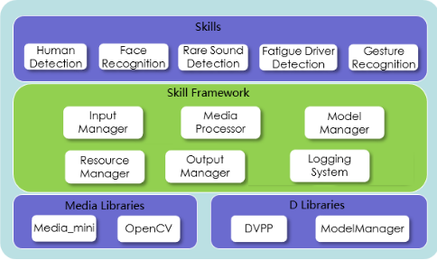

# Skill Framework简介

Skill Framework通过封装底层接口、实现常用的管理功能，让开发者可以在Huawei HiLens管理控制台上方便地开发技能，培育AI生态。

Skill Framework的分层结构如[图1](#fig8310203618820)所示，Skill Framework封装了底层的多媒体处理库（摄像头/麦克风驱动模块Media\_mini），以及D芯片相关的图像处理库（DVPP）和模型管理库（ModelManager），另外开发者也可以使用熟悉的视觉处理库OpenCV。在此之上，Skill Framework提供了以下6个模块供开发者使用，方便开发诸如人形检测、人脸识别、疲劳驾驶检测等技能，模块说明如下表[模块说明](#table173537486322)。

**图 1**  Skill Framework框架  

**表 1**  模块说明

<table><thead align="left"><tr id="row193536481323"><th class="cellrowborder" valign="top" width="6.09%" id="mcps1.2.4.1.1">
序号

</th>
<th class="cellrowborder" valign="top" width="23.95%" id="mcps1.2.4.1.2">
模块

</th>
<th class="cellrowborder" valign="top" width="69.96%" id="mcps1.2.4.1.3">
功能

</th>
</tr>
</thead>
<tbody><tr id="row53539488325"><td class="cellrowborder" valign="top" width="6.09%" headers="mcps1.2.4.1.1 ">
1

</td>
<td class="cellrowborder" valign="top" width="23.95%" headers="mcps1.2.4.1.2 ">
Input Manager

</td>
<td class="cellrowborder" valign="top" width="69.96%" headers="mcps1.2.4.1.3 ">
负责视频、音频等输入数据的接入管理。

</td>
</tr>
<tr id="row5353174810321"><td class="cellrowborder" valign="top" width="6.09%" headers="mcps1.2.4.1.1 ">
2

</td>
<td class="cellrowborder" valign="top" width="23.95%" headers="mcps1.2.4.1.2 ">
Media Processor

</td>
<td class="cellrowborder" valign="top" width="69.96%" headers="mcps1.2.4.1.3 ">
负责视频、音频等媒体数据的处理。

</td>
</tr>
<tr id="row235314481328"><td class="cellrowborder" valign="top" width="6.09%" headers="mcps1.2.4.1.1 ">
3

</td>
<td class="cellrowborder" valign="top" width="23.95%" headers="mcps1.2.4.1.2 ">
Model Manager

</td>
<td class="cellrowborder" valign="top" width="69.96%" headers="mcps1.2.4.1.3 ">
负责模型的初始化与推断任务。

</td>
</tr>
<tr id="row9353204813323"><td class="cellrowborder" valign="top" width="6.09%" headers="mcps1.2.4.1.1 ">
4

</td>
<td class="cellrowborder" valign="top" width="23.95%" headers="mcps1.2.4.1.2 ">
Output Manager

</td>
<td class="cellrowborder" valign="top" width="69.96%" headers="mcps1.2.4.1.3 ">
负责流、文件、消息通知等输出任务的管理。

</td>
</tr>
<tr id="row935344814321"><td class="cellrowborder" valign="top" width="6.09%" headers="mcps1.2.4.1.1 ">
5

</td>
<td class="cellrowborder" valign="top" width="23.95%" headers="mcps1.2.4.1.2 ">
Resource Manager

</td>
<td class="cellrowborder" valign="top" width="69.96%" headers="mcps1.2.4.1.3 ">
负责文件、图片、模型等资源的路径管理。

</td>
</tr>
<tr id="row935364811328"><td class="cellrowborder" valign="top" width="6.09%" headers="mcps1.2.4.1.1 ">
6

</td>
<td class="cellrowborder" valign="top" width="23.95%" headers="mcps1.2.4.1.2 ">
Logging System

</td>
<td class="cellrowborder" valign="top" width="69.96%" headers="mcps1.2.4.1.3 ">
负责日志系统管理。

</td>
</tr>
</tbody>
</table>

