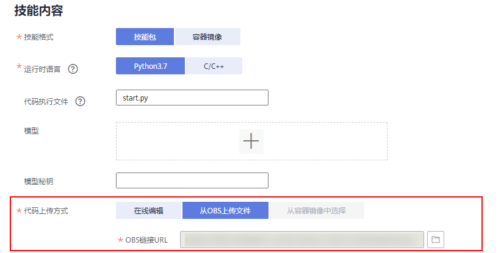

# 创建模型实例

根据技能的模型，创建一个模型实例。HiLens Kit可以使用昇腾310芯片支持的模型来进行推理，使用此方法来构造一个后续用于推理的模型。

当返回的对象被析构时，对应的模型资源也被释放。

当前支持创建普通模型和加密模型

-   **接口调用**

    hilens.Model\(filepath\)

-   **参数说明**

    **表 1**  参数说明

    
    <table><thead align="left"><tr id="row242816374399"><th class="cellrowborder" valign="top" width="13.011301130113011%" id="mcps1.2.5.1.1">
<strong id="b6848191716294">参数名称</strong>

    </th>
    <th class="cellrowborder" valign="top" width="21.402140214021404%" id="mcps1.2.5.1.2">
<strong id="b35541716132915">是否必选</strong>

    </th>
    <th class="cellrowborder" valign="top" width="22.822282228222825%" id="mcps1.2.5.1.3">
<strong id="b746471414297">参数类型</strong>

    </th>
    <th class="cellrowborder" valign="top" width="42.76427642764277%" id="mcps1.2.5.1.4">
<strong id="b0195102052916">参数描述</strong>

    </th>
    </tr>
    </thead>
    <tbody><tr id="row1942863713913"><td class="cellrowborder" valign="top" width="13.011301130113011%" headers="mcps1.2.5.1.1 ">
filepath

    </td>
    <td class="cellrowborder" valign="top" width="21.402140214021404%" headers="mcps1.2.5.1.2 ">
是

    </td>
    <td class="cellrowborder" valign="top" width="22.822282228222825%" headers="mcps1.2.5.1.3 ">
字符串

    </td>
    <td class="cellrowborder" valign="top" width="42.76427642764277%" headers="mcps1.2.5.1.4 ">
模型文件的路径。

    
可根据自己在<a href="https://support.huaweicloud.com/usermanual-hilens/hilens_02_0022.html#section4" target="_blank" rel="noopener noreferrer">新建技能&gt;填写技能内容</a>时上传模型的方式查看模型文件的路径。

    <ul id="ul14427353235"><li>方式一：在“模型”字段添加多个模型。此时获取模型路径请参见<a href="获取模型路径.md">获取模型路径</a>。</li><li>方式二：提前将多个模型和代码一起打包上传至OBS，“代码上传方式”选择“从OBS上传文件”。此时模型文件的路径为模型相对于代码所在文件位置的相对路径。</li></ul>
    </td>
    </tr>
    </tbody>
    </table>

    **图 1**  技能内容  
    

-   **返回值**

    <class 'hilens.Model'\>模型对象。

    模型构造失败则会抛出一个CreateError，并在日志上打印出错误码（例如0x1013011为模型路径错误）。

