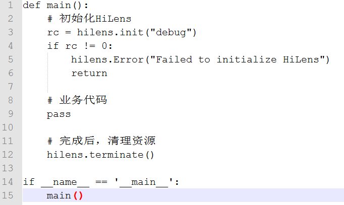

# 初始化Skill Framework<a name="hilens_05_0006"></a>

该接口用于初始化Skill Framework。在调用Skill Framework的其他接口之前，需要先做全局初始化。

-   **接口调用**

    hilens.init\(verify\)

-   **参数说明**

    **表 1**  参数说明

    <a name="table960975313718"></a>
    <table><thead align="left"><tr id="row1161015535719"><th class="cellrowborder" valign="top" width="23.762376237623766%" id="mcps1.2.5.1.1"><p id="p361095312710"><a name="p361095312710"></a><a name="p361095312710"></a><strong id="b1528016494815"><a name="b1528016494815"></a><a name="b1528016494815"></a>参数名</strong></p>
    </th>
    <th class="cellrowborder" valign="top" width="9.8009800980098%" id="mcps1.2.5.1.2"><p id="p72207345408"><a name="p72207345408"></a><a name="p72207345408"></a><strong id="b128351011174119"><a name="b128351011174119"></a><a name="b128351011174119"></a>是否必选</strong></p>
    </th>
    <th class="cellrowborder" valign="top" width="12.73127312731273%" id="mcps1.2.5.1.3"><p id="p1379143204018"><a name="p1379143204018"></a><a name="p1379143204018"></a><strong id="b17963171984116"><a name="b17963171984116"></a><a name="b17963171984116"></a>参数类型</strong></p>
    </th>
    <th class="cellrowborder" valign="top" width="53.70537053705371%" id="mcps1.2.5.1.4"><p id="p16610135315712"><a name="p16610135315712"></a><a name="p16610135315712"></a><strong id="b1864916521282"><a name="b1864916521282"></a><a name="b1864916521282"></a>描述</strong></p>
    </th>
    </tr>
    </thead>
    <tbody><tr id="row2061085318718"><td class="cellrowborder" valign="top" width="23.762376237623766%" headers="mcps1.2.5.1.1 "><p id="p861011531479"><a name="p861011531479"></a><a name="p861011531479"></a>verify</p>
    </td>
    <td class="cellrowborder" valign="top" width="9.8009800980098%" headers="mcps1.2.5.1.2 "><p id="p222018344409"><a name="p222018344409"></a><a name="p222018344409"></a>是</p>
    </td>
    <td class="cellrowborder" valign="top" width="12.73127312731273%" headers="mcps1.2.5.1.3 "><p id="p107911132174015"><a name="p107911132174015"></a><a name="p107911132174015"></a>字符串</p>
    </td>
    <td class="cellrowborder" valign="top" width="53.70537053705371%" headers="mcps1.2.5.1.4 "><p id="p013657132416"><a name="p013657132416"></a><a name="p013657132416"></a>长度0到128的字符串，对应控制台上<a href="https://support.huaweicloud.com/usermanual-hilens/hilens_02_0021.html" target="_blank" rel="noopener noreferrer">新建技能</a>的hash检验值。</p>
    <p id="p17610165320715"><a name="p17610165320715"></a><a name="p17610165320715"></a>如果和控制台上创建技能的hash检验值不一致，Skill Framework会强制技能停止。</p>
    </td>
    </tr>
    </tbody>
    </table>

-   **返回值**

    0为Skill Framework初始化成功，其他为失败。

    该方法还可以用来验证技能是否损坏或被篡改。如果想要使用该功能，参数verify应该是开发者编写的一个函数的返回值，该返回值是实时计算要验证的文件的hash值。开发者在完成技能的开发后，用同样的hash方法计算出hash值，填入控制台[新建技能](https://support.huaweicloud.com/usermanual-hilens/hilens_02_0022.html)的校验值。如下所示：

    ```
    #! /usr/bin/python3.7
    
    import hilens
    def verify():   
        # 开发者需要实现一个方法，来验证程序身份(以防被损坏、篡改)
        # 例如可以计算技能包中重要文件的Hash值，verify应当返回一个字符串(1~128字节)。
        # 在HiLens平台，技能开发中填入此Hash值。调用init方法后，技能会自动将此Hash值
        # 发送到平台上进行比对，并验证技能的使用许可。
    
        # 调试期间，开发者可以考虑使用一个固定的字符串来进行校验，以便于修改代码。
        # 因为Python脚本源码下发到设备上较容易篡改，对于商用技能，建议开发者使用C++进行开发。
        # 注意：正式发布的技能不应使用硬编码的字符串来校验！
        return "hello"
    
    def main():
        # 初始化HiLens
        rc = hilens.init(verify())
        # 运行在离线版HiLens kit的技能，verify可以任意传入一个字符串
        # 如: hilens.init("")
        if rc != 0: 
           hilens.Error("Failed to initialize HiLens")
            return 
    
       # 业务代码
        pass
    
        # 完成后，清理资源
        hilens.terminate()
    
    if __name__ == '__main__':
        main()
    ```

    如果在技能开发调试阶段不想用此功能，那么直接填写一个静态字符串即可：

    **图 1**  静态字符串<a name="fig3294959194"></a>  
    


