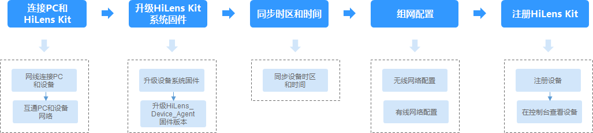

# HiLens Kit注册流程

## HiLens Kit简介

HiLens Kit是一款具备AI推理能力的多媒体终端设备，具有强大的计算性能、高清摄像头接入、体积小、接口丰富等特点。硬件集成了Atlas 200 AI加速模块（简称Atlas 200），方便用户快速简捷的接入并使用Ascend 310 AI处理器强大的处理能力，主要应用于AI开发者预研开发和视频监控领域。系统内置HiLens Framework，给运行的技能提供丰富的API接口。

HiLens Kit板载32GB eMMC，提供1个Micro SD卡槽位，可自行扩展Micro SD卡，最高支持速率SDR50，最大容量2TB，外接SD卡操作请见[使用SD卡](使用SD卡.md)。其具体参数请参见[表1](#table7925165613417)。

**图 1**  HiLens  Kit  

**表 1**  HiLens Kit参数说明

<table><thead align="left"><tr id="row99268560417"><th class="cellrowborder" valign="top" width="15.13151315131513%" id="mcps1.2.12.1.1">
芯片

</th>
<th class="cellrowborder" valign="top" width="9.56095609560956%" id="mcps1.2.12.1.2">
CPU

</th>
<th class="cellrowborder" valign="top" width="12.58125812581258%" id="mcps1.2.12.1.3">
micro SD接口

</th>
<th class="cellrowborder" valign="top" width="11.421142114211419%" id="mcps1.2.12.1.4">
摄像头

</th>
<th class="cellrowborder" valign="top" width="6.99069906990699%" id="mcps1.2.12.1.5">
麦克风

</th>
<th class="cellrowborder" valign="top" width="5.25052505250525%" id="mcps1.2.12.1.6">
网口

</th>
<th class="cellrowborder" valign="top" width="5.72057205720572%" id="mcps1.2.12.1.7">
USB

</th>
<th class="cellrowborder" valign="top" width="7.22072207220722%" id="mcps1.2.12.1.8">
HDMI

</th>
<th class="cellrowborder" valign="top" width="10.96109610961096%" id="mcps1.2.12.1.9">
Audio out

</th>
<th class="cellrowborder" valign="top" width="8.850885088508848%" id="mcps1.2.12.1.10">
操作系统

</th>
<th class="cellrowborder" valign="top" width="6.31063106310631%" id="mcps1.2.12.1.11">
WiFi

</th>
</tr>
</thead>
<tbody><tr id="row1992613561148"><td class="cellrowborder" valign="top" width="15.13151315131513%" headers="mcps1.2.12.1.1 ">
昇腾310

（8GB RAM）

</td>
<td class="cellrowborder" valign="top" width="9.56095609560956%" headers="mcps1.2.12.1.2 ">
Hi3559A

（4GB）

</td>
<td class="cellrowborder" valign="top" width="12.58125812581258%" headers="mcps1.2.12.1.3 ">
1

</td>
<td class="cellrowborder" valign="top" width="11.421142114211419%" headers="mcps1.2.12.1.4 ">
200万像素，720P

</td>
<td class="cellrowborder" valign="top" width="6.99069906990699%" headers="mcps1.2.12.1.5 ">
2

</td>
<td class="cellrowborder" valign="top" width="5.25052505250525%" headers="mcps1.2.12.1.6 ">
1

</td>
<td class="cellrowborder" valign="top" width="5.72057205720572%" headers="mcps1.2.12.1.7 ">
2

</td>
<td class="cellrowborder" valign="top" width="7.22072207220722%" headers="mcps1.2.12.1.8 ">
1

</td>
<td class="cellrowborder" valign="top" width="10.96109610961096%" headers="mcps1.2.12.1.9 ">
1

</td>
<td class="cellrowborder" valign="top" width="8.850885088508848%" headers="mcps1.2.12.1.10 ">
Linux

</td>
<td class="cellrowborder" valign="top" width="6.31063106310631%" headers="mcps1.2.12.1.11 ">
支持

</td>
</tr>
</tbody>
</table>

> **说明：** 
>-   HiLens Kit已正式出售，您可直接[购买](https://console.huaweicloud.com/hilens/?region=cn-north-4&locale=zh-cn#/hilens/skillMarket/hilensKitPurchase)。如果您需要批量购买HiLens Kit，可联系一线市场人员或华为云售前热线。
>-   HiLens Kit支持操作HiLens Kit的系统文件等配置，可以[连接PC和HiLens Kit](https://support.huaweicloud.com/usermanual-hilens/hilens_02_0102.html)，并[SSH登录HiLens Kit](https://support.huaweicloud.com/usermanual-hilens/hilens_02_0103.html)，暂不支持将系统移植至其他操作系统。
>-   HiLens Kit自带一个摄像头，同时也可以外接IP摄像头，支持接入4K及以下的PC摄像头，详情请见[配置摄像头](https://support.huaweicloud.com/usermanual-hilens/hilens_02_0016.html)，可参考实践案例[安全帽检测技能开发（外接摄像头）](https://support.huaweicloud.com/bestpractice-hilens/hilens_06_0008.html)。

**参考文档**

首次获取文档时，在企业技术支持网站（Support-E网站）注册帐号并[注册产品](https://support.huawei.com/enterprisemysupport/mysupport#click=productreg)，输入HiLens Kit的产品序列号（SN），系统默认输入产品名称，完成产品注册申请，详情请参见[提升权限](https://support.huawei.com/enterprise/enhanceMyPrivilege)。

SN码标注于HiLens Kit底部，为一串长达20的字符串，例如“21023XXXXXXXXXXXXXXX“。

产品注册申请提交之后，若是显示为“产品注册成功“，则可以直接执行下一步；若提示“产品待审核“则需要等待审核成功之后执行下一步，一个工作日之内审核。

-   [HiLens Kit用户指南](https://support.huawei.com/enterprise/zh/doc/EDOC1100112066?idPath=23710424%7C251366513%7C22892968%7C250700826)

    介绍了Atlas 200 HiLens 套件（又称Atlas 200 HiLens Kit）的产品外观，逻辑结构和产品规格，指导用户对Atlas 200 HiLens Kit进行安装、连线、上电下电、基本配置等操作。

-   [HiLens Kit 智能边缘管理系统用户指南](https://support.huawei.com/enterprise/zh/doc/EDOC1100133284?idPath=23710424%7C251366513%7C22892968%7C250700826)

    介绍了华为HiLens 智能边缘管理系统（Huawei HiLens Intelligent Edge System）的系统架构，并指导用户使用该管理系统对华为Atlas 200 HiLens Kit进行系统管理与维护等操作。

**注册HiLens Kit方式**

为了让HiLens Kit设备具备AI技能，需要将设备注册至华为HiLens控制台，才能在华为HiLens控制台上管理设备和技能等。

本章主要介绍如何登录端侧设备HiLens Kit并将设备注册至云侧华为HiLens控制台，在华为HiLens控制台上管理设备HiLens Kit。

-   目前只支持注册华为发布的HiLens Kit设备。
-   针对注册的HiLens Kit设备，只能安装并使用“适用于Ascend310芯片”的技能。

HiLens Kit有两种注册方式，分别是使用HiLens Kit智能边缘系统注册和SSH注册两种方式，具体的操作流程和指导如下：

-   [智能边缘系统注册设备](#section88938490465)
-   [使用SSH注册设备](#section11822101318475)

**常用操作**

[初始化配置](https://support.huawei.com/enterprise/zh/doc/EDOC1100112066/59baccc)：HiLens Kit出厂预装华为自研的Euler操作系统，用户无需安装操作系统。用户可通过浏览器登录华为HiLens 智能边缘管理系统，进行初始配置。

[修改初始用户名和密码](https://support.huawei.com/enterprise/zh/doc/EDOC1100112066/f03e0dea)：为保证系统的安全性，初次登录时，请务必修改初始密码，并定期更新。

[配置防火墙](配置防火墙.md)：为了防止除您允许的IP地址范围之外的用户去访问HiLens Kit智能边缘系统，您可以通过配置防火墙，防止HiLens Kit智能边缘系统受到其他攻击。

[恢复出厂设置](https://support.huawei.com/enterprise/zh/doc/EDOC1100112066/9b0a1fba)：在使用HiLens Kit过程中，如果系统被误破坏之后，无法恢复正常的使用，需考虑恢复出厂设置。

[使用SD卡](使用SD卡.md)：在HiLens Kit使用过程中，插入SD卡，存储技能数据。

## 智能边缘系统注册设备

使用智能边缘系统注册设备指通过智能边缘系统注册设备，注册过程均在智能边缘系统通过可视化界面操作，操作简便。

> **说明：** 
>-   使用智能边缘系统注册设备需要升级系统固件版本至2.2.200.011，选择该注册方式前请仔细阅读[升级HiLens Kit系统固件版本](https://support.huaweicloud.com/usermanual-hilens/hilens_02_0084.html)，评估升级操作对业务连续性的风险。如果不能接受升级系统固件版本带来的风险，请选择使用SSH注册设备。
>-   使用智能边缘系统注册设备需要关闭登录保护，[进入帐号安全设置](https://support.huaweicloud.com/usermanual-iam/iam_07_0001.html#iam_07_0001__zh-cn_topic_0179263545_section113256158575)后，管理员可以在“帐号安全设置\>敏感操作“中开启登录保护。
>    如帐号从未开启登录保护，请忽略该要求。

使用智能边缘系统注册设备流程如[图2](#fig153594817195)所示，详细操作指引请参见[表2](#table103435016204)。

**图 2**  智能边缘系统注册设备流程  

**表 2**  智能边缘系统注册设备流程说明

<table><thead align="left"><tr id="row18340506209"><th class="cellrowborder" valign="top" width="20.882088208820885%" id="mcps1.2.4.1.1">
流程

</th>
<th class="cellrowborder" valign="top" width="45.704570457045705%" id="mcps1.2.4.1.2">
说明

</th>
<th class="cellrowborder" valign="top" width="33.41334133413341%" id="mcps1.2.4.1.3">
详细指导

</th>
</tr>
</thead>
<tbody><tr id="row10341250142017"><td class="cellrowborder" valign="top" width="20.882088208820885%" headers="mcps1.2.4.1.1 ">
连接PC和HiLens Kit

</td>
<td class="cellrowborder" valign="top" width="45.704570457045705%" headers="mcps1.2.4.1.2 ">
在注册HiLens Kit至控制台之前，您需要连接PC和HiLens Kit。

</td>
<td class="cellrowborder" valign="top" width="33.41334133413341%" headers="mcps1.2.4.1.3 ">
<a href="https://support.huaweicloud.com/usermanual-hilens/hilens_02_0049.html" target="_blank" rel="noopener noreferrer">连接PC和HiLens Kit</a>

</td>
</tr>
<tr id="row173416501203"><td class="cellrowborder" valign="top" width="20.882088208820885%" headers="mcps1.2.4.1.1 ">
升级HiLens Kit系统固件版本

</td>
<td class="cellrowborder" valign="top" width="45.704570457045705%" headers="mcps1.2.4.1.2 ">
使用智能边缘系统注册设备之前需要升级HiLens Kit系统固件版本至2.2.200.011。

</td>
<td class="cellrowborder" valign="top" width="33.41334133413341%" headers="mcps1.2.4.1.3 ">
<a href="https://support.huaweicloud.com/usermanual-hilens/hilens_02_0084.html" target="_blank" rel="noopener noreferrer">升级HiLens Kit系统固件版本</a>

</td>
</tr>
<tr id="row143445020203"><td class="cellrowborder" valign="top" width="20.882088208820885%" headers="mcps1.2.4.1.1 ">
同步时区和时间

</td>
<td class="cellrowborder" valign="top" width="45.704570457045705%" headers="mcps1.2.4.1.2 ">
为了顺利注册设备，您需要同步设备的时区和时间以保证与实际一致。

</td>
<td class="cellrowborder" valign="top" width="33.41334133413341%" headers="mcps1.2.4.1.3 ">
<a href="https://support.huaweicloud.com/usermanual-hilens/hilens_02_0100.html" target="_blank" rel="noopener noreferrer">同步时区和时间</a>

</td>
</tr>
<tr id="row93416509209"><td class="cellrowborder" valign="top" width="20.882088208820885%" headers="mcps1.2.4.1.1 ">
组网配置

</td>
<td class="cellrowborder" valign="top" width="45.704570457045705%" headers="mcps1.2.4.1.2 ">
HiLens Kit有两种组网方式，分为无线和有线两种方式连接路由器，您可以选择其中一种方式进行组网配置。

不能同时使用无线网络和有线网络连接同一个路由器，无线连接会自动删除默认网关，再次使用有线网络时需要配置默认网关。<strong id="b1718444310516">推荐使用无线连接到路由器，以免更新设备IP后遗忘或丢失IP。</strong>

</td>
<td class="cellrowborder" valign="top" width="33.41334133413341%" headers="mcps1.2.4.1.3 ">
<a href="https://support.huaweicloud.com/usermanual-hilens/hilens_02_0079.html" target="_blank" rel="noopener noreferrer">配置无线网络</a>

<a href="https://support.huaweicloud.com/usermanual-hilens/hilens_02_0080.html" target="_blank" rel="noopener noreferrer">配置有线网络</a>

</td>
</tr>
<tr id="row834850172016"><td class="cellrowborder" valign="top" width="20.882088208820885%" headers="mcps1.2.4.1.1 ">
注册HiLens Kit

</td>
<td class="cellrowborder" valign="top" width="45.704570457045705%" headers="mcps1.2.4.1.2 ">
注册设备至控制台上，并在控制台上查看设备状态。

</td>
<td class="cellrowborder" valign="top" width="33.41334133413341%" headers="mcps1.2.4.1.3 ">
<a href="https://support.huaweicloud.com/usermanual-hilens/hilens_02_0101.html" target="_blank" rel="noopener noreferrer">注册HiLens Kit</a>

</td>
</tr>
</tbody>
</table>

## 使用SSH注册设备

使用SSH注册设备指通过SSH登录HiLens Kit系统，使用Linux命令注册设备。SSH登录设备系统支持操作HiLens Kit的系统文件等配置。

使用SSH注册设备流程如[图3](#fig1731236133518)所示，详细操作指引请参见[表3](#table14286324163719)。

**图 3**  SSH注册设备流程  

**表 3**  SSH注册设备流程说明

<table><thead align="left"><tr id="row1628616241375"><th class="cellrowborder" valign="top" width="20.882088208820885%" id="mcps1.2.4.1.1">
流程

</th>
<th class="cellrowborder" valign="top" width="45.704570457045705%" id="mcps1.2.4.1.2">
说明

</th>
<th class="cellrowborder" valign="top" width="33.41334133413341%" id="mcps1.2.4.1.3">
详细指导

</th>
</tr>
</thead>
<tbody><tr id="row1628614247370"><td class="cellrowborder" valign="top" width="20.882088208820885%" headers="mcps1.2.4.1.1 ">
连接PC和HiLens Kit

</td>
<td class="cellrowborder" valign="top" width="45.704570457045705%" headers="mcps1.2.4.1.2 ">
在注册HiLens Kit至控制台之前，您需要连接PC和HiLens Kit。

</td>
<td class="cellrowborder" valign="top" width="33.41334133413341%" headers="mcps1.2.4.1.3 ">
<a href="连接PC和HiLens-Kit-1.md">连接PC和HiLens Kit-1</a>

</td>
</tr>
<tr id="row13286172418376"><td class="cellrowborder" valign="top" width="20.882088208820885%" headers="mcps1.2.4.1.1 ">
SSH登录HiLens Kit

</td>
<td class="cellrowborder" valign="top" width="45.704570457045705%" headers="mcps1.2.4.1.2 ">
使用SSH连接设备HiLens Kit，用Linux指令进行操作。

</td>
<td class="cellrowborder" valign="top" width="33.41334133413341%" headers="mcps1.2.4.1.3 ">
<a href="SSH登录HiLens-Kit设备.md">SSH登录HiLens Kit设备</a>

</td>
</tr>
<tr id="row102861824113714"><td class="cellrowborder" valign="top" width="20.882088208820885%" headers="mcps1.2.4.1.1 ">
组网配置

</td>
<td class="cellrowborder" valign="top" width="45.704570457045705%" headers="mcps1.2.4.1.2 ">
HiLens Kit有两种组网方式，分为无线和有线两种方式连接路由器，您可以选择其中一种方式进行组网配置。

不能同时使用无线网络和有线网络连接同一个路由器，无线连接会自动删除默认网关，再次使用有线网络时需要配置默认网关。<strong id="b14216171210812">推荐使用无线连接到路由器，以免更新设备IP后遗忘或丢失IP。</strong>

</td>
<td class="cellrowborder" valign="top" width="33.41334133413341%" headers="mcps1.2.4.1.3 ">
<a href="无线网络配置（SSH）.md">无线网络配置（SSH）</a>

<a href="有线网络配置（SSH）.md">有线网络配置（SSH）</a>

</td>
</tr>
<tr id="row162867244379"><td class="cellrowborder" valign="top" width="20.882088208820885%" headers="mcps1.2.4.1.1 ">
注册HiLens Kit

</td>
<td class="cellrowborder" valign="top" width="45.704570457045705%" headers="mcps1.2.4.1.2 ">
注册设备至控制台上，并在控制台上查看设备状态。

</td>
<td class="cellrowborder" valign="top" width="33.41334133413341%" headers="mcps1.2.4.1.3 ">
<a href="SSH注册HiLens-Kit.md">SSH注册HiLens Kit</a>

</td>
</tr>
</tbody>
</table>

