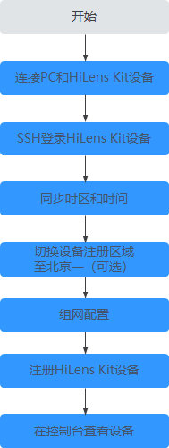

# HiLens Kit简介

HiLens Kit是一款具备AI推理能力的多媒体终端设备，具有强大的计算性能、高清摄像头接入、体积小、接口丰富等特点。硬件集成了Atlas 200 AI加速模块（简称Atlas 200），方便用户快速简捷的接入并使用Ascend 310 AI处理器强大的处理能力，主要应用于AI开发者预研开发和视频监控领域。系统内置HiLens Framework，给运行的技能提供丰富的API接口。其具体参数请参见[表1](#table7925165613417)。该产品的具体介绍见华为云[HiLens Kit 用户指南\>产品简介](https://support.huawei.com/enterprise/zh/doc/EDOC1100112066/be03db04)。

**表 1**  HiLens Kit参数说明

<table><thead align="left"><tr id="row99268560417"><th class="cellrowborder" valign="top" width="15.13151315131513%" id="mcps1.2.12.1.1">
芯片

</th>
<th class="cellrowborder" valign="top" width="9.56095609560956%" id="mcps1.2.12.1.2">
CPU

</th>
<th class="cellrowborder" valign="top" width="12.58125812581258%" id="mcps1.2.12.1.3">
micro SD接口

</th>
<th class="cellrowborder" valign="top" width="11.421142114211419%" id="mcps1.2.12.1.4">
摄像头

</th>
<th class="cellrowborder" valign="top" width="6.99069906990699%" id="mcps1.2.12.1.5">
麦克风

</th>
<th class="cellrowborder" valign="top" width="5.25052505250525%" id="mcps1.2.12.1.6">
网口

</th>
<th class="cellrowborder" valign="top" width="5.72057205720572%" id="mcps1.2.12.1.7">
USB

</th>
<th class="cellrowborder" valign="top" width="7.22072207220722%" id="mcps1.2.12.1.8">
HDMI

</th>
<th class="cellrowborder" valign="top" width="10.96109610961096%" id="mcps1.2.12.1.9">
Audio out

</th>
<th class="cellrowborder" valign="top" width="8.850885088508848%" id="mcps1.2.12.1.10">
操作系统

</th>
<th class="cellrowborder" valign="top" width="6.31063106310631%" id="mcps1.2.12.1.11">
WiFi

</th>
</tr>
</thead>
<tbody><tr id="row1992613561148"><td class="cellrowborder" valign="top" width="15.13151315131513%" headers="mcps1.2.12.1.1 ">
昇腾310

（8GB RAM）

</td>
<td class="cellrowborder" valign="top" width="9.56095609560956%" headers="mcps1.2.12.1.2 ">
Hi3559A

（4GB）

</td>
<td class="cellrowborder" valign="top" width="12.58125812581258%" headers="mcps1.2.12.1.3 ">
1

</td>
<td class="cellrowborder" valign="top" width="11.421142114211419%" headers="mcps1.2.12.1.4 ">
200万像素，720P

</td>
<td class="cellrowborder" valign="top" width="6.99069906990699%" headers="mcps1.2.12.1.5 ">
2

</td>
<td class="cellrowborder" valign="top" width="5.25052505250525%" headers="mcps1.2.12.1.6 ">
1

</td>
<td class="cellrowborder" valign="top" width="5.72057205720572%" headers="mcps1.2.12.1.7 ">
2

</td>
<td class="cellrowborder" valign="top" width="7.22072207220722%" headers="mcps1.2.12.1.8 ">
1

</td>
<td class="cellrowborder" valign="top" width="10.96109610961096%" headers="mcps1.2.12.1.9 ">
1

</td>
<td class="cellrowborder" valign="top" width="8.850885088508848%" headers="mcps1.2.12.1.10 ">
Linux

</td>
<td class="cellrowborder" valign="top" width="6.31063106310631%" headers="mcps1.2.12.1.11 ">
支持

</td>
</tr>
</tbody>
</table>

HiLens Kit出厂预装华为自研的Euler操作系统，用户无需安装操作系统。用户可通过浏览器登录华为HiLens 智能边缘管理系统，进行初始配置。初始化配置的详细操作请参见[HiLens Kit用户指南\>初始化配置](https://support.huawei.com/enterprise/zh/doc/EDOC1100112066/59baccc)。

> **说明：**   
>-   HiLens Kit已正式出售，您可直接[购买](https://console.huaweicloud.com/hilens/?region=cn-north-4&locale=zh-cn#/hilens/skillMarket/hilensKitPurchase)。如果您需要批量购买HiLens Kit，可联系一线市场人员或华为云售前热线。  
>-   HiLens Kit具体使用方法请参见[HiLens Kit用户指南](https://support.huawei.com/enterprise/zh/ai-computing-platform/a200-3000hilens-pid-250700826)。  

## 注册HiLens Kit方式

为了让HiLens Kit设备具备AI技能，需要将设备注册至Huawei HiLens控制台，才能在Huawei HiLens控制台上管理设备和技能等。

本章主要介绍如何登录端侧设备HiLens Kit并将设备注册至云侧Huawei HiLens控制台，在Huawei HiLens控制台上管理设备HiLens Kit。

-   目前只支持注册华为发布的HiLens Kit设备。
-   针对注册的HiLens Kit设备，只能安装并使用“适用于Ascend310芯片”的技能。

HiLens Kit有两种注册方式，分别是使用HiLens Kit智能边缘系统注册和SSH注册两种方式，具体的操作流程和指导如下：

-   [智能边缘系统注册设备](智能边缘系统注册设备.md)

    

-   [使用SSH注册设备](使用SSH注册设备.md)

    **图 1**  使用SSH注册设备  
    

    > **说明：**   
    >-   使用智能边缘系统注册设备需要升级系统固件版本至2.2.200.011，选择该注册方式前请仔细阅读[升级HiLens Kit系统固件版本](升级HiLens-Kit系统固件版本.md)，评估升级操作对业务连续性的风险。  
    >    如果不能接受升级系统固件版本带来的风险，请选择使用SSH注册设备。  

## HiLens Kit常用操作

-   [修改初始用户名和密码](https://support.huawei.com/enterprise/zh/doc/EDOC1100112066/f03e0dea)：为保证系统的安全性，初次登录时，请务必修改初始密码，并定期更新。

-   [配置防火墙](配置防火墙.md)：为了防止除您允许的IP地址范围之外的用户去访问HiLens Kit智能边缘系统，您可以通过配置防火墙，防止HiLens Kit智能边缘系统受到其他攻击。
-   [恢复出厂设置](https://support.huawei.com/enterprise/zh/doc/EDOC1100112066/9b0a1fba)：在使用HiLens Kit过程中，如果系统被误破坏之后，无法恢复正常的使用，需考虑恢复出厂设置。

