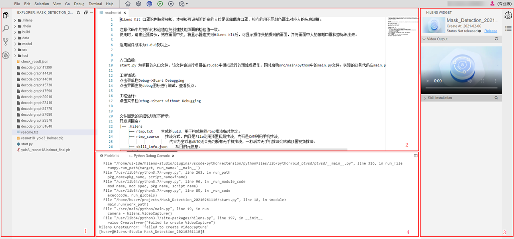
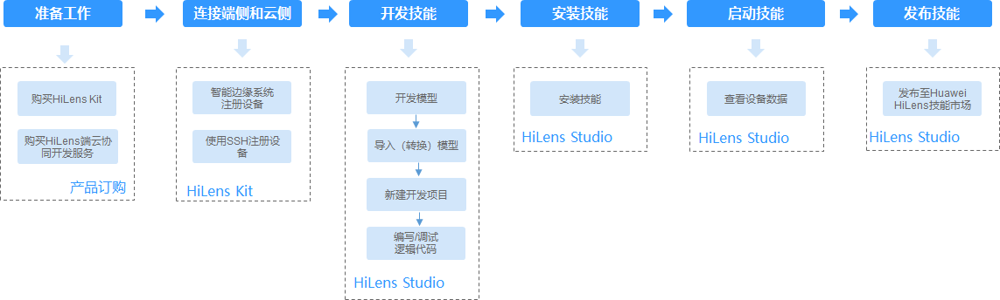

# HiLens Studio使用流程

HiLens Studio 是一个提供给开发者的多语言类集成开发环境，包括代码编辑器、编译器、调试器等，开发者可以在HiLens Studio 中编写和调试技能代码。针对调试好的技能代码，开发者也可以在HiLens Studio中发布技能、部署并运行技能到端侧设备上。

> **说明：** 
>HiLens Studio当前支持Python 3.7和C++技能的开发、调试。

## 功能介绍

HiLens Studio界面如[图1](#fig19734153464515)所示，功能介绍请参见[图1](#fig19734153464515)和[表1](#table104748295414)。

**图 1**  HiLens Studio界面  

**表 1**  功能区域介绍

<table><thead align="left"><tr id="row204758211544"><th class="cellrowborder" valign="top" id="mcps1.2.4.1.1">
区域

</th>
<th class="cellrowborder" colspan="2" valign="top" id="mcps1.2.4.1.2">
功能说明

</th>
</tr>
</thead>
<tbody><tr id="row7475522547"><td class="cellrowborder" rowspan="4" valign="top" headers="mcps1.2.4.1.1 ">
1

</td>
<td class="cellrowborder" colspan="2" valign="top" headers="mcps1.2.4.1.2 ">
单击查看开发项目的文件目录，详情请参见<a href="使用手机实时视频流编写-调试代码.md#section31895539159">项目文件目录说明</a>。

</td>
</tr>
<tr id="row3933916205717"><td class="cellrowborder" colspan="2" valign="top" headers="mcps1.2.4.1.2 ">
单击可在搜索框中搜索您想要查看的项目内容。

</td>
</tr>
<tr id="row10662630175813"><td class="cellrowborder" colspan="2" valign="top" headers="mcps1.2.4.1.2 ">
单击查看代码来源。

</td>
</tr>
<tr id="row072235813611"><td class="cellrowborder" colspan="2" valign="top" headers="mcps1.2.4.1.2 ">
单击在该页签下可调试技能代码，详情请参见<a href="使用手机实时视频流编写-调试代码.md#section343343721619"> 断点调试代码</a>。

</td>
</tr>
<tr id="row54755216543"><td class="cellrowborder" valign="top" headers="mcps1.2.4.1.1 ">
2

</td>
<td class="cellrowborder" colspan="2" valign="top" headers="mcps1.2.4.1.2 ">
代码编辑区，可在该区域内直接编辑代码。

</td>
</tr>
<tr id="row19475924545"><td class="cellrowborder" rowspan="2" valign="top" headers="mcps1.2.4.1.1 ">
3

</td>
<td class="cellrowborder" colspan="2" valign="top" headers="mcps1.2.4.1.2 ">
单击切换至该页签，可针对当前编辑好的技能代码<a href="HiLens-Studio发布技能.md">发布技能</a>、<a href="HiLens-Studio安装技能.md">安装技能</a>和<a href="HiLens-Studio启动或停止技能.md">启动技能</a>。

</td>
</tr>
<tr id="row15481188018"><td class="cellrowborder" colspan="2" valign="top" headers="mcps1.2.4.1.2 ">
单击切换至该页签，查看当前文件概览。

</td>
</tr>
<tr id="row44752235417"><td class="cellrowborder" valign="top" headers="mcps1.2.4.1.1 ">
4

</td>
<td class="cellrowborder" colspan="2" valign="top" headers="mcps1.2.4.1.2 ">
调试区，可在该区域内查看代码调试结果。

</td>
</tr>
</tbody>
</table>

## 使用HiLens Studio 开发技能

本章节介绍在HiLens Studio开发技能。

使用HiLens Studio开发技能流程如[图2](#fig261128121615)所示，流程说明请参见[表2](#table10326435153411)。

> **说明：** 
>本章节仅介绍在HiLens Studio中开发技能所涉及的操作。在控制台新建技能的具体操作请参见[控制台开发技能](控制台开发技能.md)。

**图 2**  使用HiLens Studio 开发技能流程  

**表 2**  使用HiLens Studio 开发技能流程说明

<table><thead align="left"><tr id="row13275352343"><th class="cellrowborder" valign="top" width="22.24222422242224%" id="mcps1.2.4.1.1">
流程

</th>
<th class="cellrowborder" valign="top" width="44.42444244424442%" id="mcps1.2.4.1.2">
说明

</th>
<th class="cellrowborder" valign="top" width="33.33333333333333%" id="mcps1.2.4.1.3">
详细指导

</th>
</tr>
</thead>
<tbody><tr id="row13775521210"><td class="cellrowborder" valign="top" width="22.24222422242224%" headers="mcps1.2.4.1.1 ">
准备工作

</td>
<td class="cellrowborder" valign="top" width="44.42444244424442%" headers="mcps1.2.4.1.2 "><ul id="ul14532341184712"><li>购买HiLens Kit
将开发好的技能安装至设备前提条件是购买HiLens  Kit设备。

</li><li>购买HiLens端边云协同平台服务并激活设备
当您注册的设备超过1台时，需购买HiLens端边云协同平台服务，在设备管理页面对指定设备进行权限激活后，该设备即可安装您自行开发的技能。

</li></ul>
</td>
<td class="cellrowborder" valign="top" width="33.33333333333333%" headers="mcps1.2.4.1.3 ">
<a href="订购HiLens-Kit.md">订购HiLens Kit</a>

<a href="订购HiLens端边云协同平台服务.md">订购HiLens端边云协同平台服务</a>

<a href="激活设备（购买端边云协同平台服务）.md">激活设备（购买端边云协同平台服务）</a>

</td>
</tr>
<tr id="row9327103593413"><td class="cellrowborder" valign="top" width="22.24222422242224%" headers="mcps1.2.4.1.1 ">
连接端侧和云侧

</td>
<td class="cellrowborder" valign="top" width="44.42444244424442%" headers="mcps1.2.4.1.2 ">
首先，连接您购买的HiLens Kit，并将HiLens Kit注册到华为HiLens平台，连接端侧与云侧。

</td>
<td class="cellrowborder" valign="top" width="33.33333333333333%" headers="mcps1.2.4.1.3 ">
<a href="HiLens-Kit注册流程.md">HiLens Kit注册流程</a>

<a href="智能边缘系统注册设备.md">智能边缘系统注册设备</a>

<a href="使用SSH注册设备.md">使用SSH注册设备</a>

</td>
</tr>
<tr id="row173277352341"><td class="cellrowborder" valign="top" width="22.24222422242224%" headers="mcps1.2.4.1.1 ">
开发技能

</td>
<td class="cellrowborder" valign="top" width="44.42444244424442%" headers="mcps1.2.4.1.2 ">
使用HiLens Studio开发技能，开发者可以新建技能项目，在HiLens Studio编写和调试技能代码，针对HDMI输出的技能，在HiLens Studio中还可以运行技能并查看输出数据。

</td>
<td class="cellrowborder" valign="top" width="33.33333333333333%" headers="mcps1.2.4.1.3 ">
<a href="新建技能项目.md">新建技能项目</a>

<a href="管理模型.md">管理模型</a>

<a href="使用手机实时视频流编写-调试代码.md">使用手机实时视频流编写/调试代码</a>

</td>
</tr>
<tr id="row23274359349"><td class="cellrowborder" valign="top" width="22.24222422242224%" headers="mcps1.2.4.1.1 ">
安装技能

</td>
<td class="cellrowborder" valign="top" width="44.42444244424442%" headers="mcps1.2.4.1.2 ">
在HiLens Studio中编辑完技能代码，可以直接把技能安装到设备上。

</td>
<td class="cellrowborder" valign="top" width="33.33333333333333%" headers="mcps1.2.4.1.3 ">
<a href="HiLens-Studio安装技能.md">HiLens Studio安装技能</a>

</td>
</tr>
<tr id="row15327203553412"><td class="cellrowborder" valign="top" width="22.24222422242224%" headers="mcps1.2.4.1.1 ">
启动技能

</td>
<td class="cellrowborder" valign="top" width="44.42444244424442%" headers="mcps1.2.4.1.2 ">
把技能安装至设备后，可以直接在HiLens Studio中启动技能，查看技能运行效果。

</td>
<td class="cellrowborder" valign="top" width="33.33333333333333%" headers="mcps1.2.4.1.3 ">
<a href="HiLens-Studio启动或停止技能.md">HiLens Studio启动或停止技能</a>

</td>
</tr>
<tr id="row17327635203410"><td class="cellrowborder" valign="top" width="22.24222422242224%" headers="mcps1.2.4.1.1 ">
发布技能

</td>
<td class="cellrowborder" valign="top" width="44.42444244424442%" headers="mcps1.2.4.1.2 ">
针对已经调试好的技能，可以在HiLens Studio中发布技能至华为HiLens平台技能市场，供其他用户使用。

</td>
<td class="cellrowborder" valign="top" width="33.33333333333333%" headers="mcps1.2.4.1.3 ">
<a href="HiLens-Studio发布技能.md">HiLens Studio发布技能</a>

</td>
</tr>
</tbody>
</table>

