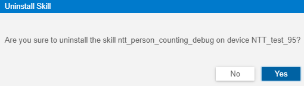

# HiLens Studio卸载技能

针对已经安装至设备的技能，如果您不再需要该技能，可在HiLens Studio界面卸载技能。

## 操作前必读

-   仅可对处于“Online“状态（即在线状态）的设备卸载技能。处于“Offline“状态（即离线状态）的设备无法卸载技能。连接端侧和云侧操作请参见[注册HiLens Kit](注册HiLens-Kit.md)。
-   卸载技能会删除端侧的技能和技能数据，请谨慎操作。

## 操作步骤

1.  登录华为HiLens管理控制台，单击左侧导航栏“技能开发\>HiLens Studio“，开始启动HiLens Studio。
2.  选择需要发布的技能，单击技能项目列表中的技能名称。

    进入HiLens Studio界面。

3.  单击HiLens Studio界面右侧。
4.  在右侧“Skill Installation“  区，在“Device Name“列选择您要安装技能的设备，单击“Operation“列的“Uninstall“。

    弹出“Uninstall Skill“  对话框。

    **图 1**  卸载技能-37  
    

5.  在“Uninstall Skill“  对话框，单击“Yes“。

    技能卸载时会有一个命令下发过程，您需要等待一段时间，HiLens Studio界面右下角提示“Success to uninstall  the skill“，完成技能卸载操作。

