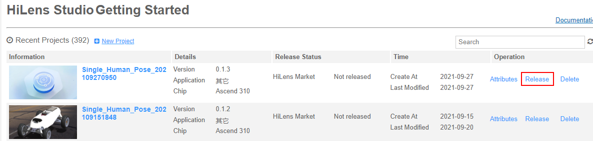
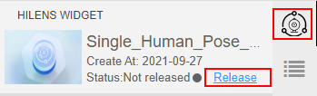
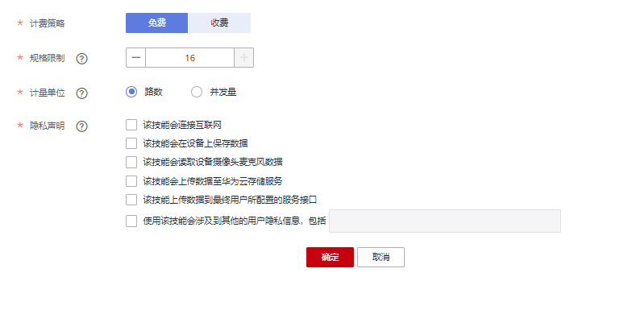

# HiLens Studio发布技能

针对已经在HiLens Studio中调试运行好的技能代码，您可以选择把技能发布到华为HiLens平台的技能市场，平台审核通过后，您分享的技能可供其它用户购买使用。

## 前提条件

-   保证华为云帐号处于不欠费状态。在华为HiLens控制台发布技能时，会占用OBS资源，需要收取一定费用，收费规则请参见[对象存储服务 OBS](https://www.huaweicloud.com/pricing.html?tab=detail#/obs)。
-   已完成[技能开发](新建技能项目.md)，且技能已完成[代码调试](使用手机实时视频流编写-调试代码.md)，调试结果满足业务诉求。

## 背景信息

-   发布至华为HiLens 技能市场的技能在3个工作日内审核，审核通过后，发布在华为HiLens技能市场的技能在“技能市场“列表中展示。
-   发布的技能名称不能与华为HiLens技能市场中其他技能重复。

## 发布技能至技能市场

1.  登录华为HiLens管理控制台，单击左侧导航栏“技能开发\>HiLens Studio“，开始启动HiLens Studio。
2.  在HiLens Studio界面，选择需要发布的技能，单击“Operation“列的“Release“。

    **图 1**  发布技能-34  
    

    也可以单击项目名称，进入技能项目后，单击HiLens Studio界面右侧，在“HiLens  Widget“  区单击“Release“。

    弹出“发布技能“窗口。

    **图 2**  发布技能-35  
    

3.  按[表1](#table1249718511464)设置对应的发布信息，单击“确定“。

    **图 3**  发布技能-36  
    

    **表 1**  发布至技能市场参数说明

    
    <table><thead align="left"><tr id="row16530205120464"><th class="cellrowborder" valign="top" width="32.32%" id="mcps1.2.3.1.1">
参数字段

    </th>
    <th class="cellrowborder" valign="top" width="67.67999999999999%" id="mcps1.2.3.1.2">
说明

    </th>
    </tr>
    </thead>
    <tbody><tr id="row553095115466"><td class="cellrowborder" valign="top" width="32.32%" headers="mcps1.2.3.1.1 ">
计费策略

    </td>
    <td class="cellrowborder" valign="top" width="67.67999999999999%" headers="mcps1.2.3.1.2 ">
技能发布在技能市场的计费策略。可选择“免费”和“收费”。

    </td>
    </tr>
    <tr id="row453095124612"><td class="cellrowborder" valign="top" width="32.32%" headers="mcps1.2.3.1.1 ">
规格限制

    </td>
    <td class="cellrowborder" valign="top" width="67.67999999999999%" headers="mcps1.2.3.1.2 ">
技能在同一设备上最多可以处理视频的路数，或最大并发量。

    </td>
    </tr>
    <tr id="row1153075144614"><td class="cellrowborder" valign="top" width="32.32%" headers="mcps1.2.3.1.1 ">
计量单位

    </td>
    <td class="cellrowborder" valign="top" width="67.67999999999999%" headers="mcps1.2.3.1.2 ">
表示可用在设备上的规格。有“路数”和“并发量”两种计量方式。若以“路数”规格，可安装在设备上使用一路视频。

    </td>
    </tr>
    <tr id="row195301510466"><td class="cellrowborder" valign="top" width="32.32%" headers="mcps1.2.3.1.1 ">
云服务类型

    </td>
    <td class="cellrowborder" rowspan="3" valign="top" width="67.67999999999999%" headers="mcps1.2.3.1.2 ">
“收费”技能需要开发者联系华为HiLens工作人员录入技能产品信息，然后返回一个资源编码，然后把编码填入“云服务类型”、“资源类型”、“资源规格编码”三个字段。

    </td>
    </tr>
    <tr id="row1153019513463"><td class="cellrowborder" valign="top" headers="mcps1.2.3.1.1 ">
资源类型

    </td>
    </tr>
    <tr id="row453085110463"><td class="cellrowborder" valign="top" headers="mcps1.2.3.1.1 ">
资源规格编码

    </td>
    </tr>
    <tr id="row453016511462"><td class="cellrowborder" valign="top" width="32.32%" headers="mcps1.2.3.1.1 ">
隐私声明

    </td>
    <td class="cellrowborder" valign="top" width="67.67999999999999%" headers="mcps1.2.3.1.2 ">
技能涉及到的用户隐私声明。

    </td>
    </tr>
    </tbody>
    </table>

    技能发布成功后，会弹出“发布成功“，发布的技能将展示在华为HiLens控制台的“产品订购\>技能市场“页面。

