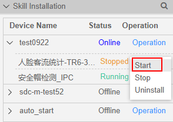
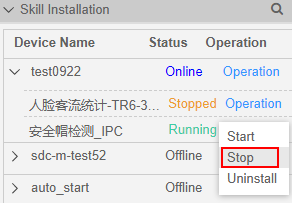

# HiLens Studio启动或停止技能

针对已经安装至设备上的技能，除了在控制台上执行[启动或停止技能](启动或停止技能.md)操作，您可以直接在HiLens Studio界面根据自己的需求启动或者停止技能。启动技能操作成功后，设备上的技能将处于“Running“状态。

## 前提条件

-   已完成技能开发，并[安装技能](HiLens-Studio安装技能.md)至设备上。用户安装技能后，需要启动技能，才能使技能在设备上运行。
-   仅可对处于“Online“状态（即在线状态）的设备启动技能。处于“Offline“状态（即离线状态）的设备无法启动技能。连接端侧和云侧操作请参见[注册HiLens Kit](注册HiLens-Kit.md)。
-   “Stopped“状态的技能，允许执行启动技能操作。
-   “Running“状态的技能，允许执行停止操作，“Running“或“Stopped“的技能允许[HiLens Studio卸载技能](HiLens-Studio卸载技能.md)。

## 进入HiLens Studio

1.  登录华为HiLens管理控制台，单击左侧导航栏“技能开发\>HiLens Studio“，开始启动HiLens Studio。
2.  选择需要发布的技能，单击技能项目列表中的技能名称。

    进入HiLens Studio界面。

## 启动技能

1.  单击HiLens Studio界面右侧。
2.  在右侧“Skill Installation“  区，在“Device Name“列选择您要启动技能的设备，单击设备名称左侧的，查看设备下的技能。
3.  鼠标移至“Operation“，单击“Start“。

    弹出“Start Skill“对话框。

    **图 1**  启动技能-32  
    

4.  在“Start Skill“对话框中单击“Yes“。

    右下方提示“Starting the skill“。

    开始启动技能，技能启动时会有一个命令下发过程，您需要等待一段时间技能才能启动成功，右下方提示“Success to start the skill“，同时在界面看到技能状态“Status“更新为“Runing“。

## 停止技能

1.  单击HiLens Studio界面右侧。
2.  在右侧“Skill Installation“  区，在“Device name“列选择您要启动技能的设备，单击设备名左侧的，查看设备下的技能。
3.  鼠标移至“Operation“，单击“Stop“。

    弹出“Stop Skill“对话框。

    **图 2**  停止技能-33  
    

4.  在“Stop Skill“对话框中单击“Yes“。

    右下方提示“Start to stop skill“。

    停止技能，技能停止时会有一个命令下发过程，您需要等待一段时间，技能才能停止成功，右下方提示“Success to stop the skill“，同时在界面看到技能状态“Status“更新为“Stopped“。

