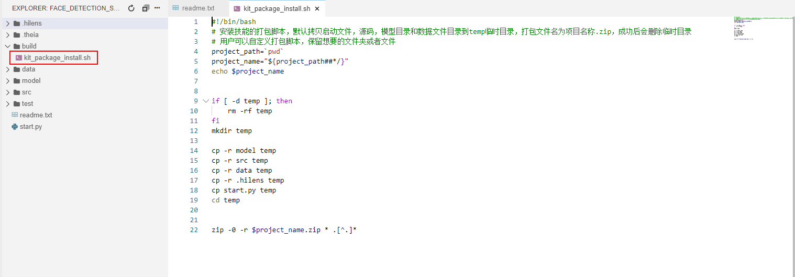
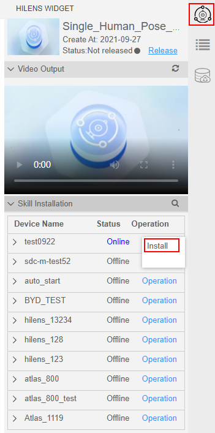

# HiLens Studio安装技能

针对已经在HiLens Studio 中调试运行好的技能代码，您可以在HiLens Studio界面中安装技能部署到您的设备中，查看技能的运行效果，判断此技能是否满足业务诉求。

## 前提条件

-   已注册HiLens Kit设备至控制台，详情请见[注册HiLens Kit](注册HiLens-Kit.md)。
-   已购买HiLens端边云协同平台服务并激活设备，详情请见[订购HiLens端边云协同平台服务](订购HiLens端边云协同平台服务.md)和[激活设备（购买端边云协同平台服务）](激活设备（购买端边云协同平台服务）.md)。
-   “设备管理\>设备列表“中，待安装技能的设备处于“在线“状态。即对HiLens Kit执行上电操作，详情请见[HiLens Kit 上电](https://support.huawei.com/enterprise/zh/doc/EDOC1100112066/330cbb35)，并保证设备网络通顺。

    > **说明：** 
    >如果使用无线网络配置，请保证路由器开启，使设备网络通顺。
    >如果使用有线网络配置，请保证网线连接设备和路由器，使设备网络通顺。

-   已完成[技能开发](新建技能项目.md)，且技能已完成[代码调试](使用手机实时视频流编写-调试代码.md)，调试结果满足业务诉求。

    如果希望定制化安装技能至HiLens Kit，例如为避免占用过多存储空间浪费资源，只希望下发部分文件至HiLens kit，可自定义技能安装的打包脚本**kit\_package\_install.sh**，如[图1](#fig114701144194016)所示。技能项目文件说明请见[项目文件说明](使用手机实时视频流编写-调试代码.md#section31895539159)。

    **图 1**  安装技能打包脚本  
    

## 操作步骤

1.  登录华为HiLens管理控制台，单击左侧导航栏“技能开发\>HiLens Studio“，开始启动HiLens Studio。
2.  选择需要安装的技能，单击技能项目列表中的技能名称。

    > **说明：** 
    >如果打开技能空项目，即单击左上角，左侧无法看到技能项目的文件，请重新[新建技能项目](新建技能项目.md)。

3.  单击HiLens Studio界面右侧。

    **图 2**  选择设备  
    

4.  在右侧“Skill Installation“  区，在“Device Name“列选择您要安装技能的设备，单击“Operation“列的“Install“。

    弹出“Install Skill“  对话框。

    **图 3**  安装技能-31  
    

5.  在“Install Skill“  对话框中单击“Yes“。

    当右下方提示“Install Successfully“，技能安装成功。

    在HiLens  Studio 右侧的“Skill Installation“区，您可以单击“Device Name“列设备左侧的，查看设备所安装的技能。

## 后续操作

技能成功安装至设备后，您可以选择在HiLens Studio 界面[启动技能](HiLens-Studio启动或停止技能.md#section13414165617238)。

