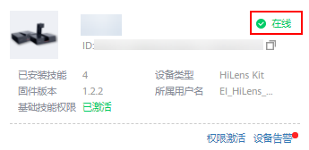

# SSH注册HiLens Kit

## 前提条件

-   网线连接PC和设备，详细操作请参见[连接PC和HiLens Kit-1](连接PC和HiLens-Kit-1.md)。
-   选择如下方式中的一种组网配置：

    -   [无线网络配置（SSH）](无线网络配置（SSH）.md)
    -   [有线网络配置（SSH）](有线网络配置（SSH）.md)

    不能同时使用无线网络和有线网络连接同一个路由器，无线连接会自动删除默认网关，再次使用有线网络时需要配置默认网关。**推荐使用无线连接到路由器，以免更新设备IP后遗忘或丢失IP。**

## 操作步骤

1.  使用SSH远程注册HiLens Kit设备至华为HiLens控制台，执行命令

    **hdactl register -u用户名 -d帐号名 -n设备名**

    按回车弹出“password“提示语。

    **用户名**指IAM用户名，**帐号名**指华为云帐号名，相关概念请参见[IAM基本概念](https://support.huaweicloud.com/productdesc-iam/iam_01_0023.html)。如果没有IAM账户时，“帐号名“与“用户名“一致。

    **设备名**请自己定义。

    注册HiLens Kit所使用的用户名、帐号名、设备名支持英文字母、数字和下划线，不支持以数字开头的名称以及只有数字的名称。

2.  在“password“提示语后输入华为云帐号的密码，按回车完成设备注册。

    如果IAM用户和华为云帐号不一致，在“password“提示语后输入IAM用户密码。

    如果有报错提示，无法注册，请将设备[恢复出厂设置](https://support.huawei.com/enterprise/zh/doc/EDOC1100112066/9b0a1fba)，重新注册设备。

    > **说明：** 
    >-   IAM用户禁止将设备注册到子项目，相关基本概念请参见[IAM基本概念](https://support.huaweicloud.com/productdesc-iam/iam_01_0023.html)。
    >-   设备注册完成后，您可登录华为HiLens管理控制台，在“设备管理\>设备列表“中查看设备状态。短时间内处于离线状态，请您耐心等待。

3.  登录华为HiLens管理控制台，单击左侧导航栏“设备管理\>设备列表“，在“设备列表“查看设备状态，如[图1](#fig148051936155317)所示。

    **图 1**  设备状态  
    

    1.  等待3分钟，若设备处于在线状态，则成功重启设备。
    2.  等待3分钟，若设备仍处于离线状态，则需要检查设备时间是否与当前时间一致，详情请参见[设备注册失败](https://support.huaweicloud.com/hilens_faq/HiLens_03_0005.html)。

## 在华为HiLens管理控制台查看注册后的设备

登录[华为HiLens管理控制台](https://console.huaweicloud.com/hilens/?region=cn-north-4#/hilens/deviceAuthority)，在管理控制台左侧菜单栏单击“设备管理 \>设备列表“，默认设备列表展现所有设备，查看到您所注册的设备列表，且设备状态处于“在线“状态，则说明您的设备成功注册。

如果注册失败或设备状态处于离线状态，请参见[HiLens Kit注册失败](https://support.huaweicloud.com/hilens_faq/HiLens_03_0005.html)排查原因。

**图 2**  设备注册状态-10  

> **须知：** 
>查看设备注册状态时：
>-   若未修改设备注册区域，默认进入“北京四“区域，请在HiLens管理页面页面左上角确认处于“北京四“。
>-   若执行[切换设备注册区域至北京一（可选）](SSH登录HiLens-Kit设备.md#section191304259256)，请在HiLens管理页面页面左上角切换至“北京一“。

