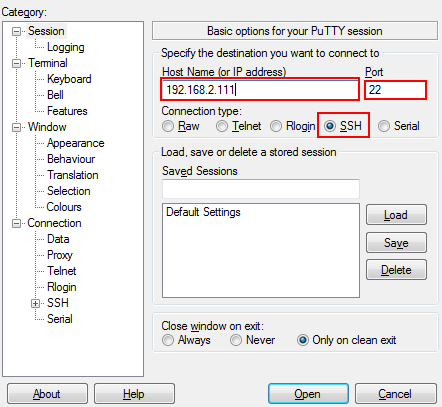

# SSH登录HiLens Kit设备

## 前提条件

已连接PC和HiLens Kit，详情请见[连接PC和HiLens Kit-1](连接PC和HiLens-Kit-1.md)。

## 操作步骤

1.  使用SSH远程连接HiLens Kit设备。
    1.  运行PuTTY，单击“Session“，在“Host Name\(or IP address\)“的输入框中输入设备IP，在“Port“输入框中输入端口号。以设备IP是192.168.2.111，设备端口号是22为例，如[图1](#fig13585102521318)所示。

        **图 1**  使用PuTTY登录HiLens Kit  
        

    2.  单击“open“。

        登录端侧设备。

2.  使用SSH远程登录设备系统。

    在“admin@192.168.2.111‘s password“提示语后输入默认账户“admin“的密码，首次登录默认密码请参见[HiLens Kit 用户指南\>默认数据](https://support.huawei.com/enterprise/zh/doc/EDOC1100112066/2347bab9)。

3.  使用SSH远程登录开发者命令行界面。

    1.  在“IES：/-\>“提示语后执行命令**develop**。
    2.  在“Password“提示语后输入root密码，首次登录默认密码请参见[HiLens Kit 用户指南\>默认数据](https://support.huawei.com/enterprise/zh/doc/EDOC1100112066/2347bab9)。

    **图 2**  SSH登录设备  
    

4.  使用SSH远程修改设备时间：
    1.  调整时区，与中国时区一致，执行命令

        **timedatectl set-timezone Asia/Shanghai**

    2.  修改设备时间，以当前时间为2019年10月17日19时19分19秒为例。执行命令

        **date -s "2019-10-17 19:19:19"**

        **hwclock -w**

        **reboot**

5.  设备默认注册至区域北京四，若希望把设备注册至北京一，[切换设备注册区域](#section191304259256)。

## 切换设备注册区域至北京一（可选）

设备默认注册至区域北京四，若希望把设备注册至北京一，请修改设备中配置文件的相关内容。详细步骤如下：

1.  在PuTTY里进入文件

    **vi /home/hilens/hda/etc/hda.conf**

2.  修改设备注册区域：在注释语“\#选择注册到华为云的区域，默认为北京4“下方，把**region=cn-north-4**修改为

    **region = cn-north-1**

    并保存。

3.  重启设备，即执行

    **reboot**

## 后续操作

组网配置：HiLens Kit有两种组网方式，分为无线和有线两种方式连接路由器，您可以选择其中一种方式进行组网配置。

两种不同组网方案的连接方式的操作指导如下：

-   [无线网络配置（SSH）](无线网络配置（SSH）.md)
-   [有线网络配置（SSH）](有线网络配置（SSH）.md)

不能同时使用无线网络和有线网络连接同一个路由器，无线连接会自动删除默认网关，再次使用有线网络时需要配置默认网关。**推荐使用无线连接到路由器，以免更新设备IP后遗忘或丢失IP。**

