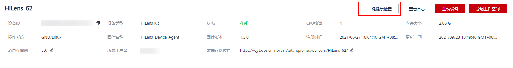

# 一键健康检查

由于时区、网络等问题会遇到设备在控制台显示离线、启动技能失败、固件升级失败等问题，您可以通过一键健康检查操作，快速定位并解决问题。

## 前提条件

云侧一键检查功能仅支持固件为1.1.0或以上版本的设备，升级固件版本请见[升级HiLens\_Device\_Agent固件版本](升级HiLens_Device_Agent固件版本.md)。

## 云侧健康检查项

-   进程信息：检查基础进程是否正常。
-   依赖库信息：检查设备依赖库是否被误删、调用是否正常。
-   时间信息：检查时区和时间是否正常。

## 云侧健康检查步骤

1.  登录华为HiLens管理控制台，在左侧菜单栏选择“设备管理 \>设备列表“。
2.  在“设备列表“页面单击设备卡片。

    进入设备详情页。

3.  在右上方单击“一键健康检查“。

    等待一段时间，待系统检查完毕，页面弹出“健康检查“对话框，并显示“进程信息“、“依赖库信息“、“时间信息“的状态。

    如果状态处于“异常“，“健康检查“对话框会显示异常原因，您可以根据原因进一步解决问题。

    **图 1**  一键健康检查  
    

## 端侧健康检查项

通过SSH登录HiLens Kit设备系统，您也可以针对端侧进行健康检查。

-   检查设备的网络连通性。
-   检查设备连接的无线网络类型是否符合要求。
-   检查设备是否处于离线状态。

## 端侧健康检查步骤

1.  [连接PC和HiLens Kit](连接PC和HiLens-Kit-1.md)
2.  [SSH登录HiLens Kit设备](SSH登录HiLens-Kit设备.md)
3.  执行命令**hdactl health\_check**。

