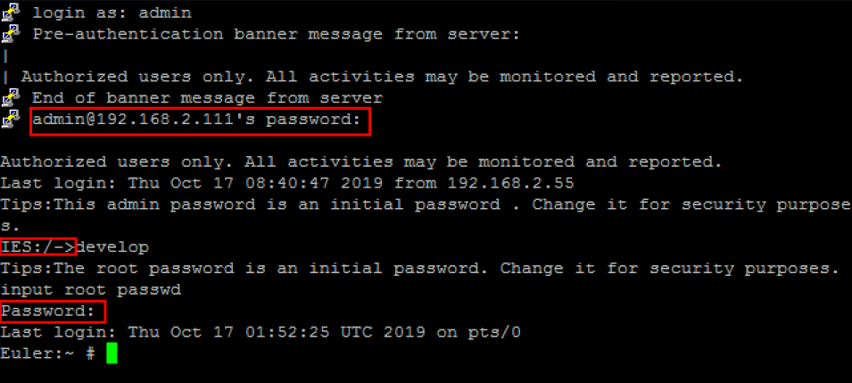

# 使用SSH注册设备

如果需要操作HiLens Kit的系统文件等配置，可以使用SSH注册并登录设备，用Linux指令进行操作。下面以PuTTY工具（[下载地址](https://www.putty.org)）为例，介绍在Windows 7环境下如何通过SSH登录HiLens Kit。

## 准备工作

-   确保您拥有至少一台HiLens Kit设备。
-   确保华为云账号没有欠费。
-   确保获得如下数据：
    -   待连接设备的IP地址：

        设备初始IP地址请参见[HiLens Kit 用户指南\>默认数据](https://support.huawei.com/enterprise/zh/doc/EDOC1100112066/2347bab9)中“管理网口初始IP地址“的“默认值“。

    -   登录待连接设备的用户名和密码：

        设备的初始用户名和密码请参见[HiLens Kit 用户指南\>默认数据](https://support.huawei.com/enterprise/zh/doc/EDOC1100112066/2347bab9)中“初始用户名与密码“的“默认值“。

        非首次登录，以修改后的账号名和密码登录，修改密码详情请见[修改初始用户名和密码](https://support.huawei.com/enterprise/zh/doc/EDOC1100112066/f03e0dea)。

-   确保下载软件PuTTY.exe，此工具为第三方软件。

## 步骤一：连接PC和HiLens Kit

详情请参见[连接PC和HiLens Kit](连接PC和HiLens-Kit.md)。

## 步骤二：SSH登录HiLens Kit设备

1.  使用SSH远程连接HiLens Kit设备。
    1.  运行PuTTY，单击“Session“，在“Host Name\(or IP address\)“的输入框中输入设备IP，在“Port“输入框中输入端口号。以设备IP是192.168.2.111，设备端口号是22为例，如[图1](#fig13585102521318)所示。

        **图 1**  使用PuTTY登录HiLens Kit  
        

    2.  单击“open“。

        登录端侧设备。

2.  使用SSH远程登录设备系统。

    在“admin@192.168.2.111‘s password“提示语后输入默认账户“admin“的密码，首次登录默认密码请参见[HiLens Kit 用户指南\>默认数据](https://support.huawei.com/enterprise/zh/doc/EDOC1100112066/2347bab9)。

3.  使用SSH远程登录开发者命令行界面。

    1.  在“IES：/-\>“提示语后执行命令**develop**。
    2.  在“Password“提示语后输入root密码，首次登录默认密码请参见[HiLens Kit 用户指南\>默认数据](https://support.huawei.com/enterprise/zh/doc/EDOC1100112066/2347bab9)。

    **图 2**  SSH登录设备  
    

## 步骤三：同步时区和时间

使用SSH远程修改设备时间。

1.  调整时区，与中国时区一致，执行命令

    **timedatectl set-timezone Asia/Shanghai**

2.  修改设备时间，以当前时间为2019年10月17日19时19分19秒为例。执行命令

    **date -s "2019-10-17 19:19:19"**

    **hwclock -w**

## 步骤四：切换设备注册区域至北京一（可选）

设备默认注册至区域北京四，若希望把设备注册至北京一，请修改设备中配置文件的相关内容。详细步骤如下：

1.  在PuTTY里进入文件

    **vi /home/hilens/hda/etc/hda.conf**

2.  修改设备注册区域：在注释语“\#选择注册到华为云的区域，默认为北京4“下方，把**region=cn-north-4**修改为

    **region = cn-north-1**

    并保存。

3.  重启设备，即执行

    **reboot**

    重启后，请[步骤六：注册HiLens Kit](#section15337205583212)。

## 步骤五：组网配置

HiLens Kit有两种组网方式，分为无线和有线两种方式连接路由器，您可以选择其中一种方式进行组网配置。

两种不同组网方案的连接方式的操作指导如下：

-   [无线网络配置](无线网络配置.md)
-   [有线网络配置](有线网络配置.md)

    有线网络配置完成后，拔出PC侧网线，断开设备与PC的网线连接，然后网线连接设备与路由器。

    1.  连接完成后，SSH登录设备。执行命令检查是否连接成功。

        **ping 8.8.8.8**

        或者

        **ping www.huaweicloud.com**

        如果设备连接成功，其提示信息将显示如下类似信息。

        **图 3**  有线连接提示信息  
        

        如果设备连接失败，请执行下一步。

    2.  使用SSH远程配置DNS。
        1.  在PuTTY里进入文件
        2.  **vi /etc/resolv.conf**
        3.  删掉原有内容，并修改为
        4.  **nameserver 8.8.8.8**
        5.  如[图4](#fig1227414257257)所示，并保存退出。重新执行上一步检查设备是否连接成功。

            **图 4**  配置DNS内容  
            

**不能同时使用无线网络和有线网络连接同一个路由器，推荐使用无线连接到路由器**，以免更新设备IP后遗忘或丢失IP。

## 步骤六：注册HiLens Kit

1.  使用SSH远程注册HiLens Kit设备至Huawei HiLens控制台，执行命令

    **hdactl register -u用户名 -d账号名 -n设备名**

    按回车弹出“password“提示语。

    **用户名**指IAM用户名，**账号名**指华为云账号名，相关概念请参见[IAM基本概念](https://support.huaweicloud.com/productdesc-iam/iam_01_0023.html)。如果没有IAM账户时，“账号名“与“用户名“一致。

    **设备名**请自己定义。

    注册HiLens Kit所使用的用户名、账号名、设备名仅支持英文字母和下划线。

2.  在“password“提示语后输入华为云账号的密码，按回车完成设备注册。

    如果IAM用户和华为云账号不一致，在“password“提示语后输入IAM用户密码。

    > **说明：**   
    >-   IAM用户禁止将设备注册到子项目，相关基本概念请参见[IAM基本概念](https://support.huaweicloud.com/productdesc-iam/iam_01_0023.html)。  
    >-   设备注册完成后，您可登录Huawei HiLens管理控制台，在“设备管理\>设备列表“中查看设备状态。短时间内处于离线状态，请您耐心等待。  

3.  登录Huawei HiLens管理控制台，单击左侧导航栏“设备管理\>设备列表“，在“产品管理“页面查看设备状态，如[图5](#fig192741125192511)所示。

    **图 5**  设备状态  
    

    -   等待3分钟，若设备处于在线状态，则成功重启设备。
    -   等待3分钟，若设备仍处于离线状态，则需要检查设备时间是否与当前时间一致，详情请参见[设备离线](https://support.huaweicloud.com/hilens_faq/hiLens_03_0022.html)。

## 在Huawei HiLens管理控制台查看注册后的设备

登录[Huawei HiLens管理控制台](https://console.huaweicloud.com/hilens/?region=cn-north-4#/hilens/deviceAuthority)，在管理控制台左侧菜单栏单击“设备管理 \>设备列表“，默认设备列表展现所有设备，查看到您所注册的设备列表，且设备状态处于“在线“状态，则说明您的设备成功注册。

**图 6**  设备注册状态\_SSH  

> **须知：**   
>查看设备注册状态时：  
>-   若未修改设备注册区域，默认进入“北京四“区域，请在HiLens管理页面页面左上角确认处于“北京四“。  
>-   若执行[步骤四：切换设备注册区域至北京一（可选）](#section191304259256)，请在HiLens管理页面页面左上角切换至“北京一“。  

