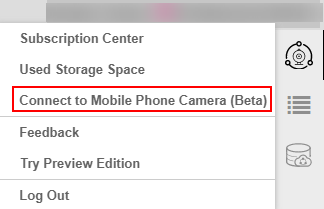

# 使用手机实时视频流编写/调试代码<a name="hilens_02_0088"></a>

新建技能开发项目，或打开已有的技能项目后，您就可以在HiLens Studio中通过编辑和调试技能逻辑代码，开发自己的技能。

当前技能项目已提供技能模板，可根据技能模板开发自己的技能代码，详情请见[编辑逻辑代码](#section122049921611)。

编辑完技能逻辑代码后，HiLens Studio提供使用手机实时视频流调试代码的功能，以手机摄像头实时的视频流作为技能输入，查看技能输出，详情请见[使用手机实时视频流调试代码](#section196261030192818)。

另外，您也可以使用预置视频流调试代码，详情请见[使用预置视频流调试代码](#section343343721619)。

## 前提条件<a name="section632144783716"></a>

在HiLens Studio中打开技能开发项目：

-   [新建技能项目](新建技能项目.md)
-   [打开已有技能项目](管理技能项目.md#li1984420053110)

## 项目文件说明<a name="section31895539159"></a>

在HiLens Studio界面单击左上角，左侧将展示开发项目的文件目录。打开项目源代码文件“src“，详细代码内容将呈现在HiLens Studio界面的编辑区，您可以直接编辑项目逻辑代码。

文件目录的详细说明如下所示：

```
开发项目名/
|── .hilens    
    ├── rtmp_source    生成的uuid，用于构成技能rtmp手机推流临时地址。
    ├── rtmp.txt    生成的uuid，用于构成技能rtmp推流临时地址。
    ├── skill_info.json    项目的元信息。
|── .theia 
    ├── launch.json    项目启动配置。
    ├── tasks.json     任务配置。
    ├── setting.json   C/C++ 配置。目前配置了cpp编译路径，是c++代码跳转非常重要的部分。
|── build 
    ├── CMakeLists.txt    文件。
    ├── kit_package_install.sh    技能部署至HiLens Kit打包脚本，此脚本可支持自定义，定制化部署技能至HiLens Kit。
    ├── build.sh    项目编译脚本。
    ├── clean.sh    项目清理脚本。
    ├── prebuild.sh    项目启动预处理脚本。
    ├── postbuild.sh   项目运行结束后处理脚本。
    ├── output    编译产物。
        ├── kit    HiLens Kit编译产物。
        ├── studio    HiLens Studio编译产物。
├── lib    c++项目第三方库。
├── data   工程需要使用的数据。
├── model    模型文件。
├── src    项目源代码。
├── test    测试数据。
    ├──  cameras0.mp4   HiLens Studio中Video Capture 默认读取的视频文件。
```

**项目文件操作**

右键单击项目文件，可针对自身业务对当前的文件进行一系列操作，详细的操作说明如[表1](#table5835101633015)所示。

**表 1**  项目文件操作说明

<a name="table5835101633015"></a>
<table><thead align="left"><tr id="row48341516183010"><th class="cellrowborder" valign="top" width="49.96%" id="mcps1.2.3.1.1"><p id="p14834141620308"><a name="p14834141620308"></a><a name="p14834141620308"></a>操作</p>
</th>
<th class="cellrowborder" valign="top" width="50.03999999999999%" id="mcps1.2.3.1.2"><p id="p1834141610303"><a name="p1834141610303"></a><a name="p1834141610303"></a>说明</p>
</th>
</tr>
</thead>
<tbody><tr id="row5835131612306"><td class="cellrowborder" valign="top" width="49.96%" headers="mcps1.2.3.1.1 "><p id="p13834916103019"><a name="p13834916103019"></a><a name="p13834916103019"></a>New File</p>
</td>
<td class="cellrowborder" valign="top" width="50.03999999999999%" headers="mcps1.2.3.1.2 "><p id="p12834171616307"><a name="p12834171616307"></a><a name="p12834171616307"></a>新建文件。</p>
</td>
</tr>
<tr id="row483571653014"><td class="cellrowborder" valign="top" width="49.96%" headers="mcps1.2.3.1.1 "><p id="p1483581663019"><a name="p1483581663019"></a><a name="p1483581663019"></a>New Folder</p>
</td>
<td class="cellrowborder" valign="top" width="50.03999999999999%" headers="mcps1.2.3.1.2 "><p id="p20835191673019"><a name="p20835191673019"></a><a name="p20835191673019"></a>新建文件夹。</p>
</td>
</tr>
<tr id="row118353161308"><td class="cellrowborder" valign="top" width="49.96%" headers="mcps1.2.3.1.1 "><p id="p14835616113015"><a name="p14835616113015"></a><a name="p14835616113015"></a>Open</p>
</td>
<td class="cellrowborder" valign="top" width="50.03999999999999%" headers="mcps1.2.3.1.2 "><p id="p1883541653012"><a name="p1883541653012"></a><a name="p1883541653012"></a>打开当前文件。</p>
</td>
</tr>
<tr id="row0996101814340"><td class="cellrowborder" valign="top" width="49.96%" headers="mcps1.2.3.1.1 "><p id="p9996141843413"><a name="p9996141843413"></a><a name="p9996141843413"></a>Find in Folder</p>
</td>
<td class="cellrowborder" valign="top" width="50.03999999999999%" headers="mcps1.2.3.1.2 "><p id="p3996171815340"><a name="p3996171815340"></a><a name="p3996171815340"></a>在当前文件搜索/替换关键词。</p>
</td>
</tr>
<tr id="row15278171973612"><td class="cellrowborder" valign="top" width="49.96%" headers="mcps1.2.3.1.1 "><p id="p72787194365"><a name="p72787194365"></a><a name="p72787194365"></a>Copy Download Link</p>
</td>
<td class="cellrowborder" valign="top" width="50.03999999999999%" headers="mcps1.2.3.1.2 "><p id="p227891910361"><a name="p227891910361"></a><a name="p227891910361"></a>复制下载当前文件的链接。</p>
</td>
</tr>
<tr id="row143015111375"><td class="cellrowborder" valign="top" width="49.96%" headers="mcps1.2.3.1.1 "><p id="p943071143713"><a name="p943071143713"></a><a name="p943071143713"></a>Upload Files</p>
</td>
<td class="cellrowborder" valign="top" width="50.03999999999999%" headers="mcps1.2.3.1.2 "><p id="p7430141173714"><a name="p7430141173714"></a><a name="p7430141173714"></a>上传本地文件至当前文件夹下。</p>
</td>
</tr>
<tr id="row13129175717384"><td class="cellrowborder" valign="top" width="49.96%" headers="mcps1.2.3.1.1 "><p id="p912945743815"><a name="p912945743815"></a><a name="p912945743815"></a>Ultra Download</p>
</td>
<td class="cellrowborder" valign="top" width="50.03999999999999%" headers="mcps1.2.3.1.2 "><p id="p713055793815"><a name="p713055793815"></a><a name="p713055793815"></a>下载当前文件/文件夹至本地。也可以备份技能项目，详情请见<a href="#section10874163295818">备份技能项目</a>。</p>
<div class="note" id="note19989988567"><a name="note19989988567"></a><a name="note19989988567"></a><span class="notetitle"> 说明： </span><div class="notebody"><a name="ul179381318145612"></a><a name="ul179381318145612"></a><ul id="ul179381318145612"><li>由于服务性能原因，从HiLens Studio下载文件大小限制在100M以内。</li><li>如果需要下载大文件，请使用OBS备份项目，然后在OBS下载超过限制大小的项目文件。</li></ul>
</div></div>
</td>
</tr>
<tr id="row527711683913"><td class="cellrowborder" valign="top" width="49.96%" headers="mcps1.2.3.1.1 "><p id="p627766133918"><a name="p627766133918"></a><a name="p627766133918"></a>Delete</p>
</td>
<td class="cellrowborder" valign="top" width="50.03999999999999%" headers="mcps1.2.3.1.2 "><p id="p1727713683917"><a name="p1727713683917"></a><a name="p1727713683917"></a>删除当前文件/文件夹。</p>
</td>
</tr>
<tr id="row1588144843914"><td class="cellrowborder" valign="top" width="49.96%" headers="mcps1.2.3.1.1 "><p id="p388194810398"><a name="p388194810398"></a><a name="p388194810398"></a>Duplicate</p>
</td>
<td class="cellrowborder" valign="top" width="50.03999999999999%" headers="mcps1.2.3.1.2 "><p id="p168810484399"><a name="p168810484399"></a><a name="p168810484399"></a>复制当前文件/文件夹。</p>
</td>
</tr>
<tr id="row926217384013"><td class="cellrowborder" valign="top" width="49.96%" headers="mcps1.2.3.1.1 "><p id="p1126203134010"><a name="p1126203134010"></a><a name="p1126203134010"></a>Rename</p>
</td>
<td class="cellrowborder" valign="top" width="50.03999999999999%" headers="mcps1.2.3.1.2 "><p id="p1626218316401"><a name="p1626218316401"></a><a name="p1626218316401"></a>重命名当前文件/文件夹。</p>
</td>
</tr>
</tbody>
</table>

## 备份技能项目<a name="section10874163295818"></a>

1.  登录华为HiLens管理控制台，在左侧导航栏中选择“技能开发\>HiLensStudio“。

    进入HiLens Studio页面。

2.  在HiLens Studio界面单击左上角“File“，在下拉框中选择“Backup Project\(s\) to OBS“。

    **图 1**  备份技能至OBS<a name="fig1356173618428"></a>  
    

3.  在对话框中选中“Back up all projects to OBS“，单击“OK“。

    耐心等待项目备份到OBS，待项目备份完成后，右下角会提示“Tasks are finished......“。

    如果项目备份失败，可以选择把项目下载至本地，右键单击鼠标选择“Download“，将项目下载至本地。

    **图 2**  Back up all projects to OBS<a name="fig37691650194113"></a>  
    


## 编辑逻辑代码<a name="section122049921611"></a>

打开项目源代码文件“src“，在HiLens Studio 界面的编辑区可直接编辑技能的逻辑代码。

**图 3**  编辑区<a name="fig937312109506"></a>  


华为HiLens提供了一套HiLens Framework，HiLens Framework通过封装底层接口、实现常用的管理功能，让开发者可以方便的开发Skill，发展AI生态。详细指导和API介绍可参见[《开发指南》](https://support.huaweicloud.com/devg-hilens/hilens_05_0001.html)。

## 使用手机实时视频流调试代码<a name="section196261030192818"></a>

HiLens Studio的调试器允许使用断点、单步调试等，与编辑器配合使用。在调试代码的过程中，可以使用手机登录HiLens Studio，以手机摄像头实时的视频流作为技能输入，查看技能输出。

-   **步骤一：绑定手机与HiLens Studio帐号**
    1.  在HiLens Studio界面右上角单击用户名，选择“接入手机摄像头（Beta）“。

        弹出“接入手机摄像头（Beta）“对话框。

        **图 4**  手机登录HiLens Studio<a name="fig23479581435"></a>  
        

    2.  按照“接入手机摄像头（Beta）“对话框的指引，打开手机微信，扫描对话框中的二维码。

        手机微信进入“EI体验空间“小程序。

        **图 5**  扫描小程序二维码<a name="fig1465617549432"></a>  
        

    3.  在手机微信小程序中，选择“HiLens Studio“。

        进入HiLens Studio手机小程序界面。

        **图 6**  HiLens Studio小程序<a name="fig1194354794620"></a>  
        

    4.  单击HiLens Studio界面“接入手机摄像头（Beta）“对话框的“下一步“。

        对话框显示摄像头推流二维码。

        **图 7**  摄像头推流二维码<a name="fig192762917416"></a>  
        

    5.  在HiLens Studio手机小程序界面勾选“用户协议“，然后单击“扫一扫“，用手机扫描步骤4中的二维码。

        进入手机调试界面，功能介绍如[表2](#table1853932865518)所示。此时手机与HiLens Studio帐号绑定，可以使用手机摄像头在线调试技能。

        **图 8**  手机调试界面<a name="fig1559410502190"></a>  
        

        **表 2**  手机调试功能说明

        <a name="table1853932865518"></a>
        <table><thead align="left"><tr id="row1853992815559"><th class="cellrowborder" valign="top" width="6.61%" id="mcps1.2.3.1.1"><p id="p853913289557"><a name="p853913289557"></a><a name="p853913289557"></a>序号</p>
        </th>
        <th class="cellrowborder" valign="top" width="93.39%" id="mcps1.2.3.1.2"><p id="p20539528135515"><a name="p20539528135515"></a><a name="p20539528135515"></a>说明</p>
        </th>
        </tr>
        </thead>
        <tbody><tr id="row1953917286558"><td class="cellrowborder" valign="top" width="6.61%" headers="mcps1.2.3.1.1 "><p id="p1753919282557"><a name="p1753919282557"></a><a name="p1753919282557"></a>1</p>
        </td>
        <td class="cellrowborder" valign="top" width="93.39%" headers="mcps1.2.3.1.2 "><p id="p742122518818"><a name="p742122518818"></a><a name="p742122518818"></a>当前手机摄像头调试的技能名称以及实时输入的视频流。</p>
        <p id="p14539122812553"><a name="p14539122812553"></a><a name="p14539122812553"></a>单击技能名称，可切换技能，在手机弹出的新界面选择新的技能，然后单击<span class="uicontrol" id="uicontrol12462023684"><a name="uicontrol12462023684"></a><a name="uicontrol12462023684"></a>“确定”</span>，即可切换技能。</p>
        </td>
        </tr>
        <tr id="row1253972817557"><td class="cellrowborder" valign="top" width="6.61%" headers="mcps1.2.3.1.1 "><p id="p1653992885518"><a name="p1653992885518"></a><a name="p1653992885518"></a>2</p>
        </td>
        <td class="cellrowborder" valign="top" width="93.39%" headers="mcps1.2.3.1.2 "><p id="p55396281553"><a name="p55396281553"></a><a name="p55396281553"></a>当前调试的技能输出视频流。</p>
        </td>
        </tr>
        <tr id="row34751313205612"><td class="cellrowborder" valign="top" width="6.61%" headers="mcps1.2.3.1.1 "><p id="p1147513133561"><a name="p1147513133561"></a><a name="p1147513133561"></a>3</p>
        </td>
        <td class="cellrowborder" valign="top" width="93.39%" headers="mcps1.2.3.1.2 "><p id="p0475191310563"><a name="p0475191310563"></a><a name="p0475191310563"></a>操作列，可进行如下操作：</p>
        <a name="ul7405152119236"></a><a name="ul7405152119236"></a><ul id="ul7405152119236"><li>前置摄像头:切换手机摄像头为前置摄像头。</li><li>后置摄像头：切换手机摄像头为后置摄像头。</li><li>暂停：暂停当前技能的调试或运行。</li><li>返回：退出当前手机调试技能界面，返回至HiLens Studio手机小程序界面。</li></ul>
        </td>
        </tr>
        </tbody>
        </table>


-   **步骤二：调试和运行技能代码**
    1.  在HiLens Studio编辑区代码左侧单击鼠标，出现断点。

        **图 9**  设置断点<a name="fig197668221901"></a>  
        

    2.  调试代码。

        单击HiLens Studio界面上方导航栏的，选择“Read Stream from Mobile Phone“。

        **图 10**  实时推流调试代码<a name="fig1176617221015"></a>  
        

        在HiLens Studio界面下方“Debug Console“  查看代码调试信息。

        **图 11**  Debug Console<a name="fig976618222010"></a>  
        

    3.  运行代码

        代码调试完成后，可运行代码，查看技能输出。

        单击HiLens Studio界面上方导航栏的运行按钮。

        HDMI技能在运行完技能代码后，可在HiLens Studio小程序界面查看技能输出。

        **图 12**  手机调试界面-27<a name="fig20207163242716"></a>  
        

        同时，也可在HiLens Studio界面右侧单击，在“Video Output“区查看技能输出。

        **图 13**  技能输出<a name="fig499016299919"></a>  
        


## 使用预置视频流调试代码<a name="section343343721619"></a>

HiLens Studio的调试器允许使用断点、单步调试等，与编辑器配合使用。

1.  在HiLens Studio编辑区代码左侧单击鼠标，出现断点。

    **图 14**  设置断点-28<a name="fig18393205815408"></a>  
    

2.  调试代码。

    方式一：单击HiLens Studio界面上方导航栏的，选择“Read Stream from File“。

    **图 15**  预置视频流调试代码<a name="fig1228315244153"></a>  
    

    方式二：单击HiLens Studio界面左侧的，弹出“Debug“区，单击开始调试代码。

    **图 16**  调试区<a name="fig10375426204717"></a>  
    

    方式三：快捷键“F5“，开始调试代码。

    在HiLens Studio界面下方“Debug Console“  查看代码调试信息。

    **图 17**  Debug Console-29<a name="fig18819145285112"></a>  
    

3.  运行代码

    代码调试完成后，可运行代码，查看技能输出。

    单击HiLens Studio界面上方导航栏的。

    HDMI技能在运行完技能代码后，可在HiLens Studio界面右侧单击，在“Video Output“区查看技能输出。

    如果视频流获取失败，可在“Video Output“区右上角单击刷新按钮重新获取。

    **图 18**  技能输出-30<a name="fig1421512451910"></a>  
    


## 后续操作<a name="section17251121115815"></a>

技能代码编辑和调试成功后，您可以把调试好的技能安装至端侧设备，详情请见[HiLens Studio安装技能](HiLens-Studio安装技能.md)。

