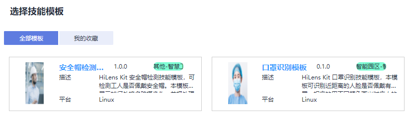
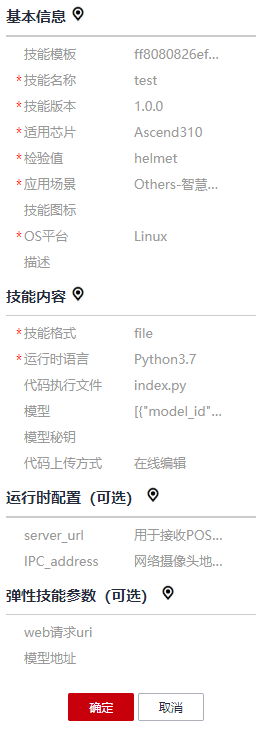

# 使用技能模板

本章节介绍使用技能模板新建技能的操作步骤。使用技能模板新建技能，可以使用技能模板中的默认值，包含逻辑代码或算法模型等，只需填写基本信息即可完成一个技能的创建。

## 前提条件

已在技能模板页面查找并获取到满足响应业务要求的技能模板，详细操作请参见[获取技能模板](获取技能模板.md)。

## 1. 开始新建技能

1.  登录Huawei HiLens管理控制台，在左侧导航栏中选择“技能开发 \> 技能管理“，进入技能列表。
2.  在“技能管理“页面，单击右上角“新建技能“，进入“创建技能“页面。

## 2. 选择模板

1.  在“创建技能“页面，在“技能模板“中单击“选择已有模板“，弹出“选择技能模板“对话框。

    **图 1**  选择技能模板  
    

2.  在弹出的对话框中，选择您想要使用的模板，然后单击“确定“。

    此时，页面自动跳转至“创建技能“页面的“技能内容“编辑区域，您选择的模板的默认配置将自动加载，您可以在创建技能页面右侧查看到相关信息。

    **图 2**  技能基本信息  
    

## 3. 填写相关信息

选择已有模板后，您可以参考[使用空模板](使用空模板.md)章节的指导，填写技能相关信息，包含[基本信息](使用空模板.md#section1965413416481)、[技能内容](使用空模板.md#section1651084013481)、[运行时配置（可选）](使用空模板.md#section662915238494)。

其中，“检验值“会根据所选模板自动初始化，“名称（英文）“、“名称（中文）“、“版本“等参数是您必须填写的，技能模板并未携带此类信息。针对技能模板中的内容，您可以根据自身业务情况进行修改，也可以保持其默认值。

## 4. 确认信息并完成新建技能

上述参数填写完成后，您可以在界面右侧查看其配置参数值，如果某个字段填写错误，在右侧会显示一个小红叉。

确认信息无误后，单击“确定“完成技能创建。

**图 3**  确认信息并完成新建技能  

创建完成后，您的技能将进入“技能开发\>技能管理“页面，且状态为“未发布“，您可以执行发布操作，将技能[发布至技能市场](发布至技能市场.md)。

发布后，技能将处于“审核中“状态，Huawei HiLens工作人员将在3个工作日内完成审核，请您耐心等待。当审核通过后，状态将变更为“审核通过，已发布“。

