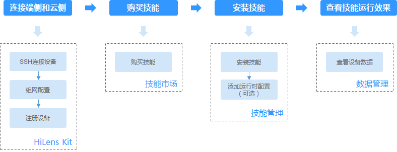
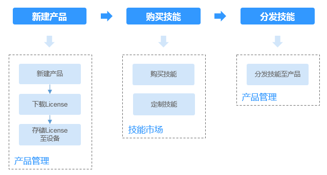

# 使用流程简介

Huawei HiLens面向三种不同用户提供了设备管理、技能开发、数据管理、技能市场、产品管理等功能，帮助用户开发AI技能并将其推送到端侧设备。

> **说明：**   
>端侧设备HiLens Kit的具体使用方法请参见[HiLens Kit用户指南](https://support.huawei.com/enterprise/zh/ai-computing-platform/a200-3000hilens-pid-250700826)。  

基于不同的使用场景，用户所需的功能不同。针对三种不同角色及其使用场景，梳理了其在Huawei HiLens中的主要使用流程；另外，针对Huawei HiLens提供的功能，您可以通过功能导读快速了解功能并通过链接跳转至相应章节了解详情。

针对三种不同角色的使用流程如下所示，此处仅罗列主要流程，其他管理操作可参见[Huawei HiLens功能导读](#section1711973715574)。

-   [普通用户使用技能](#section315912576266)
-   [开发者开发技能](#section1675624132710)
-   [厂商管理产品](#section1637816288273)

## 前提条件

-   在使用Huawei HiLens之前您需要申请华为云账号并进行实名认证。通过此账号，您可以使用所有华为云服务，并且只需为您所使用的服务付费。具体申请信息请见[账号注册](https://support.huaweicloud.com/usermanual-account/zh-cn_topic_0069252244.html)和[实名认证](https://support.huaweicloud.com/usermanual-account/zh-cn_topic_0057005689.html)。
-   由于Huawei HiLens服务依赖其他服务，所以需要在开始使用Huawei HiLens前获得相关服务的权限，包含ModelArts、OBS和SWR服务，Huawei HiLens与相关服务的关系请参见[与其它服务的关系](https://support.huaweicloud.com/productdesc-hilens/hilens_01_0006.html)。

## 普通用户使用技能

普通用户是指购买HiLens Kit设备，希望提高家庭、商超、园区或工地等场景下的智能监控能力的用户。

**图 1**  普通用户使用流程  

**表 1**  普通用户使用流程说明

<table><thead align="left"><tr id="row177815201330"><th class="cellrowborder" valign="top" width="19.71%" id="mcps1.2.4.1.1">
主任务

</th>
<th class="cellrowborder" valign="top" width="42.04%" id="mcps1.2.4.1.2">
说明

</th>
<th class="cellrowborder" valign="top" width="38.25%" id="mcps1.2.4.1.3">
详细指导

</th>
</tr>
</thead>
<tbody><tr id="row10781142063317"><td class="cellrowborder" valign="top" width="19.71%" headers="mcps1.2.4.1.1 ">
<strong id="b10945102545416">注册HiLens Kit</strong>

</td>
<td class="cellrowborder" valign="top" width="42.04%" headers="mcps1.2.4.1.2 ">
首先，连接您购买的HiLens Kit，并将HiLens Kit注册到Huawei HiLens平台，连接端侧与云测。

</td>
<td class="cellrowborder" valign="top" width="38.25%" headers="mcps1.2.4.1.3 ">
<a href="注册HiLens-Kit.md">注册HiLens Kit</a>

</td>
</tr>
<tr id="row1978122053313"><td class="cellrowborder" rowspan="2" valign="top" width="19.71%" headers="mcps1.2.4.1.1 ">
<strong id="b144239913716">订购技能</strong>

</td>
<td class="cellrowborder" valign="top" width="42.04%" headers="mcps1.2.4.1.2 ">
<strong id="b1196061782913">定制技能</strong>（可选）：技能市场现有的技能无法满足您的需求，您可以提出定制需求。针对HiLens Kit设备，您需要定制用于Ascend芯片的技能。

</td>
<td class="cellrowborder" valign="top" width="38.25%" headers="mcps1.2.4.1.3 ">
<a href="定制技能.md">定制技能</a>

</td>
</tr>
<tr id="row11537220132910"><td class="cellrowborder" valign="top" headers="mcps1.2.4.1.1 ">
<strong id="b119282242349">购买技能</strong>：在技能市场直接购买所需要的技能，或者在技能市场上购买已定制完成的技能，以便安装在设备上使用，拓展设备的AI能力。在技能市场中，请选择适用于Ascend芯片的技能。

</td>
<td class="cellrowborder" valign="top" headers="mcps1.2.4.1.2 ">
<a href="购买技能.md">购买技能</a>

</td>
</tr>
<tr id="row37828207331"><td class="cellrowborder" valign="top" width="19.71%" headers="mcps1.2.4.1.1 ">
<strong id="b742412933710">安装技能</strong>

</td>
<td class="cellrowborder" valign="top" width="42.04%" headers="mcps1.2.4.1.2 ">
将购买的技能安装到设备上。

</td>
<td class="cellrowborder" valign="top" width="38.25%" headers="mcps1.2.4.1.3 ">
<a href="安装技能.md">安装技能</a>

</td>
</tr>
<tr id="row1782142010336"><td class="cellrowborder" valign="top" width="19.71%" headers="mcps1.2.4.1.1 ">
<strong id="b1425179183717">查看技能运行效果</strong>

</td>
<td class="cellrowborder" valign="top" width="42.04%" headers="mcps1.2.4.1.2 ">
查看设备数据以及技能的运行效果。

</td>
<td class="cellrowborder" valign="top" width="38.25%" headers="mcps1.2.4.1.3 ">
<a href="管理数据.md">管理数据</a>

</td>
</tr>
</tbody>
</table>

## 开发者开发技能

Huawei HiLens提供了技能开发的平台，您可以根据自身情况开发可用于Ascend310或者海思35XX系列的技能。适用于Ascend310芯片的技能可直接安装部署在HiLens Kit设备中使用。

由于使用海思35XX系列芯片的设备，其芯片内存和性能偏低，需要对模型进行优化后才能运行，其对应的技能开发难度较大，如果碰到困难，可联系Huawei HiLens平台工作人员支撑。

-   技能开发过程中需要将技能部署到设备，以便查看技能运行效果，所以建议开发者购买一个HiLens Kit设备。
-   开发技能需要模型，所以开发者需要在本地或在ModelArts中训练好AI模型。在ModelArts中训练模型可参见[ModelArts训练模型](https://support.huaweicloud.com/engineers-modelarts/modelarts_23_0044.html)。

使用流程如[图2](#fig274432216232)，流程说明请参见[表2](#table422723792410)。

**图 2**  开发者使用流程  

**表 2**  开发者使用流程说明

<table><thead align="left"><tr id="row42281837142419"><th class="cellrowborder" valign="top" width="20.217978202179776%" id="mcps1.2.4.1.1">
流程

</th>
<th class="cellrowborder" valign="top" width="50.864913508649124%" id="mcps1.2.4.1.2">
说明

</th>
<th class="cellrowborder" valign="top" width="28.91710828917108%" id="mcps1.2.4.1.3">
详细指导

</th>
</tr>
</thead>
<tbody><tr id="row1228137142411"><td class="cellrowborder" valign="top" width="20.217978202179776%" headers="mcps1.2.4.1.1 ">
注册HiLens Kit

</td>
<td class="cellrowborder" valign="top" width="50.864913508649124%" headers="mcps1.2.4.1.2 ">
首先，连接您购买的HiLens Kit，并将HiLens Kit注册到Huawei HiLens平台，连接端侧与云侧。

</td>
<td class="cellrowborder" valign="top" width="28.91710828917108%" headers="mcps1.2.4.1.3 ">
<a href="HiLens-Kit简介.md">HiLens Kit简介</a>

<a href="智能边缘系统注册设备.md">智能边缘系统注册设备</a>

<a href="使用SSH注册设备.md">使用SSH注册设备</a>

</td>
</tr>
<tr id="row0228737202417"><td class="cellrowborder" rowspan="2" valign="top" width="20.217978202179776%" headers="mcps1.2.4.1.1 ">
开发技能

</td>
<td class="cellrowborder" valign="top" width="50.864913508649124%" headers="mcps1.2.4.1.2 ">
<strong id="b5752956297">使用技能模板新建技能</strong>：获取Huawei HiLens提供的技能模板（已经包含了算法模型和逻辑代码），快速新建技能。

</td>
<td class="cellrowborder" valign="top" width="28.91710828917108%" headers="mcps1.2.4.1.3 ">
<a href="获取技能模板.md">获取技能模板</a>

<a href="使用技能模板.md">使用技能模板</a>

</td>
</tr>
<tr id="row8228163711246"><td class="cellrowborder" valign="top" headers="mcps1.2.4.1.1 ">
<strong id="b4344884293">使用空模板新建技能</strong>：为满足更多业务诉求，可以自行开发模型，并将开发好的算法模型导入Huawei HiLens，根据业务诉求编写逻辑代码，然后基于您自定义的算法模型和逻辑代码新建技能。

如果您的算法模型不符合Huawei HiLens格式要求，还可以使用模型转换功能满足要求。

</td>
<td class="cellrowborder" valign="top" headers="mcps1.2.4.1.2 ">
<a href="开发模型.md">开发模型</a>

<a href="导入（转换）模型.md">导入（转换）模型</a>

<a href="编写逻辑代码.md">编写逻辑代码</a>

<a href="使用空模板.md">使用空模板</a>

</td>
</tr>
<tr id="row5228163713241"><td class="cellrowborder" valign="top" width="20.217978202179776%" headers="mcps1.2.4.1.1 ">
部署技能

</td>
<td class="cellrowborder" valign="top" width="50.864913508649124%" headers="mcps1.2.4.1.2 ">
将技能部署到设备上，便于调试运行效果。

</td>
<td class="cellrowborder" valign="top" width="28.91710828917108%" headers="mcps1.2.4.1.3 ">
<a href="部署和调试技能.md">部署和调试技能</a>

</td>
</tr>
<tr id="row11630782815"><td class="cellrowborder" valign="top" width="20.217978202179776%" headers="mcps1.2.4.1.1 ">
查看技能运行效果

</td>
<td class="cellrowborder" valign="top" width="50.864913508649124%" headers="mcps1.2.4.1.2 ">
查看设备数据以及技能的运行效果。

</td>
<td class="cellrowborder" valign="top" width="28.91710828917108%" headers="mcps1.2.4.1.3 ">
<a href="管理数据.md">管理数据</a>

</td>
</tr>
<tr id="row294772391611"><td class="cellrowborder" valign="top" width="20.217978202179776%" headers="mcps1.2.4.1.1 ">
发布至技能市场

</td>
<td class="cellrowborder" valign="top" width="50.864913508649124%" headers="mcps1.2.4.1.2 ">
将技能发布到技能市场，供用户安装使用。

</td>
<td class="cellrowborder" valign="top" width="28.91710828917108%" headers="mcps1.2.4.1.3 ">
<a href="发布技能.md">发布技能</a>

</td>
</tr>
</tbody>
</table>

## 厂商管理产品

针对生产海思35xx系列芯片的摄像头的设备商，Huawei HiLens提供了一个产品管理的流程。设备厂商可以通过Huawei HiLens管理设备产品，订购技能，然后将License分发至产品设备，使得厂商的设备具备AI能力。

厂商管理产品的使用流程如[图3](#fig1640644961614)，流程说明请参见[表3](#table8290178131718)。

**图 3**  厂商使用流程  

**表 3**  厂商的使用流程说明

<table><thead align="left"><tr id="row829119811710"><th class="cellrowborder" valign="top" width="21.73%" id="mcps1.2.4.1.1">
流程

</th>
<th class="cellrowborder" valign="top" width="48.89%" id="mcps1.2.4.1.2">
说明

</th>
<th class="cellrowborder" valign="top" width="29.38%" id="mcps1.2.4.1.3">
详细指导

</th>
</tr>
</thead>
<tbody><tr id="row92913815173"><td class="cellrowborder" valign="top" width="21.73%" headers="mcps1.2.4.1.1 ">
新建产品

</td>
<td class="cellrowborder" valign="top" width="48.89%" headers="mcps1.2.4.1.2 ">
厂商创建一个产品，然后把设备“关联”到这个产品。

</td>
<td class="cellrowborder" valign="top" width="29.38%" headers="mcps1.2.4.1.3 ">
<a href="新建产品.md">新建产品</a>

</td>
</tr>
<tr id="row1629119821719"><td class="cellrowborder" rowspan="2" valign="top" width="21.73%" headers="mcps1.2.4.1.1 ">
订购技能

</td>
<td class="cellrowborder" valign="top" width="48.89%" headers="mcps1.2.4.1.2 ">
<strong id="b07371197295">定制技能</strong>：技能市场现有的技能无法满足您的需求，您可以提出定制需求。提出需求时，需指定此技能适用于海思35XX系列芯片。

</td>
<td class="cellrowborder" valign="top" width="29.38%" headers="mcps1.2.4.1.3 ">
<a href="定制技能.md">定制技能</a>

</td>
</tr>
<tr id="row430319714181"><td class="cellrowborder" valign="top" headers="mcps1.2.4.1.1 ">
<strong id="b0459151792912">购买技能</strong>：在技能市场直接购买所需要的技能（适用于海思35XX系列的芯片），或者在技能市场上购买已定制完成的技能，以便分发至用户设备上使用。

</td>
<td class="cellrowborder" valign="top" headers="mcps1.2.4.1.2 ">
<a href="购买技能.md">购买技能</a>

</td>
</tr>
<tr id="row3303174114207"><td class="cellrowborder" valign="top" width="21.73%" headers="mcps1.2.4.1.1 ">
分发技能

</td>
<td class="cellrowborder" valign="top" width="48.89%" headers="mcps1.2.4.1.2 ">
将订购的技能分发到设备上，并下载SDK集成到设备上，供用户使用。

</td>
<td class="cellrowborder" valign="top" width="29.38%" headers="mcps1.2.4.1.3 ">
<a href="分发技能.md">分发技能</a>

</td>
</tr>
</tbody>
</table>

## Huawei HiLens功能导读

**表 4**  文档导读

<table><thead align="left"><tr id="row138992555110"><th class="cellrowborder" valign="top" width="24.57%" id="mcps1.2.4.1.1">
章节

</th>
<th class="cellrowborder" valign="top" width="18.759999999999998%" id="mcps1.2.4.1.2">
面向角色

</th>
<th class="cellrowborder" valign="top" width="56.67%" id="mcps1.2.4.1.3">
说明

</th>
</tr>
</thead>
<tbody><tr id="row826013465468"><td class="cellrowborder" valign="top" width="24.57%" headers="mcps1.2.4.1.1 ">
<a href="#section24641135291">注册账号和实名认证</a>

</td>
<td class="cellrowborder" valign="top" width="18.759999999999998%" headers="mcps1.2.4.1.2 ">
ALL

</td>
<td class="cellrowborder" valign="top" width="56.67%" headers="mcps1.2.4.1.3 ">
首先，作为任意一种角色，您需要申请华为云账号并进行实名认证。通过此账号，您可以使用所有华为云服务，并且只需为您所使用的服务付费。在开始使用Huawei HiLens前获得其他相关服务的授权，然后再进入Huawei HiLens管理控制台使用相关功能。

</td>
</tr>
<tr id="row109731656124718"><td class="cellrowborder" valign="top" width="24.57%" headers="mcps1.2.4.1.1 ">
<a href="注册HiLens-Kit.md">注册HiLens Kit</a>

</td>
<td class="cellrowborder" valign="top" width="18.759999999999998%" headers="mcps1.2.4.1.2 "><ul id="ul751433319281"><li>普通用户</li><li>开发者</li></ul>
</td>
<td class="cellrowborder" valign="top" width="56.67%" headers="mcps1.2.4.1.3 ">
针对普通使用者或开发者，在使用技能或开发技能前，需先购买HiLens Kit设备，并且参考操作指导完成连接，将端侧HiLens Kit与云侧Huawei HiLens管理控制台完成连接。

</td>
</tr>
<tr id="row038932545110"><td class="cellrowborder" valign="top" width="24.57%" headers="mcps1.2.4.1.1 ">
<a href="设备管理简介.md">设备管理</a>

</td>
<td class="cellrowborder" valign="top" width="18.759999999999998%" headers="mcps1.2.4.1.2 "><ul id="ul01641439132817"><li>普通用户</li><li>开发者</li></ul>
</td>
<td class="cellrowborder" valign="top" width="56.67%" headers="mcps1.2.4.1.3 ">
您可以通过Huawei HiLens管理控制台管理已注册的HiLens Kit设备。包括设备上的技能管理、升级固件、配置摄像头等操作。对于拥有HiLens Kit设备的用户（包括普通使用者和开发者），您都可以通过设备管理的操作，管理您的设备。

</td>
</tr>
<tr id="row1438952518518"><td class="cellrowborder" valign="top" width="24.57%" headers="mcps1.2.4.1.1 ">
<a href="技能简介.md">技能开发</a>

</td>
<td class="cellrowborder" valign="top" width="18.759999999999998%" headers="mcps1.2.4.1.2 ">
开发者

</td>
<td class="cellrowborder" valign="top" width="56.67%" headers="mcps1.2.4.1.3 ">
对于开发者，您可以在Huawei HiLens平台新建您的技能，可以使用技能模板新建技能，或者自行开发算法模型和逻辑代码，再用于新建技能。另外，还支持将您开发的技能安装部署至设备进行调试。

最后，针对调试完成的技能，您可以将其发布至技能市场，供更多用户获取使用，同时您还能获得相应的报酬。

</td>
</tr>
<tr id="row1975515318281"><td class="cellrowborder" valign="top" width="24.57%" headers="mcps1.2.4.1.1 ">
<a href="技能市场简介.md">技能市场</a>

</td>
<td class="cellrowborder" valign="top" width="18.759999999999998%" headers="mcps1.2.4.1.2 ">
ALL

</td>
<td class="cellrowborder" valign="top" width="56.67%" headers="mcps1.2.4.1.3 ">
技能市场是一个开放的平台，提供了适用于不同芯片、不同应用场景的技能。您可以在技能市场购买技能、定制技能。如果您是开发者，也可以将自己开发的技能发布至技能市场，收取相应的报酬。

</td>
</tr>
<tr id="row883981082812"><td class="cellrowborder" valign="top" width="24.57%" headers="mcps1.2.4.1.1 ">
<a href="管理数据.md">数据管理</a>

</td>
<td class="cellrowborder" valign="top" width="18.759999999999998%" headers="mcps1.2.4.1.2 "><ul id="ul1578184218284"><li>普通用户</li><li>开发者</li></ul>
</td>
<td class="cellrowborder" valign="top" width="56.67%" headers="mcps1.2.4.1.3 ">
针对注册至Huawei HiLens的设备，您可以查看设备的视频数据以及技能的运行效果。通过查看设备数据，了解技能运行效果。

</td>
</tr>
<tr id="row10425123216485"><td class="cellrowborder" valign="top" width="24.57%" headers="mcps1.2.4.1.1 ">
<a href="管理产品.md">管理产品</a>

</td>
<td class="cellrowborder" valign="top" width="18.759999999999998%" headers="mcps1.2.4.1.2 ">
厂商

</td>
<td class="cellrowborder" valign="top" width="56.67%" headers="mcps1.2.4.1.3 ">
针对厂商（使用海思35XX系列芯片的设备厂商），您可以使用Huawei HiLens平台管理您的产品，同时订购相应的技能，将技能分发至产品设备中，并下载SDK集成到设备上，使得您的设备产品具备AI能力。

</td>
</tr>
</tbody>
</table>

