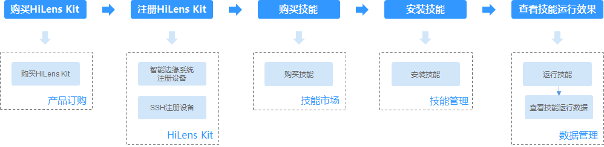
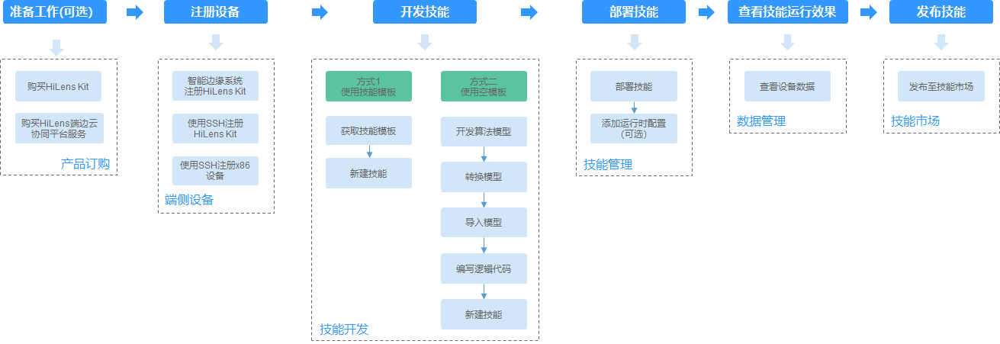
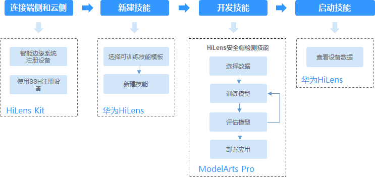

# 使用流程简介

华为HiLens面向三种不同用户提供了设备管理、技能开发、数据管理、技能市场、产品管理等功能，帮助用户开发AI技能并将其推送到端侧设备。

> **说明：** 
>端侧设备HiLens Kit的具体使用方法请参见[HiLens Kit用户指南](https://support.huawei.com/enterprise/zh/ai-computing-platform/a200-3000hilens-pid-250700826)。

基于不同的使用场景，用户所需的功能不同。针对三种不同角色及其使用场景，梳理了其在华为HiLens中的主要使用流程；另外，针对华为HiLens提供的功能，您可以通过功能导读快速了解功能并通过链接跳转至相应章节了解详情。

针对不同角色的使用流程如下所示，此处仅罗列主要流程，其他管理操作可参见[华为HiLens功能导读](#section1711973715574)。

-   [普通用户使用技能](#section315912576266)
-   [开发者控制台开发技能](#section1675624132710)
-   [新建可训练技能的流程](#section149812434162)
-   [使用HiLens Studio 开发技能](#section8994341145620)
-   [厂商管理产品](#section1637816288273)

## 前提条件

-   在使用华为HiLens之前您需要申请华为云帐号并进行实名认证。通过此帐号，您可以使用所有华为云服务，并且只需为您所使用的服务付费。具体申请信息请见[帐号注册](https://support.huaweicloud.com/usermanual-account/account_id_001.html)和[实名认证](https://support.huaweicloud.com/usermanual-account/account_auth_00001.html)。
-   由于华为HiLens服务依赖其他服务，所以需要在开始使用华为HiLens前获得相关服务的权限，包含ModelArts、OBS和SWR服务，华为HiLens与相关服务的关系请参见[与其它服务的关系](https://support.huaweicloud.com/productdesc-hilens/hilens_01_0006.html)。

## 普通用户使用技能

普通用户是指购买HiLens Kit设备，希望提高家庭、商超、园区或工地等场景下的智能监控能力的用户。

**图 1**  普通用户使用流程  

**表 1**  普通用户使用流程说明

<table><thead align="left"><tr id="row177815201330"><th class="cellrowborder" valign="top" width="19.71%" id="mcps1.2.4.1.1">
主任务

</th>
<th class="cellrowborder" valign="top" width="42.04%" id="mcps1.2.4.1.2">
说明

</th>
<th class="cellrowborder" valign="top" width="38.25%" id="mcps1.2.4.1.3">
详细指导

</th>
</tr>
</thead>
<tbody><tr id="row1367929191316"><td class="cellrowborder" valign="top" width="19.71%" headers="mcps1.2.4.1.1 ">
<strong id="b8318815141418">购买HiLens Kit</strong>

</td>
<td class="cellrowborder" valign="top" width="42.04%" headers="mcps1.2.4.1.2 ">
使用技能的前提条件是购买HiLens Kit设备。

</td>
<td class="cellrowborder" valign="top" width="38.25%" headers="mcps1.2.4.1.3 ">
<a href="订购HiLens-Kit.md">订购HiLens Kit</a>

</td>
</tr>
<tr id="row10781142063317"><td class="cellrowborder" valign="top" width="19.71%" headers="mcps1.2.4.1.1 ">
<strong id="b10945102545416">注册HiLens Kit</strong>

</td>
<td class="cellrowborder" valign="top" width="42.04%" headers="mcps1.2.4.1.2 ">
首先，连接您购买的HiLens Kit，并将HiLens Kit注册到华为HiLens平台，连接端侧与云测。

</td>
<td class="cellrowborder" valign="top" width="38.25%" headers="mcps1.2.4.1.3 ">
<a href="HiLens-Kit注册流程.md">HiLens Kit注册流程</a>

<a href="智能边缘系统注册设备.md">智能边缘系统注册设备</a>

<a href="使用SSH注册设备.md">使用SSH注册设备</a>

</td>
</tr>
<tr id="row1978122053313"><td class="cellrowborder" rowspan="2" valign="top" width="19.71%" headers="mcps1.2.4.1.1 ">
<strong id="b144239913716">订购技能</strong>

</td>
<td class="cellrowborder" valign="top" width="42.04%" headers="mcps1.2.4.1.2 ">
<strong id="b1196061782913">定制技能</strong>（可选）：技能市场现有的技能无法满足您的需求，您可以提出定制需求。针对HiLens Kit设备，您需要定制用于Ascend芯片的技能。

</td>
<td class="cellrowborder" valign="top" width="38.25%" headers="mcps1.2.4.1.3 ">
<a href="定制技能.md">定制技能</a>

</td>
</tr>
<tr id="row11537220132910"><td class="cellrowborder" valign="top" headers="mcps1.2.4.1.1 ">
<strong id="b119282242349">购买技能</strong>：在技能市场直接购买所需要的技能，或者在技能市场上购买已定制完成的技能，以便安装在设备上使用，拓展设备的AI能力。在技能市场中，请选择适用于Ascend芯片的技能。

</td>
<td class="cellrowborder" valign="top" headers="mcps1.2.4.1.2 ">
<a href="购买技能.md">购买技能</a>

</td>
</tr>
<tr id="row37828207331"><td class="cellrowborder" valign="top" width="19.71%" headers="mcps1.2.4.1.1 ">
<strong id="b742412933710">安装技能</strong>

</td>
<td class="cellrowborder" valign="top" width="42.04%" headers="mcps1.2.4.1.2 ">
将购买的技能安装到设备上。

</td>
<td class="cellrowborder" valign="top" width="38.25%" headers="mcps1.2.4.1.3 ">
<a href="安装技能.md">安装技能</a>

</td>
</tr>
<tr id="row1782142010336"><td class="cellrowborder" valign="top" width="19.71%" headers="mcps1.2.4.1.1 ">
<strong id="b1425179183717">查看技能运行效果</strong>

</td>
<td class="cellrowborder" valign="top" width="42.04%" headers="mcps1.2.4.1.2 ">
查看设备数据以及技能的运行效果。

</td>
<td class="cellrowborder" valign="top" width="38.25%" headers="mcps1.2.4.1.3 ">
<a href="管理数据.md">管理数据</a>

</td>
</tr>
</tbody>
</table>

## 开发者控制台开发技能

华为HiLens提供了技能开发的平台，您可以根据自身情况开发可用于Ascend310或者海思35XX系列的技能。适用于Ascend310芯片的技能可直接安装部署在HiLens Kit设备中使用。

由于使用海思35XX系列芯片的设备，其芯片内存和性能偏低，需要对模型进行优化后才能运行，其对应的技能开发难度较大，如果碰到困难，可联系华为HiLens平台工作人员支撑。

-   技能开发过程中需要将技能部署到设备，以便查看技能运行效果，所以建议开发者购买一个HiLens Kit设备。
-   开发技能需要模型，所以开发者需要在本地或在ModelArts中训练好AI模型。在ModelArts中训练模型可参见[ModelArts训练模型](https://support.huaweicloud.com/engineers-modelarts/modelarts_23_0044.html)。

使用流程如[图2](#fig09151710114711)，流程说明请参见[表2](#table422723792410)。

**图 2**  开发者使用流程  

**表 2**  开发者使用流程说明

<table><thead align="left"><tr id="row42281837142419"><th class="cellrowborder" valign="top" width="20.18798120187981%" id="mcps1.2.4.1.1">
流程

</th>
<th class="cellrowborder" valign="top" width="50.89491050894911%" id="mcps1.2.4.1.2">
说明

</th>
<th class="cellrowborder" valign="top" width="28.917108289171082%" id="mcps1.2.4.1.3">
详细指导

</th>
</tr>
</thead>
<tbody><tr id="row9173734103918"><td class="cellrowborder" valign="top" width="20.18798120187981%" headers="mcps1.2.4.1.1 ">
准备工作

</td>
<td class="cellrowborder" valign="top" width="50.89491050894911%" headers="mcps1.2.4.1.2 ">
华为HiLens控制台支持设备管理和技能管理，在使用华为HiLens之前，您可以根据自身业务选择合适的设备。如果您选择HiLens Kit设备，请做好如下准备工作。<ul id="ul46891418426"><li>购买HiLens Kit
将开发好的技能安装至设备前提条件是购买HiLens  Kit设备。

</li><li>购买HiLens端边云协同平台服务并激活设备
当您注册的设备超过1台时，需购买HiLens端边云协同平台服务，在设备管理页面对指定设备进行权限激活后，该设备即可安装您自行开发的技能。

</li></ul>

</td>
<td class="cellrowborder" valign="top" width="28.917108289171082%" headers="mcps1.2.4.1.3 ">
<a href="订购HiLens-Kit.md">订购HiLens Kit</a>

<a href="订购HiLens端边云协同平台服务.md">订购HiLens端边云协同平台服务</a>

<a href="激活设备（购买端边云协同平台服务）.md">激活设备（购买端边云协同平台服务）</a>

</td>
</tr>
<tr id="row1228137142411"><td class="cellrowborder" valign="top" width="20.18798120187981%" headers="mcps1.2.4.1.1 ">
注册设备

</td>
<td class="cellrowborder" valign="top" width="50.89491050894911%" headers="mcps1.2.4.1.2 ">
首先，将设备注册到华为HiLens平台，连接端侧与云侧。华为HiLens支持HiLens Kit、Atlas500、Atlas 800，IVS 1800以及其他适配中设备。

</td>
<td class="cellrowborder" valign="top" width="28.917108289171082%" headers="mcps1.2.4.1.3 ">
<a href="注册HiLens-Kit.md">注册HiLens Kit</a>

</td>
</tr>
<tr id="row0228737202417"><td class="cellrowborder" rowspan="2" valign="top" width="20.18798120187981%" headers="mcps1.2.4.1.1 ">
开发技能

</td>
<td class="cellrowborder" valign="top" width="50.89491050894911%" headers="mcps1.2.4.1.2 ">
<strong id="b5752956297">使用技能模板新建技能</strong>：获取华为HiLens提供的技能模板（已经包含了算法模型和逻辑代码），快速新建技能。

</td>
<td class="cellrowborder" valign="top" width="28.917108289171082%" headers="mcps1.2.4.1.3 ">
<a href="获取技能模板.md">获取技能模板</a>

<a href="使用技能模板.md">使用技能模板</a>

</td>
</tr>
<tr id="row8228163711246"><td class="cellrowborder" valign="top" headers="mcps1.2.4.1.1 ">
<strong id="b4344884293">使用空模板新建技能</strong>：为满足更多业务诉求，可以自行开发模型，并将开发好的算法模型导入华为HiLens，根据业务诉求编写逻辑代码，然后基于您自定义的算法模型和逻辑代码新建技能。

如果您的算法模型不符合华为HiLens格式要求，还可以使用模型转换功能满足要求。

</td>
<td class="cellrowborder" valign="top" headers="mcps1.2.4.1.2 ">
<a href="开发算法模型.md">开发算法模型</a>

<a href="导入（转换）模型.md">导入（转换）模型</a>

<a href="编写逻辑代码.md">编写逻辑代码</a>

<a href="使用空模板.md">使用空模板</a>

</td>
</tr>
<tr id="row5228163713241"><td class="cellrowborder" valign="top" width="20.18798120187981%" headers="mcps1.2.4.1.1 ">
部署技能

</td>
<td class="cellrowborder" valign="top" width="50.89491050894911%" headers="mcps1.2.4.1.2 ">
将技能部署到设备上，便于调试运行效果。

</td>
<td class="cellrowborder" valign="top" width="28.917108289171082%" headers="mcps1.2.4.1.3 ">
<a href="安装和调试技能.md">安装和调试技能</a>

</td>
</tr>
<tr id="row11630782815"><td class="cellrowborder" valign="top" width="20.18798120187981%" headers="mcps1.2.4.1.1 ">
查看技能运行效果

</td>
<td class="cellrowborder" valign="top" width="50.89491050894911%" headers="mcps1.2.4.1.2 ">
查看设备数据以及技能的运行效果。

</td>
<td class="cellrowborder" valign="top" width="28.917108289171082%" headers="mcps1.2.4.1.3 ">
<a href="管理数据.md">管理数据</a>

</td>
</tr>
<tr id="row294772391611"><td class="cellrowborder" valign="top" width="20.18798120187981%" headers="mcps1.2.4.1.1 ">
发布技能至技能市场

</td>
<td class="cellrowborder" valign="top" width="50.89491050894911%" headers="mcps1.2.4.1.2 ">
将技能发布到技能市场，供用户安装使用。

</td>
<td class="cellrowborder" valign="top" width="28.917108289171082%" headers="mcps1.2.4.1.3 ">
<a href="发布技能.md">发布技能</a>

</td>
</tr>
</tbody>
</table>

## 新建可训练技能的流程

ModelArts Pro控制台提供可训练技能工作流，使用可训练技能模板在ModelArts Pro控制台自主上传数据训练模型，无需代码，即可快速提高模型精度，创建技能，并且一键部署至设备。

> **说明：** 
>-   使用可训练技能模板新建技能，仅支持训练模型提高模型精度，暂不支持修改技能模板的逻辑代码。如果您希望自行修改技能的逻辑代码，可以选择在华为HiLens控制台开发技能，详情请见[控制台开发技能](控制台开发技能.md)。
>-   在开发可训练技能时，会占用OBS资源，需要收取一定费用，收费规则请参见[对象存储服务 OBS](https://www.huaweicloud.com/pricing.html?tab=detail#/obs)。
>-   在开发可训练技能时，会占用ModelArts的训练资源，需要收取一定费用，收费规则请参见[ModelArts价格详情](https://www.huaweicloud.com/pricing.html?tab=detail#/modelarts)。

新建可训练技能的详细流程如[图3](#hilens_02_0138_fig1389453811182)所示。

**图 3**  可训练技能开发流程  

**表 3**  新建可训练技能常用操作指引

<table><thead align="left"><tr id="hilens_02_0138_row1490445101912"><th class="cellrowborder" colspan="2" valign="top" id="mcps1.2.5.1.1">
步骤

</th>
<th class="cellrowborder" valign="top" id="mcps1.2.5.1.2">
说明

</th>
<th class="cellrowborder" valign="top" id="mcps1.2.5.1.3">
快速跳转至详细指导

</th>
</tr>
</thead>
<tbody><tr id="hilens_02_0138_row151962873112"><td class="cellrowborder" colspan="2" valign="top" headers="mcps1.2.5.1.1 ">
连接端侧和云侧

</td>
<td class="cellrowborder" valign="top" headers="mcps1.2.5.1.2 ">
首先，连接您购买的HiLens Kit，并将HiLens Kit注册到华为HiLens平台，连接端侧与云侧。

</td>
<td class="cellrowborder" valign="top" headers="mcps1.2.5.1.3 ">
<a href="HiLens-Kit注册流程.md">HiLens Kit注册流程</a>

<a href="智能边缘系统注册设备.md">智能边缘系统注册设备</a>

<a href="使用SSH注册设备.md">使用SSH注册设备</a>

</td>
</tr>
<tr id="hilens_02_0138_row149014514196"><td class="cellrowborder" colspan="2" valign="top" headers="mcps1.2.5.1.1 ">
新建可训练技能（使用可训练技能模板）

</td>
<td class="cellrowborder" valign="top" headers="mcps1.2.5.1.2 ">
基于预置的可训练技能新建技能，填写技能的基本信息。

</td>
<td class="cellrowborder" valign="top" headers="mcps1.2.5.1.3 ">
<a href="新建可训练技能.md">新建可训练技能</a>

</td>
</tr>
<tr id="hilens_02_0138_row16901445121912"><td class="cellrowborder" colspan="2" valign="top" headers="mcps1.2.5.1.1 ">
开发技能（HiLens安全帽检测技能）

</td>
<td class="cellrowborder" valign="top" headers="mcps1.2.5.1.2 ">
根据工作流指引，开发安全帽检测技能，通过上传训练数据，训练生成安全帽检测模型，自主更新和调整模型精度，实现高精度的安全帽检测功能，并一键安装技能至HiLens Kit设备。

</td>
<td class="cellrowborder" valign="top" headers="mcps1.2.5.1.3 ">
<a href="HiLens安全帽检测技能.md">HiLens安全帽检测技能</a>

</td>
</tr>
<tr id="hilens_02_0138_row161981544123410"><td class="cellrowborder" colspan="2" valign="top" headers="mcps1.2.5.1.1 ">
启动技能

</td>
<td class="cellrowborder" valign="top" headers="mcps1.2.5.1.2 ">
把技能安装至设备后，可以直接在HiLens Studio中启动技能，查看技能运行效果。

</td>
<td class="cellrowborder" valign="top" headers="mcps1.2.5.1.3 ">
<a href="启动或停止技能.md">启动或停止技能</a>

</td>
</tr>
</tbody>
</table>

## 使用HiLens Studio 开发技能

本章节介绍在HiLens Studio开发技能。

使用HiLens Studio开发技能流程如[图4](#hilens_02_0086_fig261128121615)所示，流程说明请参见[表4](#hilens_02_0086_table10326435153411)。

> **说明：** 
>本章节仅介绍在HiLens Studio中开发技能所涉及的操作。在控制台新建技能的具体操作请参见[控制台开发技能](控制台开发技能.md)。

**图 4**  使用HiLens Studio 开发技能流程  

**表 4**  使用HiLens Studio 开发技能流程说明

<table><thead align="left"><tr id="hilens_02_0086_row13275352343"><th class="cellrowborder" valign="top" width="22.24222422242224%" id="mcps1.2.4.1.1">
流程

</th>
<th class="cellrowborder" valign="top" width="44.42444244424442%" id="mcps1.2.4.1.2">
说明

</th>
<th class="cellrowborder" valign="top" width="33.33333333333333%" id="mcps1.2.4.1.3">
详细指导

</th>
</tr>
</thead>
<tbody><tr id="hilens_02_0086_row13775521210"><td class="cellrowborder" valign="top" width="22.24222422242224%" headers="mcps1.2.4.1.1 ">
准备工作

</td>
<td class="cellrowborder" valign="top" width="44.42444244424442%" headers="mcps1.2.4.1.2 "><ul id="hilens_02_0086_ul14532341184712"><li>购买HiLens Kit
将开发好的技能安装至设备前提条件是购买HiLens  Kit设备。

</li><li>购买HiLens端边云协同平台服务并激活设备
当您注册的设备超过1台时，需购买HiLens端边云协同平台服务，在设备管理页面对指定设备进行权限激活后，该设备即可安装您自行开发的技能。

</li></ul>
</td>
<td class="cellrowborder" valign="top" width="33.33333333333333%" headers="mcps1.2.4.1.3 ">
<a href="订购HiLens-Kit.md">订购HiLens Kit</a>

<a href="订购HiLens端边云协同平台服务.md">订购HiLens端边云协同平台服务</a>

<a href="激活设备（购买端边云协同平台服务）.md">激活设备（购买端边云协同平台服务）</a>

</td>
</tr>
<tr id="hilens_02_0086_row9327103593413"><td class="cellrowborder" valign="top" width="22.24222422242224%" headers="mcps1.2.4.1.1 ">
连接端侧和云侧

</td>
<td class="cellrowborder" valign="top" width="44.42444244424442%" headers="mcps1.2.4.1.2 ">
首先，连接您购买的HiLens Kit，并将HiLens Kit注册到华为HiLens平台，连接端侧与云侧。

</td>
<td class="cellrowborder" valign="top" width="33.33333333333333%" headers="mcps1.2.4.1.3 ">
<a href="HiLens-Kit注册流程.md">HiLens Kit注册流程</a>

<a href="智能边缘系统注册设备.md">智能边缘系统注册设备</a>

<a href="使用SSH注册设备.md">使用SSH注册设备</a>

</td>
</tr>
<tr id="hilens_02_0086_row173277352341"><td class="cellrowborder" valign="top" width="22.24222422242224%" headers="mcps1.2.4.1.1 ">
开发技能

</td>
<td class="cellrowborder" valign="top" width="44.42444244424442%" headers="mcps1.2.4.1.2 ">
使用HiLens Studio开发技能，开发者可以新建技能项目，在HiLens Studio编写和调试技能代码，针对HDMI输出的技能，在HiLens Studio中还可以运行技能并查看输出数据。

</td>
<td class="cellrowborder" valign="top" width="33.33333333333333%" headers="mcps1.2.4.1.3 ">
<a href="新建技能项目.md">新建技能项目</a>

<a href="管理模型.md">管理模型</a>

<a href="使用手机实时视频流编写-调试代码.md">使用手机实时视频流编写/调试代码</a>

</td>
</tr>
<tr id="hilens_02_0086_row23274359349"><td class="cellrowborder" valign="top" width="22.24222422242224%" headers="mcps1.2.4.1.1 ">
安装技能

</td>
<td class="cellrowborder" valign="top" width="44.42444244424442%" headers="mcps1.2.4.1.2 ">
在HiLens Studio中编辑完技能代码，可以直接把技能安装到设备上。

</td>
<td class="cellrowborder" valign="top" width="33.33333333333333%" headers="mcps1.2.4.1.3 ">
<a href="HiLens-Studio安装技能.md">HiLens Studio安装技能</a>

</td>
</tr>
<tr id="hilens_02_0086_row15327203553412"><td class="cellrowborder" valign="top" width="22.24222422242224%" headers="mcps1.2.4.1.1 ">
启动技能

</td>
<td class="cellrowborder" valign="top" width="44.42444244424442%" headers="mcps1.2.4.1.2 ">
把技能安装至设备后，可以直接在HiLens Studio中启动技能，查看技能运行效果。

</td>
<td class="cellrowborder" valign="top" width="33.33333333333333%" headers="mcps1.2.4.1.3 ">
<a href="HiLens-Studio启动或停止技能.md">HiLens Studio启动或停止技能</a>

</td>
</tr>
<tr id="hilens_02_0086_row17327635203410"><td class="cellrowborder" valign="top" width="22.24222422242224%" headers="mcps1.2.4.1.1 ">
发布技能

</td>
<td class="cellrowborder" valign="top" width="44.42444244424442%" headers="mcps1.2.4.1.2 ">
针对已经调试好的技能，可以在HiLens Studio中发布技能至华为HiLens平台技能市场，供其他用户使用。

</td>
<td class="cellrowborder" valign="top" width="33.33333333333333%" headers="mcps1.2.4.1.3 ">
<a href="HiLens-Studio发布技能.md">HiLens Studio发布技能</a>

</td>
</tr>
</tbody>
</table>

## 厂商管理产品

针对生产海思35xx系列芯片的摄像头的设备商，华为HiLens提供了一个产品管理的流程。设备厂商可以通过华为HiLens管理设备产品，订购技能，然后将License分发至产品设备，使得厂商的设备具备AI能力。

厂商管理产品的使用流程如[图5](#fig1640644961614)，流程说明请参见[表5](#table8290178131718)。

**图 5**  厂商使用流程  

**表 5**  厂商的使用流程说明

<table><thead align="left"><tr id="row829119811710"><th class="cellrowborder" valign="top" width="21.73%" id="mcps1.2.4.1.1">
流程

</th>
<th class="cellrowborder" valign="top" width="48.89%" id="mcps1.2.4.1.2">
说明

</th>
<th class="cellrowborder" valign="top" width="29.38%" id="mcps1.2.4.1.3">
详细指导

</th>
</tr>
</thead>
<tbody><tr id="row92913815173"><td class="cellrowborder" valign="top" width="21.73%" headers="mcps1.2.4.1.1 ">
新建产品

</td>
<td class="cellrowborder" valign="top" width="48.89%" headers="mcps1.2.4.1.2 ">
厂商创建一个产品，然后把设备“关联”到这个产品。

</td>
<td class="cellrowborder" valign="top" width="29.38%" headers="mcps1.2.4.1.3 ">
<a href="新建产品.md">新建产品</a>

</td>
</tr>
<tr id="row1629119821719"><td class="cellrowborder" rowspan="2" valign="top" width="21.73%" headers="mcps1.2.4.1.1 ">
订购技能

</td>
<td class="cellrowborder" valign="top" width="48.89%" headers="mcps1.2.4.1.2 ">
<strong id="b07371197295">定制技能</strong>：技能市场现有的技能无法满足您的需求，您可以提出定制需求。提出需求时，需指定此技能适用于海思35XX系列芯片。

</td>
<td class="cellrowborder" valign="top" width="29.38%" headers="mcps1.2.4.1.3 ">
<a href="定制技能.md">定制技能</a>

</td>
</tr>
<tr id="row430319714181"><td class="cellrowborder" valign="top" headers="mcps1.2.4.1.1 ">
<strong id="b0459151792912">购买技能</strong>：在技能市场直接购买所需要的技能（适用于海思35XX系列的芯片），或者在技能市场上购买已定制完成的技能，以便分发至用户设备上使用。

</td>
<td class="cellrowborder" valign="top" headers="mcps1.2.4.1.2 ">
<a href="购买技能.md">购买技能</a>

</td>
</tr>
<tr id="row3303174114207"><td class="cellrowborder" valign="top" width="21.73%" headers="mcps1.2.4.1.1 ">
分发技能

</td>
<td class="cellrowborder" valign="top" width="48.89%" headers="mcps1.2.4.1.2 ">
将订购的技能分发到设备上，并下载SDK集成到设备上，供用户使用。

</td>
<td class="cellrowborder" valign="top" width="29.38%" headers="mcps1.2.4.1.3 ">
<a href="分发技能.md">分发技能</a>

</td>
</tr>
</tbody>
</table>

## 华为HiLens功能导读

**表 6**  文档导读

<table><thead align="left"><tr id="row138992555110"><th class="cellrowborder" valign="top" width="24.57%" id="mcps1.2.4.1.1">
章节

</th>
<th class="cellrowborder" valign="top" width="18.759999999999998%" id="mcps1.2.4.1.2">
面向角色

</th>
<th class="cellrowborder" valign="top" width="56.67%" id="mcps1.2.4.1.3">
说明

</th>
</tr>
</thead>
<tbody><tr id="row826013465468"><td class="cellrowborder" valign="top" width="24.57%" headers="mcps1.2.4.1.1 ">
<a href="#section24641135291">注册帐号和实名认证</a>

</td>
<td class="cellrowborder" valign="top" width="18.759999999999998%" headers="mcps1.2.4.1.2 ">
ALL

</td>
<td class="cellrowborder" valign="top" width="56.67%" headers="mcps1.2.4.1.3 ">
首先，作为任意一种角色，您需要申请华为云帐号并进行实名认证。通过此帐号，您可以使用所有华为云服务，并且只需为您所使用的服务付费。在开始使用华为HiLens前获得其他相关服务的授权，然后再进入华为HiLens管理控制台使用相关功能。

</td>
</tr>
<tr id="row17243191511526"><td class="cellrowborder" valign="top" width="24.57%" headers="mcps1.2.4.1.1 ">
<a href="注册HiLens-Kit.md">注册HiLens Kit</a>

</td>
<td class="cellrowborder" valign="top" width="18.759999999999998%" headers="mcps1.2.4.1.2 "><ul id="ul1473722516527"><li>普通用户</li><li>开发者</li></ul>
</td>
<td class="cellrowborder" valign="top" width="56.67%" headers="mcps1.2.4.1.3 ">
针对普通使用者或开发者，在使用技能或开发技能前，需先购买端侧设备，并且参考操作指导完成连接，将端侧设备与云侧华为HiLens管理控制台完成连接。

</td>
</tr>
<tr id="row038932545110"><td class="cellrowborder" valign="top" width="24.57%" headers="mcps1.2.4.1.1 ">
<a href="设备管理简介.md">设备管理</a>

</td>
<td class="cellrowborder" valign="top" width="18.759999999999998%" headers="mcps1.2.4.1.2 "><ul id="ul01641439132817"><li>普通用户</li><li>开发者</li></ul>
</td>
<td class="cellrowborder" valign="top" width="56.67%" headers="mcps1.2.4.1.3 ">
您可以通过华为HiLens管理控制台管理已注册的端侧设备。包括设备上的技能管理、升级固件、配置摄像头等操作。对于拥有端侧设备的用户（包括普通使用者和开发者），您都可以通过设备管理的操作，管理您的设备。

</td>
</tr>
<tr id="row1438952518518"><td class="cellrowborder" valign="top" width="24.57%" headers="mcps1.2.4.1.1 ">
<a href="技能简介.md">技能开发</a>

</td>
<td class="cellrowborder" valign="top" width="18.759999999999998%" headers="mcps1.2.4.1.2 ">
开发者

</td>
<td class="cellrowborder" valign="top" width="56.67%" headers="mcps1.2.4.1.3 ">
对于开发者，您可以在华为HiLens平台新建您的技能，可以使用技能模板新建技能，或者自行开发算法模型和逻辑代码，再用于新建技能。另外，还支持将您开发的技能安装部署至设备进行调试。

最后，针对调试完成的技能，您可以将其发布至技能市场，供更多用户获取使用，同时您还能获得相应的报酬。

</td>
</tr>
<tr id="row1975515318281"><td class="cellrowborder" valign="top" width="24.57%" headers="mcps1.2.4.1.1 ">
<a href="技能市场简介.md">技能市场</a>

</td>
<td class="cellrowborder" valign="top" width="18.759999999999998%" headers="mcps1.2.4.1.2 ">
ALL

</td>
<td class="cellrowborder" valign="top" width="56.67%" headers="mcps1.2.4.1.3 ">
技能市场是一个开放的平台，提供了适用于不同芯片、不同应用场景的技能。您可以在技能市场购买技能、定制技能。如果您是开发者，也可以将自己开发的技能发布至技能市场，收取相应的报酬。

</td>
</tr>
<tr id="row883981082812"><td class="cellrowborder" valign="top" width="24.57%" headers="mcps1.2.4.1.1 ">
<a href="管理数据.md">数据管理</a>

</td>
<td class="cellrowborder" valign="top" width="18.759999999999998%" headers="mcps1.2.4.1.2 "><ul id="ul1578184218284"><li>普通用户</li><li>开发者</li></ul>
</td>
<td class="cellrowborder" valign="top" width="56.67%" headers="mcps1.2.4.1.3 ">
针对注册至华为HiLens的设备，您可以查看设备的视频数据以及技能的运行效果。通过查看设备数据，了解技能运行效果。

</td>
</tr>
<tr id="row10425123216485"><td class="cellrowborder" valign="top" width="24.57%" headers="mcps1.2.4.1.1 ">
<a href="管理产品.md">管理产品</a>

</td>
<td class="cellrowborder" valign="top" width="18.759999999999998%" headers="mcps1.2.4.1.2 ">
厂商

</td>
<td class="cellrowborder" valign="top" width="56.67%" headers="mcps1.2.4.1.3 ">
针对厂商（使用海思35XX系列芯片的设备厂商），您可以使用华为HiLens平台管理您的产品，同时订购相应的技能，将技能分发至产品设备中，并下载SDK集成到设备上，使得您的设备产品具备AI能力。

</td>
</tr>
</tbody>
</table>

