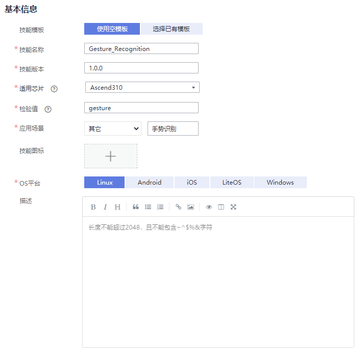
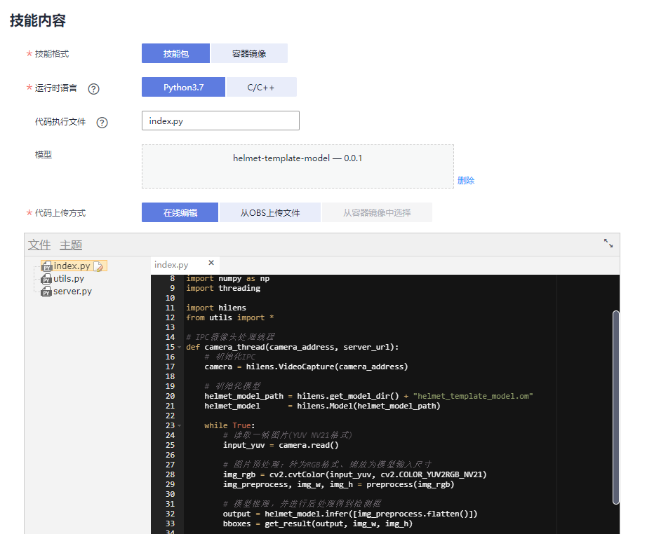
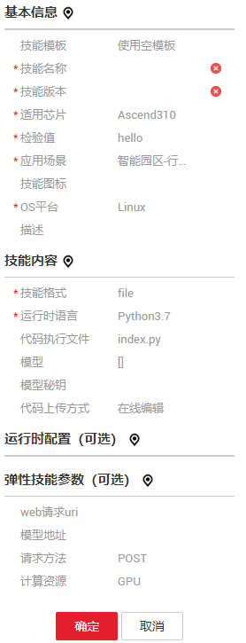

# 使用空模板<a name="hilens_02_0022"></a>

本章节介绍使用空模板新建技能的操作步骤。如果您选择使用空模板，需提前准备好使用的模型和逻辑代码。

## 背景信息<a name="section821692513013"></a>

-   算法模型必须是.om格式，且满足Huawei HiLens的要求，详细可参考[开发模型](开发模型.md)。
-   逻辑代码的存储方式有两种：“在线编辑代码“和“从OBS上传代码“。
    -   如果您的代码逻辑较简单，建议直接在线编辑代码。
    -   如果您的代码结构比较复杂，推荐用本地IDE开发完成后，使用OBS上传代码zip或tar.gz包的方式，上传操作可参见[OBS快速入门](https://support.huaweicloud.com/qs-obs/obs_qs_0002.html)。上传到OBS需要收取一定费用，收费规则请参见[对象存储服务 OBS](https://www.huaweicloud.com/pricing.html?tab=detail#/obs)。

        > **说明：**   
        >-   上传文件时，要求此OBS桶与您使用的Huawei HiLens处于同一区域。  
        >-   若您从OBS上传代码，需要将所有代码文件压缩后上传，上传的文件必须为“.zip“或“tar.gz”格式，且入口文件必须在一级目录。如下示例所示，入口代码（“main.py“）在一级目录，其它的代码按需求自行设计，您可将模型与代码一起打包上传。  
        >-   入口代码所在文件（如上面的main.py）通过参数【代码执行文件】进行配置，后面会有说明。  

        代码目录示例如下所示：

        ```
        skill/
        |---main.py		#入口文件，名称与新建技能的“代码配置”参数一致
        |---depends/		#可选，用于存放模型文件
        |---workspace/		#工作空间，用于存放技能生成的数据
        	|---data/	#用于存放运行时配置
        ```


## 前提条件<a name="section810816472505"></a>

-   新建技能使用的算法模型已[导入Huawei HiLens](导入（转换）模型.md)中。
-   如果使用“从OBS上传代码“方式，请提前按照要求将逻辑代码上传至OBS桶中。

## 1. 开始新建技能<a name="section892314238481"></a>

1.  登录Huawei HiLens管理控制台，在左侧导航栏中选择“技能开发 \> 技能管理“，进入技能列表。
2.  在“技能管理“页面，单击右上角“新建技能“，进入“创建技能“页面。

## 2. 基本信息<a name="section1965413416481"></a>

在“创建技能“页面，在“技能模板“中选择“使用空模板“后，填写基本信息。参数说明请参见[表1](#table1638755115118)。

**图 1**  填写基本信息<a name="fig147302179154"></a>  


**表 1**  基本信息参数设置

<a name="table1638755115118"></a>
<table><thead align="left"><tr id="row43055512519"><th class="cellrowborder" valign="top" width="25.040000000000003%" id="mcps1.2.3.1.1"><p id="p530155585114"><a name="p530155585114"></a><a name="p530155585114"></a>字段名称</p>
</th>
<th class="cellrowborder" valign="top" width="74.96000000000001%" id="mcps1.2.3.1.2"><p id="p1930555155116"><a name="p1930555155116"></a><a name="p1930555155116"></a>说明</p>
</th>
</tr>
</thead>
<tbody><tr id="row1632855165112"><td class="cellrowborder" valign="top" width="25.040000000000003%" headers="mcps1.2.3.1.1 "><p id="p15312055185113"><a name="p15312055185113"></a><a name="p15312055185113"></a>技能模板</p>
</td>
<td class="cellrowborder" valign="top" width="74.96000000000001%" headers="mcps1.2.3.1.2 "><p id="p93125513518"><a name="p93125513518"></a><a name="p93125513518"></a>是否使用模板来开发技能。如果选择已有模板，则会使用模板的模型和代码。即技能内容模块的字段都会使用模板的信息。</p>
</td>
</tr>
<tr id="row63215565120"><td class="cellrowborder" valign="top" width="25.040000000000003%" headers="mcps1.2.3.1.1 "><p id="p732655115117"><a name="p732655115117"></a><a name="p732655115117"></a>名称（英文）</p>
</td>
<td class="cellrowborder" valign="top" width="74.96000000000001%" headers="mcps1.2.3.1.2 "><p id="p53275545120"><a name="p53275545120"></a><a name="p53275545120"></a>技能的英文名称，下发到端侧也使用该名称作为根目录。</p>
<p id="p1189483451615"><a name="p1189483451615"></a><a name="p1189483451615"></a>可输入字母、数字、下划线或中划线，必须以字母开头，以字母或数字结尾，长度不超过60个字符。</p>
<div class="note" id="note17827182618586"><a name="note17827182618586"></a><a name="note17827182618586"></a><span class="notetitle"> 说明： </span><div class="notebody"><p id="p4828182605812"><a name="p4828182605812"></a><a name="p4828182605812"></a>由于技能市场不允许存在同名技能，所以如果想发布到技能市场，请使用全局唯一的名称对您的技能进行命名。</p>
</div></div>
</td>
</tr>
<tr id="row1686114251714"><td class="cellrowborder" valign="top" width="25.040000000000003%" headers="mcps1.2.3.1.1 "><p id="p14627175012421"><a name="p14627175012421"></a><a name="p14627175012421"></a>名称（中文）</p>
</td>
<td class="cellrowborder" valign="top" width="74.96000000000001%" headers="mcps1.2.3.1.2 "><p id="p724917293186"><a name="p724917293186"></a><a name="p724917293186"></a>技能的中文名称。</p>
<p id="p6130164015422"><a name="p6130164015422"></a><a name="p6130164015422"></a>可输入中文、字母、数字、下划线或中划线，必须以字母开头，以中文、字母或数字开头，长度不超过60个字符。</p>
</td>
</tr>
<tr id="row143315535119"><td class="cellrowborder" valign="top" width="25.040000000000003%" headers="mcps1.2.3.1.1 "><p id="p13331755165111"><a name="p13331755165111"></a><a name="p13331755165111"></a>版本</p>
</td>
<td class="cellrowborder" valign="top" width="74.96000000000001%" headers="mcps1.2.3.1.2 "><p id="p1333165565111"><a name="p1333165565111"></a><a name="p1333165565111"></a>技能的版本。版本号格式为<span class="parmname" id="parmname169203446161"><a name="parmname169203446161"></a><a name="parmname169203446161"></a>“A.A.A”</span>，<span class="parmname" id="parmname363524771619"><a name="parmname363524771619"></a><a name="parmname363524771619"></a>“A”</span>为不超过3位的自然数。例如<span class="parmvalue" id="parmvalue189556590168"><a name="parmvalue189556590168"></a><a name="parmvalue189556590168"></a>“1.0.0”</span>。</p>
</td>
</tr>
<tr id="row333185515519"><td class="cellrowborder" valign="top" width="25.040000000000003%" headers="mcps1.2.3.1.1 "><p id="p1833105515513"><a name="p1833105515513"></a><a name="p1833105515513"></a>适用芯片</p>
</td>
<td class="cellrowborder" valign="top" width="74.96000000000001%" headers="mcps1.2.3.1.2 "><p id="p33318557517"><a name="p33318557517"></a><a name="p33318557517"></a>技能支持的芯片。运行在HiLens Kit上的技能需选择Ascend 310芯片。</p>
</td>
</tr>
<tr id="row177711822115615"><td class="cellrowborder" valign="top" width="25.040000000000003%" headers="mcps1.2.3.1.1 "><p id="p1477212219565"><a name="p1477212219565"></a><a name="p1477212219565"></a>检验值</p>
</td>
<td class="cellrowborder" valign="top" width="74.96000000000001%" headers="mcps1.2.3.1.2 "><p id="p1677272275613"><a name="p1677272275613"></a><a name="p1677272275613"></a>用于技能校验，防止技能伪冒。要与代码中初始化接口的参数一致。具体使用方法请参见<a href="https://support.huaweicloud.com/devg-hilens/hilens_05_0006.html" target="_blank" rel="noopener noreferrer">初始化HiLens Framework</a>。</p>
</td>
</tr>
<tr id="row151084810198"><td class="cellrowborder" valign="top" width="25.040000000000003%" headers="mcps1.2.3.1.1 "><p id="p1034821454316"><a name="p1034821454316"></a><a name="p1034821454316"></a>应用场景</p>
</td>
<td class="cellrowborder" valign="top" width="74.96000000000001%" headers="mcps1.2.3.1.2 "><p id="p234831416436"><a name="p234831416436"></a><a name="p234831416436"></a>技能适用的场景，例如<span class="parmname" id="parmname197812010185212"><a name="parmname197812010185212"></a><a name="parmname197812010185212"></a>“智慧园区”</span>、<span class="parmname" id="parmname17498151345215"><a name="parmname17498151345215"></a><a name="parmname17498151345215"></a>“智慧家庭”</span>、<span class="parmname" id="parmname1870216153521"><a name="parmname1870216153521"></a><a name="parmname1870216153521"></a>“智能车载”</span>、<span class="parmname" id="parmname1063521818520"><a name="parmname1063521818520"></a><a name="parmname1063521818520"></a>“智能商超”</span>的子场景及<span class="parmname" id="parmname154561920155217"><a name="parmname154561920155217"></a><a name="parmname154561920155217"></a>“其他”</span>。</p>
</td>
</tr>
<tr id="row103445595111"><td class="cellrowborder" valign="top" width="25.040000000000003%" headers="mcps1.2.3.1.1 "><p id="p14331055185117"><a name="p14331055185117"></a><a name="p14331055185117"></a>技能图标</p>
</td>
<td class="cellrowborder" valign="top" width="74.96000000000001%" headers="mcps1.2.3.1.2 "><p id="p1033195525112"><a name="p1033195525112"></a><a name="p1033195525112"></a>技能的头像。</p>
</td>
</tr>
<tr id="row93414559510"><td class="cellrowborder" valign="top" width="25.040000000000003%" headers="mcps1.2.3.1.1 "><p id="p14341355115117"><a name="p14341355115117"></a><a name="p14341355115117"></a>技能图片</p>
</td>
<td class="cellrowborder" valign="top" width="74.96000000000001%" headers="mcps1.2.3.1.2 "><p id="p16349552519"><a name="p16349552519"></a><a name="p16349552519"></a>用来向用户介绍技能的使用或技能的效果。上传本地<span class="parmname" id="parmname578111813177"><a name="parmname578111813177"></a><a name="parmname578111813177"></a>“jpg”</span>、<span class="parmname" id="parmname5196120141714"><a name="parmname5196120141714"></a><a name="parmname5196120141714"></a>“jpeg”</span>、<span class="parmname" id="parmname18562132291711"><a name="parmname18562132291711"></a><a name="parmname18562132291711"></a>“png”</span>图片，最多可以上传5张，每张不得超过2MB。</p>
</td>
</tr>
<tr id="row134755165112"><td class="cellrowborder" valign="top" width="25.040000000000003%" headers="mcps1.2.3.1.1 "><p id="p163419553515"><a name="p163419553515"></a><a name="p163419553515"></a>OS平台</p>
</td>
<td class="cellrowborder" valign="top" width="74.96000000000001%" headers="mcps1.2.3.1.2 "><p id="p2341655145110"><a name="p2341655145110"></a><a name="p2341655145110"></a>技能运行的操作系统平台，包括Linux、Android、IOS、LiteOS和Windows。HiLens Kit用的是基于CentOS制作的Linux发型版Euler系统操作系统，所以如果开发的是运行在HiLens Kit的技能，这里选择Linux。</p>
</td>
</tr>
<tr id="row1834125514512"><td class="cellrowborder" valign="top" width="25.040000000000003%" headers="mcps1.2.3.1.1 "><p id="p7345551513"><a name="p7345551513"></a><a name="p7345551513"></a>英文描述</p>
</td>
<td class="cellrowborder" valign="top" width="74.96000000000001%" headers="mcps1.2.3.1.2 "><p id="p163435515120"><a name="p163435515120"></a><a name="p163435515120"></a>对技能的详细介绍。用于英文界面的显示。</p>
<p id="p634655135118"><a name="p634655135118"></a><a name="p634655135118"></a>最大长度512，不允许输入特殊字符。</p>
</td>
</tr>
<tr id="row1435155514512"><td class="cellrowborder" valign="top" width="25.040000000000003%" headers="mcps1.2.3.1.1 "><p id="p1434185565110"><a name="p1434185565110"></a><a name="p1434185565110"></a>中文描述</p>
</td>
<td class="cellrowborder" valign="top" width="74.96000000000001%" headers="mcps1.2.3.1.2 "><p id="p17351555145115"><a name="p17351555145115"></a><a name="p17351555145115"></a>对技能的详细介绍。用于中文界面的显示。</p>
<p id="p0252622141714"><a name="p0252622141714"></a><a name="p0252622141714"></a>最大长度512，不允许输入特殊字符。</p>
<div class="note" id="note11600131616192"><a name="note11600131616192"></a><a name="note11600131616192"></a><span class="notetitle"> 说明： </span><div class="notebody"><p id="p17600191661915"><a name="p17600191661915"></a><a name="p17600191661915"></a>若新建技能的场景需要发送消息到用户的手机或邮箱，比如检测到陌生人技能需要在发现陌生人后发送消息提醒用户，描述中<strong id="b1895232112336"><a name="b1895232112336"></a><a name="b1895232112336"></a>必须注明</strong>：<span class="parmvalue" id="parmvalue18687175919324"><a name="parmvalue18687175919324"></a><a name="parmvalue18687175919324"></a>“本技能支持发送订阅消息”</span>，发送的具体内容需在<a href="编写逻辑代码.md">编写逻辑代码</a>时注明，详细指导和API介绍可参见<a href="https://support.huaweicloud.com/devg-hilens/hilens_05_0001.html" target="_blank" rel="noopener noreferrer">开发指南</a>。</p>
</div></div>
</td>
</tr>
</tbody>
</table>

## 3. 技能内容<a name="section1651084013481"></a>

根据您的模型和逻辑代码情况，填写技能内容，详细参数说明请参见[表2](#table153521111132814)。

**图 2**  技能内容<a name="fig157201237152714"></a>  


**表 2**  技能内容的参数说明

<a name="table153521111132814"></a>
<table><thead align="left"><tr id="row1268212303284"><th class="cellrowborder" valign="top" width="29.69%" id="mcps1.2.3.1.1"><p id="p48141211172917"><a name="p48141211172917"></a><a name="p48141211172917"></a>字段名称</p>
</th>
<th class="cellrowborder" valign="top" width="70.30999999999999%" id="mcps1.2.3.1.2"><p id="p8814711132911"><a name="p8814711132911"></a><a name="p8814711132911"></a>说明</p>
</th>
</tr>
</thead>
<tbody><tr id="row1235145519516"><td class="cellrowborder" valign="top" width="29.69%" headers="mcps1.2.3.1.1 "><p id="p11350555515"><a name="p11350555515"></a><a name="p11350555515"></a>模型</p>
</td>
<td class="cellrowborder" valign="top" width="70.30999999999999%" headers="mcps1.2.3.1.2 "><p id="p1923384561917"><a name="p1923384561917"></a><a name="p1923384561917"></a>技能的核心算法。在本地或ModelArts训练，<a href="导入（转换）模型.md">导入到HiLens平台</a>。单击加号，您可以在弹出框中，选择Huawei HiLens平台中模型管理列表下的模型。</p>
</td>
</tr>
<tr id="row11359551512"><td class="cellrowborder" valign="top" width="29.69%" headers="mcps1.2.3.1.1 "><p id="p23585585116"><a name="p23585585116"></a><a name="p23585585116"></a>运行时语言</p>
</td>
<td class="cellrowborder" valign="top" width="70.30999999999999%" headers="mcps1.2.3.1.2 "><p id="p735175505111"><a name="p735175505111"></a><a name="p735175505111"></a>逻辑代码的运行时语言。目前支持<span class="parmname" id="parmname12901115872513"><a name="parmname12901115872513"></a><a name="parmname12901115872513"></a>“Python3.7”</span>和<span class="parmname" id="parmname561841152617"><a name="parmname561841152617"></a><a name="parmname561841152617"></a>“C/C++”</span>。如果选择C/C++语言开发，将不支持在线编辑代码。开发者线下开发完成后，需要在Linux环境下把代码编译打包，然后上传到obs。</p>
</td>
</tr>
<tr id="row1636135525119"><td class="cellrowborder" valign="top" width="29.69%" headers="mcps1.2.3.1.1 "><p id="p536175575118"><a name="p536175575118"></a><a name="p536175575118"></a>代码执行文件</p>
</td>
<td class="cellrowborder" valign="top" width="70.30999999999999%" headers="mcps1.2.3.1.2 "><p id="p1436175545119"><a name="p1436175545119"></a><a name="p1436175545119"></a>技能的启动将以该代码执行文件为入口，类似C语言的main函数。入口文件必须在一级目录。</p>
<p id="p136125518518"><a name="p136125518518"></a><a name="p136125518518"></a>格式为<span class="parmname" id="parmname109831175551"><a name="parmname109831175551"></a><a name="parmname109831175551"></a>“[文件名.后缀]”</span>，不超过64位，以字母开头，允许输入字母、数字或下划线。</p>
</td>
</tr>
<tr id="row4361655165119"><td class="cellrowborder" valign="top" width="29.69%" headers="mcps1.2.3.1.1 "><p id="p123615575115"><a name="p123615575115"></a><a name="p123615575115"></a>代码上传方式</p>
</td>
<td class="cellrowborder" valign="top" width="70.30999999999999%" headers="mcps1.2.3.1.2 "><p id="p13979154711311"><a name="p13979154711311"></a><a name="p13979154711311"></a>逻辑代码的上传方式。</p>
<a name="ul121731653141318"></a><a name="ul121731653141318"></a><ul id="ul121731653141318"><li><span class="parmname" id="parmname524020531257"><a name="parmname524020531257"></a><a name="parmname524020531257"></a>“在线编辑”</span><p id="p8601133913259"><a name="p8601133913259"></a><a name="p8601133913259"></a>使用在线开发技能的逻辑代码，会自动生成一个zip包上传到OBS中。HiLens会自动创建一个OBS桶用于存储技能包，桶名称命名规则为<span class="parmname" id="parmname18233163510247"><a name="parmname18233163510247"></a><a name="parmname18233163510247"></a>“&lt;project_id&gt;-hilens-skill”</span>，您可以前往OBS服务，找到对应命名规则的OBS桶，并获取在线编辑的代码包文件。</p>
</li><li><span class="parmname" id="parmname5865755162512"><a name="parmname5865755162512"></a><a name="parmname5865755162512"></a>“从OBS桶上传文件”</span><p id="p44711047122510"><a name="p44711047122510"></a><a name="p44711047122510"></a>针对比较复杂的工程代码可以线下开发，手动生成zip或tar.gz包并上传到OBS中，然后在此参数中选择使用OBS中的zip或tar.gz代码包。在上传OBS之前，您可以把模型一起打包并上传使用，模型与代码结构可参考<a href="#section821692513013">背景信息</a>中定义的规范。</p>
</li></ul>
</td>
</tr>
</tbody>
</table>

## 4. 运行时配置（可选）<a name="section662915238494"></a>

部分技能在运行的时候需要用户配置参数，比如人脸识别类的技能需要用户上传人脸库等。运行时配置就像是一个“钩子”，开发者把“钩子”放出去，用户运行技能的时候设置了这些配置项，HiLens就会帮开发者把“钩子”收回来，这时候在代码里面开发者就可以使用这些用户的设置。您可以在界面中单击添加配置标签，参考[表3](#table193681822142815)填写您的配置。

您还可以单击“预览JSON格式“查看“钩子”的格式。开发者通过HiLens Framework提供的get\_skill\_config接口获取技能配置的JSON格式，读取里面字段的值来使用用户的配置。

运行时配置JSON格式如下所示：

```
{
        //全局配置
	"Languge": "enum",
        //视频分路配置
	"multi_camera": [ //该字段key值multi_camera固定，值表示摄像头分路配置
		{       
			"camera_names": [     //该字段key值camera_names固定，值表示该分组配置里包含了哪些摄像头
				"cameraX",
				"cameraY"
			],
			"FaceLib": {        //配置名
				"from": "file source", //文件类型值，表示文件来自哪个服务。比如OBS
				"path": "file path"  //文件类型值，表示文件的路径
			}
		}
	],
       }
```

**表 3**  运行时配置的参数说明

<a name="table193681822142815"></a>
<table><thead align="left"><tr id="row1599282516281"><th class="cellrowborder" valign="top" width="25.1%" id="mcps1.2.3.1.1"><p id="p682118257394"><a name="p682118257394"></a><a name="p682118257394"></a>字段名称</p>
</th>
<th class="cellrowborder" valign="top" width="74.9%" id="mcps1.2.3.1.2"><p id="p28212025113919"><a name="p28212025113919"></a><a name="p28212025113919"></a>说明</p>
</th>
</tr>
</thead>
<tbody><tr id="row6368112214284"><td class="cellrowborder" valign="top" width="25.1%" headers="mcps1.2.3.1.1 "><p id="p73755565111"><a name="p73755565111"></a><a name="p73755565111"></a>配置名</p>
</td>
<td class="cellrowborder" valign="top" width="74.9%" headers="mcps1.2.3.1.2 "><p id="p15371755195112"><a name="p15371755195112"></a><a name="p15371755195112"></a>配置的名称，逻辑代码里面可用该字段获取该配置的值。运行时配置指技能在运行的时候，由用户配置的内容。比如人脸识别技能需要用户上传人脸库等。需要说明的是，整个运行时配置是可选的，但如果添加了一条配置，那么<span class="parmname" id="parmname27414261282"><a name="parmname27414261282"></a><a name="parmname27414261282"></a>“配置名”</span>、<span class="parmname" id="parmname11461202932816"><a name="parmname11461202932816"></a><a name="parmname11461202932816"></a>“配置说明”</span>是必填项。</p>
</td>
</tr>
<tr id="row11369722112812"><td class="cellrowborder" valign="top" width="25.1%" headers="mcps1.2.3.1.1 "><p id="p18371655165120"><a name="p18371655165120"></a><a name="p18371655165120"></a>值类型</p>
</td>
<td class="cellrowborder" valign="top" width="74.9%" headers="mcps1.2.3.1.2 "><p id="p1237855105112"><a name="p1237855105112"></a><a name="p1237855105112"></a>表示该配置项的值是什么类型的数据。</p>
<p id="p1637125512513"><a name="p1637125512513"></a><a name="p1637125512513"></a>数值类型（int、float）、枚举类型、字符串和文件类型。</p>
</td>
</tr>
<tr id="row1936922215283"><td class="cellrowborder" valign="top" width="25.1%" headers="mcps1.2.3.1.1 "><p id="p537355205111"><a name="p537355205111"></a><a name="p537355205111"></a>值约束</p>
</td>
<td class="cellrowborder" valign="top" width="74.9%" headers="mcps1.2.3.1.2 "><p id="p183815510510"><a name="p183815510510"></a><a name="p183815510510"></a>表示该配置可以设置的范围。跟值类型有关。</p>
<a name="ul76611933195612"></a><a name="ul76611933195612"></a><ul id="ul76611933195612"><li>数值类型：用开闭区间的表示方法。如[1,100)表示大于等于1小于100。</li><li>字符串和文件：该项无需输入。</li><li>枚举：集合的表示方式，如{a,b}。</li></ul>
</td>
</tr>
<tr id="row1436992210289"><td class="cellrowborder" valign="top" width="25.1%" headers="mcps1.2.3.1.1 "><p id="p7381551517"><a name="p7381551517"></a><a name="p7381551517"></a>配置说明</p>
</td>
<td class="cellrowborder" valign="top" width="74.9%" headers="mcps1.2.3.1.2 "><p id="p7386551517"><a name="p7386551517"></a><a name="p7386551517"></a>说明该配置的作用，以及配置方法。<strong id="b7774151845"><a name="b7774151845"></a><a name="b7774151845"></a>该字段非常重要，用户会根据该字段的说明来配置，所以如果有运行时配置，开发者一定要在这里解释清楚。</strong></p>
</td>
</tr>
<tr id="row12369922182814"><td class="cellrowborder" valign="top" width="25.1%" headers="mcps1.2.3.1.1 "><p id="p5382555516"><a name="p5382555516"></a><a name="p5382555516"></a>配置对象</p>
</td>
<td class="cellrowborder" valign="top" width="74.9%" headers="mcps1.2.3.1.2 "><p id="p997317103422"><a name="p997317103422"></a><a name="p997317103422"></a>HiLens Kit可以连接多个（最多8个）摄像头，所以可以开发支持多路视屏的技能。</p>
<a name="ul446112207425"></a><a name="ul446112207425"></a><ul id="ul446112207425"><li>选择<span class="parmname" id="parmname2073614312420"><a name="parmname2073614312420"></a><a name="parmname2073614312420"></a>“视频”</span>，则表示该配置是可以针对设备上每个摄像头视频进行配置的，比如摄像头1和摄像头2采用不同的人脸库。</li><li>选择<span class="parmname" id="parmname16347465426"><a name="parmname16347465426"></a><a name="parmname16347465426"></a>“全局”</span>,则表示设备上所有摄像头都用同一个配置值。</li></ul>
</td>
</tr>
</tbody>
</table>

## 5. 确认信息并完成新建技能<a name="section1990984520456"></a>

上述参数填写完成后，您可以在界面右侧查看其配置参数值，如果某个字段填写错误，在右侧会显示一个小红叉。

确认信息无误后，单击“确定“完成技能创建。

**图 3**  确认信息并完成空模板新建技能<a name="fig09531074479"></a>  


创建完成后，您的技能将进入“技能开发\>技能管理“页面，且状态为“未发布“，您可以执行发布操作，将技能[发布至技能市场](发布至技能市场.md)。

发布后，技能将处于“审核中“状态，Huawei HiLens工作人员将在3个工作日内完成审核，请您耐心等待。当审核通过后，状态将变更为“审核通过，已发布“。

