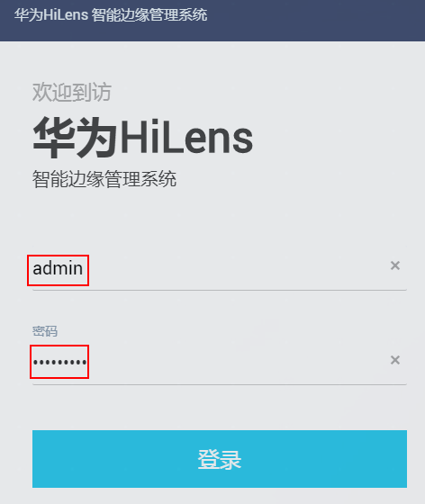
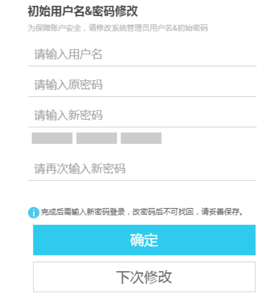

# 修改HiLens Kit用户密码

为保证安全性，请在首次将Huawei Kit设备注册至Huawei HiLens控制台后，立即修改用户名和密码。修改后，使用新的用户名和密码登录Huawei Kit设备。

> **说明：**   
>管理系统开发者命令行登录用户名和密码与HUAWEI HiLens智能边缘管理系统登录用户名和密码一致，修改后，使用新的用户名和密码登录Huawei  Kit设备和Huawei HiLens智能边缘系统。  

修改HiLens Kit用户密码的操作步骤如下：

1.  网线连接电脑和设备，确保可以SSH连接到HiLens Kit设备，详细操作指导请参见[步骤1：使用SSH连接到HiLens Kit](步骤1-使用SSH连接到HiLens-Kit.md)。
2.  浏览器输入https://192.168.2.111（以设备IP是192.168.2.111为例），首次登录Huawei HiLens智能边缘管理系统，以默认账号名为“admin“和默认密码登录，首次登录默认密码请参见[HiLens Kit 用户指南\>默认数据](https://support.huawei.com/enterprise/zh/doc/EDOC1100112066/2347bab9)。

    推荐使用chrome浏览器或IE11以上版本浏览器登录Huawei HiLens智能边缘管理系统。

    **图 1**  登录边缘管理系统  
    

3.  在弹出的“初始用户名&密码修改“对话框中，输入新的“用户名“和“密码“，如[图2](#fig12342013520)所示，单击“确定“，完成用户名和密码修改，并进入系统首页。

    此处是针对默认账号“admin“修改用户名和密码，再次使用SSH连接HiLens  Kit设备或登录边缘系统，需使用修改后的新用户名和密码。

    **图 2**  修改用户名和密码  
    

