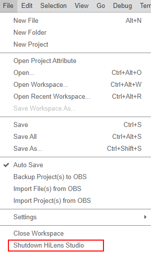

# 停止技能实例

在退出使用HiLens Studio之前，为避免HiLens Studio继续使用推理资源，您可以停止HiLens Studio正在运行的技能实例。

1.  登录华为HiLens管理控制台，在左侧导航栏中选择“技能开发\>HiLens Studio“。

    进入HiLens Studio 页面。

2.  在HiLens Studio页面单击左上角的“File“，在下拉框中单击“Shutdown HiLens Studio“。

    弹出“Shutdown HiLens Studio“对话框。

    **图 1**  停止技能实例  
    

3.  单击“Yes“，停止技能示例。

