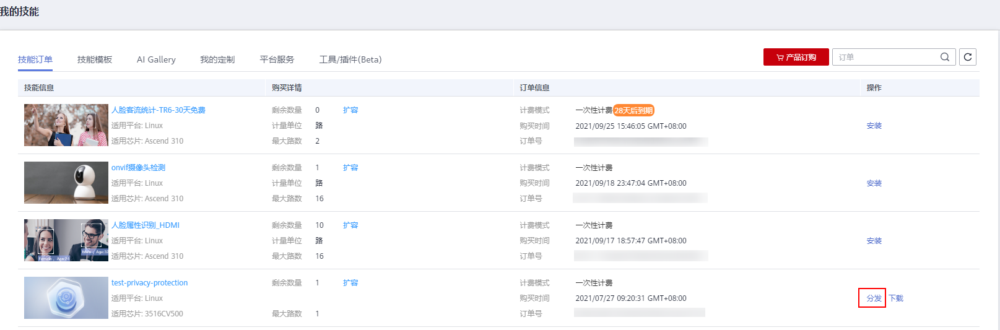
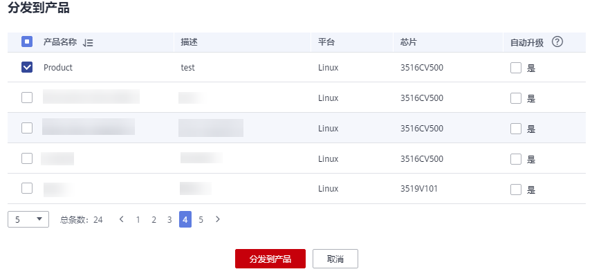
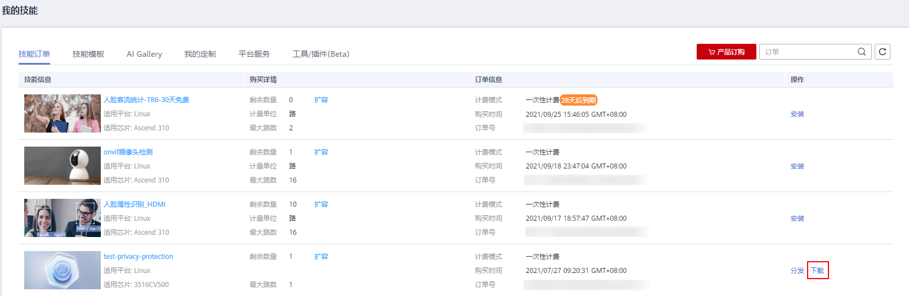

# 分发技能

“适用于海思35XX系列芯片的技能“需要分发至设备上才能使用。针对使用海思35xx系列芯片的设备，由于性能限制，最多只能分发5个技能。

## 前提条件

-   已将设备管理至产品，参见[新建产品](新建产品.md)。
-   已订购技能，参见[订购技能（用于35XX系列设备）](订购技能（用于35XX系列设备）.md)。

## 分发技能

1.  登录华为HiLens管理控制台，单击左侧导航栏“产品订购\>订单管理“，默认进入“技能订单“页面。
2.  在“技能订单“页面，选择对应的技能，将技能的License分发至产品上。

    技能信息中，“适用芯片“不是“Ascend 310“的技能才能分发到产品。

    1.  选择需要分发的技能，单击“操作“列的“分发“。

        **图 1**  分发技能  
        

    2.  在弹出的“分发到产品“的对话框中，勾选需要分发的产品，根据自身需要选择勾选“自动升级“的“是“，然后单击“分发到产品“。

        勾选“自动升级“表示如果分发的技能有新的版本，产品中的该技能会自动升级到最新版本。

        **图 2**  分发技能至产品  
        

    3.  对话框内容显示技能分发情况，确认“安装状态“为“成功“，单击“确定“完成技能分发操作。

3.  下载技能。

    在“技能订单“页面，在分发的技能中选择需要使用的技能，单击操作列的“下载“。浏览器自动下载技能的SDK包。

    **图 3**  下载技能  
    

4.  部署技能。将步骤[3](#li2542023121713)下载的SDK包集成到设备中。

    集成到设备的具体位置根据不同的设备有所差异，操作指导请联系华为工程师。

