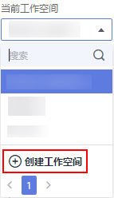
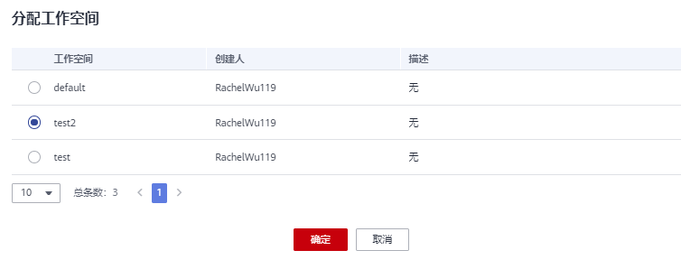
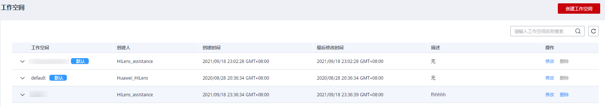
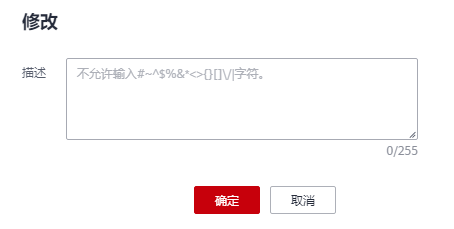
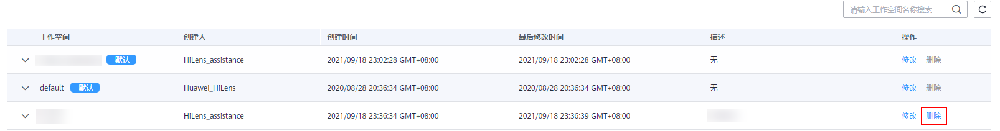
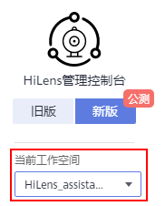

# 创建工作空间

在使用华为HiLens之前，如果您想实现资源隔离管理，您可以创建工作空间，实现资源隔离，即在不同工作空间导入的模型、创建的技能等资源，均实现隔离管理。

## 隔离资源说明

每个华为云帐号或IAM帐号，均存在一个默认的工作空间“default“，该空间可查看当前帐号下在华为HiLens所创建的所有资源。

创建工作空间后，可实现隔离管理的资源如下：

**表 1**  隔离资源

<table><thead align="left"><tr id="row16823303228"><th class="cellrowborder" valign="top" width="50%" id="mcps1.2.3.1.1">
导航栏

</th>
<th class="cellrowborder" valign="top" width="50%" id="mcps1.2.3.1.2">
隔离资源

</th>
</tr>
</thead>
<tbody><tr id="row198217300226"><td class="cellrowborder" valign="top" width="50%" headers="mcps1.2.3.1.1 ">
设备管理&gt;设备列表

</td>
<td class="cellrowborder" valign="top" width="50%" headers="mcps1.2.3.1.2 ">
注册的HiLens Kit以及设备上的技能管理、摄像头管理、告警管理、固件版本资源。

</td>
</tr>
<tr id="row13824305228"><td class="cellrowborder" valign="top" width="50%" headers="mcps1.2.3.1.1 ">
技能开发&gt;模型管理

</td>
<td class="cellrowborder" valign="top" width="50%" headers="mcps1.2.3.1.2 ">
导入（转换）至华为HiLens的模型。

</td>
</tr>
<tr id="row1882113015224"><td class="cellrowborder" valign="top" width="50%" headers="mcps1.2.3.1.1 ">
技能开发&gt;HiLens&nbsp;Studio

</td>
<td class="cellrowborder" valign="top" width="50%" headers="mcps1.2.3.1.2 ">
在HiLens Studio创建的技能项目、开发的技能以及安装技能的设备列表。

</td>
</tr>
<tr id="row163471134153414"><td class="cellrowborder" valign="top" width="50%" headers="mcps1.2.3.1.1 ">
技能开发&gt;技能管理

</td>
<td class="cellrowborder" valign="top" width="50%" headers="mcps1.2.3.1.2 ">
在控制台新建的技能资源。

</td>
</tr>
<tr id="row7201135516353"><td class="cellrowborder" valign="top" width="50%" headers="mcps1.2.3.1.1 ">
数据管理（Beta）

</td>
<td class="cellrowborder" valign="top" width="50%" headers="mcps1.2.3.1.2 ">
不同空间的设备运行技能时所产生的日志。

</td>
</tr>
</tbody>
</table>

创建工作空间后，所有工作空间可共享的资源，即无法实现隔离管理的资源如下：

**表 2**  共享资源

<table><thead align="left"><tr id="row61284160405"><th class="cellrowborder" valign="top" width="50%" id="mcps1.2.3.1.1">
导航栏

</th>
<th class="cellrowborder" valign="top" width="50%" id="mcps1.2.3.1.2">
共享资源

</th>
</tr>
</thead>
<tbody><tr id="row12154192114118"><td class="cellrowborder" valign="top" width="50%" headers="mcps1.2.3.1.1 ">
技能市场

</td>
<td class="cellrowborder" valign="top" width="50%" headers="mcps1.2.3.1.2 ">
技能市场可共享的技能以及使用当前帐号购买的技能。

</td>
</tr>
<tr id="row9128616194010"><td class="cellrowborder" valign="top" width="50%" headers="mcps1.2.3.1.1 ">
设备管理&gt;产品管理

</td>
<td class="cellrowborder" valign="top" width="50%" headers="mcps1.2.3.1.2 ">
在华为HiLens 新建的产品，即35xx芯片的摄像头设备。

</td>
</tr>
<tr id="row201281116104020"><td class="cellrowborder" valign="top" width="50%" headers="mcps1.2.3.1.1 ">
技能开发&gt;技能模板

</td>
<td class="cellrowborder" valign="top" width="50%" headers="mcps1.2.3.1.2 ">
华为HiLens预置的模板以及当前帐号所收藏的模板。

</td>
</tr>
</tbody>
</table>

## 创建工作空间

1.  登录华为HiLens管理控制台，在左侧导航栏中“当前工作空间“下方的下拉框中选择“创建工作空间“。

    进入“创建工作空间“页面。

    **图 1**  创建工作空间  
    

2.  填写工作空间名称和描述，填完之后单击右下角的“立即创建“，跳到“工作空间“页面，可查看所创建的新工作空间。

    填写工作空间描述时，不允许输入\#\~^$%&\*<\>\{\}\[\]\\/|字符。

    **图 2**  创建工作空间-0  
    

## 分配工作空间

分配工作空间指把某工作空间的设备及其该设备下的技能、摄像头等资源挪到其他工作空间内。

此处以“test“作为设备资源所在的原工作空间，以“test2“作为设备资源分配的目标工作空间为例，介绍如何分配工作空间。

1.  登录华为HiLens管理控制台，在左侧导航栏中“当前工作空间“下方的下拉框中切换工作空间至“test“。
2.  在左侧导航栏中选择“设备管理\>设备列表“，选择待分配的设备单击设备卡片。

    进入设备详情页。

3.  单击右上角的“分配工作空间“。

    弹出“分配工作空间“对话框。

4.  勾选工作空间“test2“，单击“确定“。

    界面右上角弹出分配工作空间成功。您可以切换至工作空间“test2“，在“设备管理\>设备列表“页面查看已分配的设备资源。

    **图 3**  分配工作空间  
    

## 修改工作空间

基于已创建的工作空间，当前支持修改自定义工作空间的名称和描述，暂不支持修改默认工作空间的名称。

1.  登录华为HiLens管理控制台，在左侧导航栏中选择“工作空间“。

    进入“工作空间“页面。

    **图 4**  工作空间  
    

2.  选择待修改的工作空间，单击“操作“列的“修改“。
3.  在对话框中重新编辑工作空间的“描述“，单击“确定“。

    **图 5**  修改工作空间  
    

## 删除工作空间

对于不再使用的工作空间，您可以删除工作空间以释放资源。默认工作空间不允许删除。

1.  登录华为HiLens管理控制台，在左侧导航栏中选择“工作空间“。

    进入“工作空间“页面。

2.  选择待修改的工作空间，单击“操作“列的“删除“。

    **图 6**  删除工作空间  
    

3.  确认提示框中的内容，单击“确定“。

## 后续操作

创建不同的工作空间后，您可以在控制台左侧导航栏中，单击“当前工作空间“下方的下拉框，单击工作空间，进入所选工作空间内使用华为HiLens，可参考[使用流程简介](使用流程简介.md)。

**图 7**  当前工作空间  

