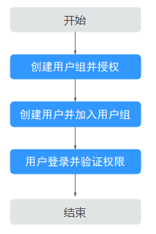

# 创建用户并授权使用Huawei HiLens

如果您需要对您所拥有的Huawei HiLens进行精细的权限管理，您可以使用[统一身份认证服务](https://support.huaweicloud.com/usermanual-iam/iam_01_0001.html)（Identity and Access Management，简称IAM），通过IAM，您可以：

-   根据企业的业务组织，在您的华为云账号中，给企业中不同职能部门的员工创建IAM用户，让员工拥有唯一安全凭证，并使用Huawei HiLens资源。
-   根据企业用户的职能，设置不同的访问权限，以达到用户之间的权限隔离。
-   将Huawei HiLens资源委托给更专业、高效的其他华为云账号或者云服务，这些账号或者云服务可以根据权限进行代运维。

如果华为云账号已经能满足您的要求，不需要创建独立的IAM用户，您可以跳过本章节，不影响您使用Huawei HiLens服务的其它功能。

本章节为您介绍对用户授权的方法，操作流程如[图1](#fig718014211017)所示。

## 前提条件

给用户组授权之前，请您了解用户组可以添加的Huawei HiLens权限，并结合实际需求进行选择，Huawei HiLens支持的系统权限，请参见：[Huawei HiLens权限管理](https://support.huaweicloud.com/productdesc-hilens/hilens_01_0007.html)。若您需要对除Huawei HiLens之外的其它服务授权，IAM支持服务的所有权限请参见[权限策略](https://support.huaweicloud.com/usermanual-permissions/iam_01_0001.html)。

## 示例流程

**图 1**  给用户授予Huawei HiLens权限流程  

1.  [创建用户组并授权](https://support.huaweicloud.com/usermanual-iam/iam_03_0001.html)

    在IAM控制台创建用户组，并授予HiLens CommonOperations权限。

2.  [创建用户并加入用户组](https://support.huaweicloud.com/usermanual-iam/iam_02_0001.html)

    在IAM控制台创建用户，并将其加入[1](#li151920531401)中创建的用户组。

3.  [用户登录](https://support.huaweicloud.com/usermanual-iam/iam_01_0552.html)并验证权限

    新创建的用户登录控制台，切换至授权区域，验证权限：

    在“服务列表“中选择Huawei HiLens，进入Huawei HiLens主界面，单击“设备管理\>设备列表“，选择其中一个设备卡片，单击“操作\>注销“（如果注册设备后需要激活设备，请先退订管理费后再执行注销操作），如果无法注销设备（假设当前权限仅包含HiLens CommonOperations），表示“HiLens CommonOperations”已生效。

