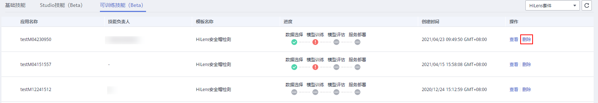

# 删除可训练技能

如果已创建的技能不再使用，您可以删除技能以释放资源。

## 操作步骤

1.  登录华为HiLens管理控制台，在左侧导航栏选择“技能开发\>技能管理“。

    默认进入“基础技能“页签。

2.  单击“可训练技能“，切换至“可训练技能“页签。
3.  选择技能单击操作列的“删除“，确认信息后单击“确定“，删除技能。

    **图 1**  删除可训练技能  
    

    > **说明：** 
    >删除后无法恢复，请谨慎操作。

