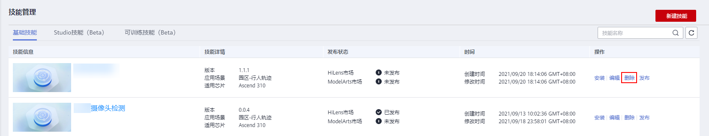
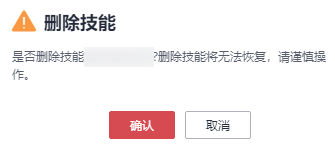

# 删除技能

如果您管理的技能将不再使用，您可以删除技能以释放资源。

1.  登录华为HiLens管理控制台，在左侧导航栏中选择“技能开发\>技能管理“，进入技能列表。
2.  在“技能管理“页面，单击“操作“列的“删除“。

    弹出“删除技能“提示框。

    **图 1**  删除技能  
    

3.  确认删除信息后，在提示框中单击“确定“。

    **图 2**  删除技能-23  
    

    > **说明：** 
    >删除后无法恢复，请谨慎操作。

