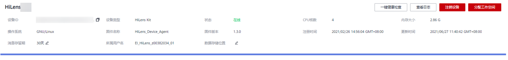

# 升级HiLens\_Device\_Agent固件版本

如果设备生产商推送了新版本的固件，可通过华为HiLens管理控制台升级HiLens Framework版本。随着业务不断演进，工程师将不断升级HiLens Framework版本，为保证您的设备可以运行更新更好的技能，建议及时升级版本。

## 操作前必读

-   只有“在线“状态的设备才能执行升级固件版本的操作。
-   当“设备列表“中，“固件版本“显示为“可升级“时，表示存在更新版本的固件，您可以选择版本进行升级。
-   在执行升级固件操作时，设备无法执行其他操作。

    **图 1**  升级固件版本的要求  
    

## 升级固件版本

1.  在管理控制台左侧菜单栏选择“设备管理 \>设备列表“。
2.  单击右上角的“批量\>升级“，弹出“固件批量升级“对话框。
3.  在对话框中选择设备类型和固件升级的新版本号，下方会显示可升级的设备，包括设备名称、设备类型、固件名称和固件版本。

    **图 2**  固件批量升级  
    

4.  勾选需要升级的设备，单击“确定“。

    在升级过程中，您可以进入设备详情页，查看到固件的版本以及固件升级进度，如[图3](#fig5297139306)所示。“固件版本“状态显示“升级成功“，表示升级固件版本成功。

    **图 3**  固件版本和状态  
    

