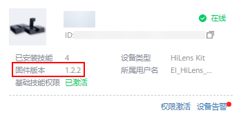

# 升级固件版本

如果设备生产商推送了新版本的固件，可通过HiLens管理控制台升级设备的固件版本。随着业务不断演进，工程师将不断升级设备的固件版本，为保证您的设备可以运行更新更好的技能，建议及时升级固件版本。

## 操作前必读

-   只有“在线“状态的设备才能执行升级固件版本的操作。
-   当“设备列表“中，“固件版本“显示为“可升级“时，表示存在更新版本的固件，您可以选择版本进行升级。
-   在执行升级固件操作时，设备无法执行其他操作。

    **图 1**  升级固件版本的要求  
    

## 升级固件版本

1.  在管理控制台左侧菜单栏选择“设备管理 \>设备列表“，然后在设备列表中，选择需要进行管理的某一设备，单击“固件列表“进入设备详情页的“固件列表“页面。
2.  在默认“固件列表“页签下，选择指定的设备，单击“操作“列的“升级“，弹出固件升级的确认框，信息确认无误后，单击“同意升级“开始升级，如[图2](#fig132962919018)所示。

    在升级过程中，您可以进入设备详情页，查看到固件的版本以及固件升级进度，如[图3](#fig5297139306)所示。

    **图 2**  同意升级  
    

    **图 3**  固件版本和状态  
    

