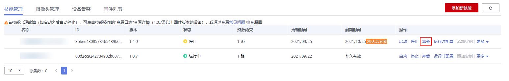
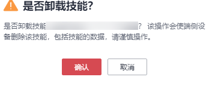

# 卸载技能

若不再需要某个技能，可通过HiLens管理控制台卸载技能。

## 操作前必读

-   仅可对处于“在线“状态（即运行状态）的设备卸载技能。处于离线状态（即非运行状态）的设备无法卸载技能。
-   卸载技能会删除端侧的技能和技能数据，请谨慎操作。

## 卸载技能

1.  在“技能管理“界面中，进入“技能管理“界面，选择指定的技能，单击“操作“列的“卸载“。

    **图 1**  卸载技能  
    

2.  在弹出的对话框中，确认要卸载的技能信息，单击“确定“完成卸载操作。

    **图 2**  卸载技能-18  
    

