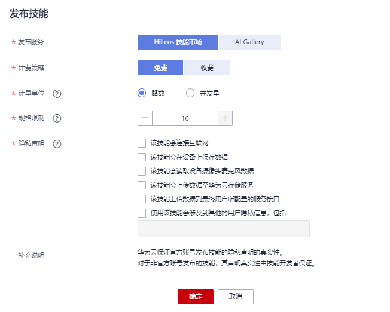

# 发布技能

开发者完成技能的开发、调试后，可以选择把技能发布到华为HiLens平台的技能市场，平台审核通过后，您分享的技能可供其它用户购买使用。您也可以把技能发布在ModelArts平台的AI Gallery，发布后您可以设置购买金额，当有用户购买使用时，您作为技能发布者，将获得相应的报酬。

## 前提条件

已完成[技能开发](新建技能.md)，且技能已完成[安装调试](安装和调试技能.md)，调试结果满足业务诉求。

## 背景信息

-   发布的技能在3个工作日内审核，审核通过后，发布在华为HiLens技能市场的技能在“技能市场“列表中展示，发布在ModelArts AI Gallery的技能在“ModelArts控制台\>AI Gallery“的“我的发布“页签下展示。
-   发布的技能名称不能与华为HiLens技能市场、ModelArts AI Gallery中其他技能重复。

## 发布技能至技能市场/ModelArts AI Gallery

1.  登录华为HiLens管理控制台，单击左侧导航栏“技能开发\>技能管理“，进入“技能管理“页面。
2.  选择需要发布的技能，单击操作列的“发布“。

    **图 1**  发布技能  
    

3.  在弹出的“发布技能“对话框中，选择发布技能的服务，并设置对应的发布信息，单击“确定“。

    **图 2**  发布技能至技能市场  
    

    -   发布技能至华为HiLens技能市场

        按[表1](#table5632512142519)设置发布信息。

        **表 1**  发布至技能市场参数说明

        
        <table><thead align="left"><tr id="row46321412202517"><th class="cellrowborder" valign="top" width="32.1%" id="mcps1.2.3.1.1">
参数字段

        </th>
        <th class="cellrowborder" valign="top" width="67.9%" id="mcps1.2.3.1.2">
说明

        </th>
        </tr>
        </thead>
        <tbody><tr id="row4208729174719"><td class="cellrowborder" valign="top" width="32.1%" headers="mcps1.2.3.1.1 ">
发布服务

        </td>
        <td class="cellrowborder" valign="top" width="67.9%" headers="mcps1.2.3.1.2 ">
技能发布的服务位置。选择“HiLens技能市场”。

        </td>
        </tr>
        <tr id="row1263291211259"><td class="cellrowborder" valign="top" width="32.1%" headers="mcps1.2.3.1.1 ">
计费策略

        </td>
        <td class="cellrowborder" valign="top" width="67.9%" headers="mcps1.2.3.1.2 ">
技能发布在技能市场的计费策略。可选择“免费”和“收费”。

        </td>
        </tr>
        <tr id="row1963231215254"><td class="cellrowborder" valign="top" width="32.1%" headers="mcps1.2.3.1.1 ">
计费模式

        </td>
        <td class="cellrowborder" valign="top" width="67.9%" headers="mcps1.2.3.1.2 ">
技能发布后的计费模式。

        <ul id="ul7609145110480"><li>若选择“免费”计费策略，仅可选择“一次性”计费模式。</li><li>若选择“收费”计费策略，可选择“包年/包月”和“一次性”两种计费模式。</li></ul>
        </td>
        </tr>
        <tr id="row1763361218250"><td class="cellrowborder" valign="top" width="32.1%" headers="mcps1.2.3.1.1 ">
计量单位

        </td>
        <td class="cellrowborder" valign="top" width="67.9%" headers="mcps1.2.3.1.2 ">
每份License可用在设备上的规格。有“路数”和“并发量”两种计量方式。若以“路数”规格，一份License可安装在设备上使用一路视频。

        </td>
        </tr>
        <tr id="row17469121994912"><td class="cellrowborder" valign="top" width="32.1%" headers="mcps1.2.3.1.1 ">
规格限制

        </td>
        <td class="cellrowborder" valign="top" width="67.9%" headers="mcps1.2.3.1.2 ">
技能在同一设备上最多可以处理视频的路数，或最大并发量。

        </td>
        </tr>
        <tr id="row146337123259"><td class="cellrowborder" valign="top" width="32.1%" headers="mcps1.2.3.1.1 ">
云服务类型

        </td>
        <td class="cellrowborder" rowspan="3" valign="top" width="67.9%" headers="mcps1.2.3.1.2 ">
“收费”技能需要开发者联系华为HiLens工作人员录入技能产品信息，然后返回一个资源编码，然后把编码填入“云服务类型”、“资源类型”、“资源规格编码”三个字段。

        </td>
        </tr>
        <tr id="row13474818193619"><td class="cellrowborder" valign="top" headers="mcps1.2.3.1.1 ">
资源类型

        </td>
        </tr>
        <tr id="row16671162416364"><td class="cellrowborder" valign="top" headers="mcps1.2.3.1.1 ">
资源规格编码

        </td>
        </tr>
        <tr id="row554135473711"><td class="cellrowborder" valign="top" width="32.1%" headers="mcps1.2.3.1.1 ">
隐私声明

        </td>
        <td class="cellrowborder" valign="top" width="67.9%" headers="mcps1.2.3.1.2 ">
技能涉及到的用户隐私声明。

        </td>
        </tr>
        </tbody>
        </table>

        提交之后，将发送至华为HiLens后台，由工作人员进行审核，3个工作日之内完成审核，请您耐心等待。

        审核完成后，发布的技能将展示在华为HiLens控制台的“产品订购\>技能市场“页面。

    -   发布技能至ModelArts AI Gallery

        按[表2](#table662011399556)设置发布信息。

        **表 2**  发布至ModelArts AI Gallery参数说明

        
        <table><thead align="left"><tr id="row196201393551"><th class="cellrowborder" valign="top" width="50%" id="mcps1.2.3.1.1">
参数字段

        </th>
        <th class="cellrowborder" valign="top" width="50%" id="mcps1.2.3.1.2">
说明

        </th>
        </tr>
        </thead>
        <tbody><tr id="row86202397554"><td class="cellrowborder" valign="top" width="50%" headers="mcps1.2.3.1.1 ">
发布服务

        </td>
        <td class="cellrowborder" valign="top" width="50%" headers="mcps1.2.3.1.2 ">
技能发布的服务位置。选择“AI Gallery”。

        </td>
        </tr>
        <tr id="row3620123975512"><td class="cellrowborder" valign="top" width="50%" headers="mcps1.2.3.1.1 ">
权限

        </td>
        <td class="cellrowborder" valign="top" width="50%" headers="mcps1.2.3.1.2 ">
设置此技能的公开权限。

        <ul id="ul55175025816"><li>公开：表示所有可以使用ModelArts AI Gallery的用户都可以看到并使用您的技能。</li><li>草稿：表示只有当前帐号可以使用此技能。
您也可以单击“AI Gallery”，进入ModelArts AI Gallery发布技能给白名单用户使用，具体操作请参见<a href="在ModelArts-AI-Gallery发布技能.md">在ModelArts AI Gallery发布技能</a>。

        </li></ul>
        </td>
        </tr>
        </tbody>
        </table>

        提交之后，您可以在华为HiLens控制台的“技能开发\>技能管理“页面，查看技能的发布状态。

        若发布状态显示“ModelArts市场审核通过，已发布“，则表示技能发布成功，技能将展示在ModelArts AI Gallery的“ModelHub\>我的发布“页面。

