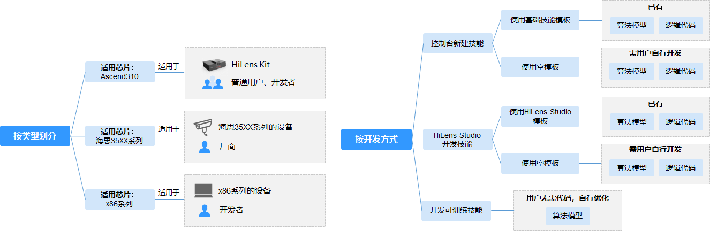

# 可训练技能简介

技能可以抽象地理解为算法模型+逻辑代码。算法模型负责关键的AI推理，逻辑代码负责处理模型推理的结果。技能详细介绍可参见[什么是技能](技能管理简介.md#section161861359114016)。

本章节介绍使用可训练技能模板在ModelArts Pro控制台开发技能。使用可训练技能模板开发技能，无需代码，只需自主上传训练数据，快速训练高精度算法模型，并且一键部署至设备。

## 技能开发说明

如[图1](#hilens_02_0019_fig54917174497)所示，根据不同芯片类型，技能分为两种类型，分别为可应用于HiLens Kit设备的技能和可应用于海思35XX系列芯片设备的技能。平台不仅支持使用技能模板快速开发技能，便捷高效；还支持自行开发模型和逻辑代码，可以满足您更丰富的场景。使用可训练技能模板开发技能，可无代码上传训练数据，提高模型精度，开发出契合行业场景的技能，详情请见[新建可训练技能的流程](可训练技能简介.md#section149812434162)。

运行在海思35XX系列芯片的技能对内存和性能的要求比较高，针对适用于此类设备的技能需要对模型进行优化后才能运行，若需要开发此类技能，请联系华为工程师。

**图 1**  技能开发的不同场景  

## 新建可训练技能的流程

ModelArts Pro控制台提供可训练技能工作流，使用可训练技能模板在ModelArts Pro控制台自主上传数据训练模型，无需代码，即可快速提高模型精度，创建技能，并且一键部署至设备。

> **说明：** 
>-   使用可训练技能模板新建技能，仅支持训练模型提高模型精度，暂不支持修改技能模板的逻辑代码。如果您希望自行修改技能的逻辑代码，可以选择在华为HiLens控制台开发技能，详情请见[控制台开发技能](控制台开发技能.md)。
>-   在开发可训练技能时，会占用OBS资源，需要收取一定费用，收费规则请参见[对象存储服务 OBS](https://www.huaweicloud.com/pricing.html?tab=detail#/obs)。
>-   在开发可训练技能时，会占用ModelArts的训练资源，需要收取一定费用，收费规则请参见[ModelArts价格详情](https://www.huaweicloud.com/pricing.html?tab=detail#/modelarts)。

新建可训练技能的详细流程如[图2](#fig1389453811182)所示。

**图 2**  可训练技能开发流程  

**表 1**  新建可训练技能常用操作指引

<table><thead align="left"><tr id="row1490445101912"><th class="cellrowborder" colspan="2" valign="top" id="mcps1.2.5.1.1">
步骤

</th>
<th class="cellrowborder" valign="top" id="mcps1.2.5.1.2">
说明

</th>
<th class="cellrowborder" valign="top" id="mcps1.2.5.1.3">
快速跳转至详细指导

</th>
</tr>
</thead>
<tbody><tr id="row151962873112"><td class="cellrowborder" colspan="2" valign="top" headers="mcps1.2.5.1.1 ">
连接端侧和云侧

</td>
<td class="cellrowborder" valign="top" headers="mcps1.2.5.1.2 ">
首先，连接您购买的HiLens Kit，并将HiLens Kit注册到华为HiLens平台，连接端侧与云侧。

</td>
<td class="cellrowborder" valign="top" headers="mcps1.2.5.1.3 ">
<a href="HiLens-Kit注册流程.md">HiLens Kit注册流程</a>

<a href="智能边缘系统注册设备.md">智能边缘系统注册设备</a>

<a href="使用SSH注册设备.md">使用SSH注册设备</a>

</td>
</tr>
<tr id="row149014514196"><td class="cellrowborder" colspan="2" valign="top" headers="mcps1.2.5.1.1 ">
新建可训练技能（使用可训练技能模板）

</td>
<td class="cellrowborder" valign="top" headers="mcps1.2.5.1.2 ">
基于预置的可训练技能新建技能，填写技能的基本信息。

</td>
<td class="cellrowborder" valign="top" headers="mcps1.2.5.1.3 ">
<a href="新建可训练技能.md">新建可训练技能</a>

</td>
</tr>
<tr id="row16901445121912"><td class="cellrowborder" colspan="2" valign="top" headers="mcps1.2.5.1.1 ">
开发技能（HiLens安全帽检测技能）

</td>
<td class="cellrowborder" valign="top" headers="mcps1.2.5.1.2 ">
根据工作流指引，开发安全帽检测技能，通过上传训练数据，训练生成安全帽检测模型，自主更新和调整模型精度，实现高精度的安全帽检测功能，并一键安装技能至HiLens Kit设备。

</td>
<td class="cellrowborder" valign="top" headers="mcps1.2.5.1.3 ">
<a href="HiLens安全帽检测技能.md">HiLens安全帽检测技能</a>

</td>
</tr>
<tr id="row161981544123410"><td class="cellrowborder" colspan="2" valign="top" headers="mcps1.2.5.1.1 ">
启动技能

</td>
<td class="cellrowborder" valign="top" headers="mcps1.2.5.1.2 ">
把技能安装至设备后，可以直接在HiLens Studio中启动技能，查看技能运行效果。

</td>
<td class="cellrowborder" valign="top" headers="mcps1.2.5.1.3 ">
<a href="启动或停止技能.md">启动或停止技能</a>

</td>
</tr>
</tbody>
</table>

