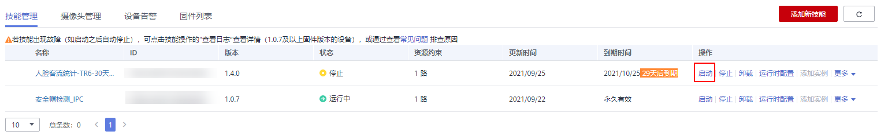
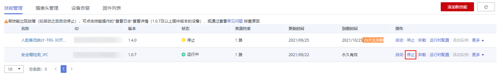

# 启动或停止技能

针对设备上的技能，您可以根据您的需求启动或停止技能。启动技能操作成功后，设备上的技能将处于“运行中“状态，表示技能已经在设备中应用。停止操作成功后，设备上的技能将处于“停止“状态。

## 操作前必读

-   “停止“状态的技能，允许执行“启动“操作。
-   “运行中“允许执行停止操作，“故障“或“停止“的技能允许卸载。
-   用户安装技能后，需要启动技能，才能使技能在设备上运行，详情请参见[启动技能](#section370814182517)。

## 启动技能

在“技能管理“界面中，选择状态为“停止“的技能，单击“操作“列的“启动“。技能启动时会有一个命令下发过程，您需要等待一段时间才能在界面看到技能状态的更新。

**图 1**  启动技能  

## 停止技能

在“技能管理“界面中，选择状态为“运行中“的技能，单击“操作“列的“停止“。技能停止后会有一个命令下发过程，您需要等待一段时间才能在界面看到技能状态的更新。

**图 2**  停止技能  

