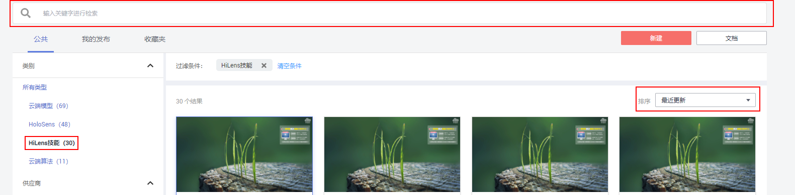
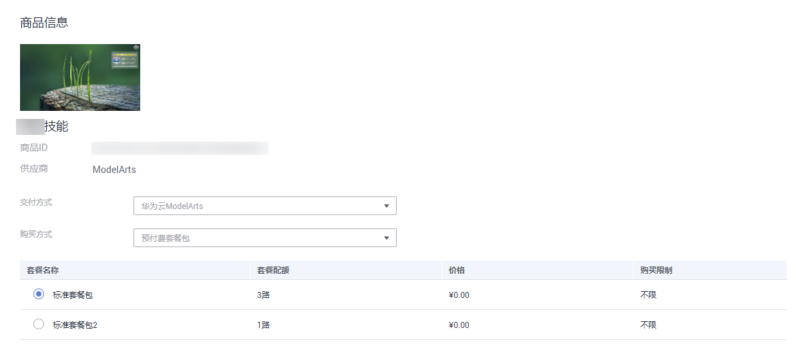

# 在ModelArts AI市场购买技能

您也可以在ModelArts的AI市场中，查找并购买您想要的技能。

## 进入AI市场

登录ModelArts控制台，单击左侧导航栏的“AI市场“，系统默认进入“ModelHub\>公共“页签，展示AI市场其他人共享的模型和技能。

## 查找技能

在“公共“页签下，在左侧的导航栏中，单击“所有类型“中的“HiLens技能“过滤技能，筛选出您所需要的技能。

-   方式1：在搜索框中，输入关键词，AI市场会自动在所有的模型或技能中搜索与关键词相关的技能。
-   方式2：在左侧的导航栏中，单击“类别“下的“HiLens技能“，筛选出适用于Huawei HiLens的技能。
-   方式3：在右上角的分类下拉框中，选择您所需的分类，筛选出您想要的模型。目前有“最近更新“、“最近发布“、“最多收藏“、“最多浏览“和“最多订阅“五种类别。

    **图 1**  查找技能  
    

## 查看技能详情

在公共、我的发布、收藏等页签下，仅展示技能的基本信息，如果想要了解详细信息，可单击技能所在区块进入详情页面。

在技能详情页面，将展示此技能的描述、价格、版本、Demo、品评等信息，详细内容请从界面获取。

## 订阅技能

模型或算法详情页面中，单击“订阅“，进入“订单详情“页面，根据界面提示填写详细配置，如“交付方式“、“购买方式“等，勾选合适的套餐，单击“下一步“，根据界面提示，按步骤完成订阅。

**图 2**  订阅信息  

