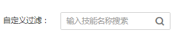
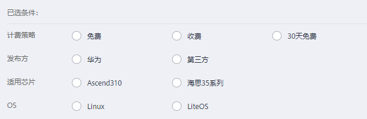

# 在技能市场查找技能

由于技能市场是一个开放的市场，有自己发布的技能，还有其他开发者分享的技能，在众多技能中，您可以通过如下几种方式查找您想要的技能。

技能市场默认按综合排序进行展示。

## 搜索技能

在“技能市场“页面左上角的“自定义过滤“中，输入技能名称的关键词，通过关键词进行搜索。

**图 1**  搜索  

## 筛选技能

在已选条件下方，可以选择对应的“应用场景“，筛选相关的技能，帮助您快速通过场景选择技能。

**图 2**  筛选技能  

