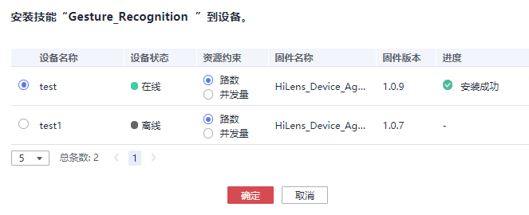

# 安装和调试技能

技能创建完成后，您可以将技能安装至设备中，通过查看设备的技能视频或原始视频，查看技能运行效果，判断此技能是否满足业务诉求。

您还可以查看端侧日志调试技能，帮助定位问题，具体操作请参见[查看设备日志](查看设备日志.md)。

## 前提条件

-   已有一个HiLens Kit设备，在华为HiLens中完成注册，且设备处于“在线“状态。设备管理相关指导请参见[设备管理简介](设备管理简介.md)。
-   在华为HiLens中[新建技能](新建技能.md)，技能已完成开发。
-   安装自行开发的技能，需要购买HiLens端边云协同平台服务并激活设备，详情请见[订购HiLens端边云协同平台服务](订购HiLens端边云协同平台服务.md)和[激活设备（购买端边云协同平台服务）](激活设备（购买端边云协同平台服务）.md)。

## 安装技能

1.  登录华为HiLens管理控制台，单击左侧导航栏“技能开发\>技能管理“。

    进入“技能管理\>基础技能“页面。

2.  选择需要安装的技能，单击右侧操作列“安装“。

    **图 1**  安装技能  
    

3.  在弹出的安装对话框中，勾选需要安装的设备，单击“确定“。

    当显示如下类似信息时，表示安装成功。

    **图 2**  安装成功  
    

4.  安装成功后，您可以前往[数据管理](管理数据.md)，查看技能效果。

