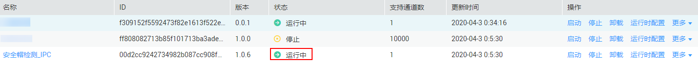

# 安装技能

针对您管理的设备，可以在技能市场中选购所需的技能，并将其安装部署到您的设备中，拓展设备的AI能力。

## 前提条件

-   “设备列表“中至少拥有一个设备，且设备状态为“在线“。
-   “我的技能 \> 我的订单“中至少拥有一个技能。如果未购买任意技能，即此页面显示无内容，建议您先参考指导[购买技能](购买技能.md)，购买相关技能。
-   如果“我的技能 \> 我的订单“中的技能不满足要求，您可以前往“技能市场“购买其他所需技能，或者进入“我的技能 \> 我的定制“页面[定制技能](定制技能.md)。

## 操作步骤

1.  在管理控制台左侧菜单栏选择“设备管理 \>设备列表“，然后在设备列表中，选择需要进行管理的某一设备，单击“技能管理“进入设备详情页面。“设备详情“页面默认展示“技能管理“页签。
2.  在“技能管理“页签中，单击右上角“添加新技能“，系统跳转至“技能市场\>我的技能“页面。
3.  系统默认显示“我的订单“页签，展示您的账号下已完成购买的技能列表。
4.  选择本次需要安装的技能，单击“操作“列的“安装“。

    > **说明：**   
    >只能选择“适用芯片：Ascend310“类型的技能，且该技能购买的份数未使用完。  

5.  在弹出的安装技能对话框中，勾选您需要安装的设备，待“进度“栏显示“安装成功“后，单击“安装“。
6.  执行如下操作确认技能是否正常安装。若技能状态为“安装成功“，说明技能正常安装至设备。
    1.  单击左侧导航栏“设备管理 \>设备列表“，进入设备列表页面。
    2.  单击已注册设备的“技能管理“，检查技能状态是否为“安装成功“，如[图1](#fig15697236122817)，技能成功下发到设备。

        技能状态包含“安装中“、“安装失败“、“安装成功“、“启动中“、“启动失败“、“启动成功“、“停止中“、“停止失败“、“停止成功“、“卸载中“、“卸载失败“。其中，安装技能的状态说明请参见[表1](#table1539193162320)。

        **图 1**  查看技能状态  
        

        **表 1**  安装技能状态

        
        <table><thead align="left"><tr id="row10392316236"><th class="cellrowborder" valign="top" width="22.900000000000002%" id="mcps1.2.3.1.1">
状态名

        </th>
        <th class="cellrowborder" valign="top" width="77.10000000000001%" id="mcps1.2.3.1.2">
状态说明

        </th>
        </tr>
        </thead>
        <tbody><tr id="row639193192312"><td class="cellrowborder" valign="top" width="22.900000000000002%" headers="mcps1.2.3.1.1 ">
安装中

        </td>
        <td class="cellrowborder" valign="top" width="77.10000000000001%" headers="mcps1.2.3.1.2 ">
下发状态，技能正在下发，建议您耐心等待。

        </td>
        </tr>
        <tr id="row103920312315"><td class="cellrowborder" valign="top" width="22.900000000000002%" headers="mcps1.2.3.1.1 ">
安装失败

        </td>
        <td class="cellrowborder" valign="top" width="77.10000000000001%" headers="mcps1.2.3.1.2 ">
失败状态，技能下发失败，建议您重新安装。

        </td>
        </tr>
        <tr id="row4395332316"><td class="cellrowborder" valign="top" width="22.900000000000002%" headers="mcps1.2.3.1.1 ">
安装成功

        </td>
        <td class="cellrowborder" valign="top" width="77.10000000000001%" headers="mcps1.2.3.1.2 ">
成功状态，技能安装成功，建议您<a href="启动或停止技能.md#section370814182517">启动技能</a>。

        </td>
        </tr>
        </tbody>
        </table>

