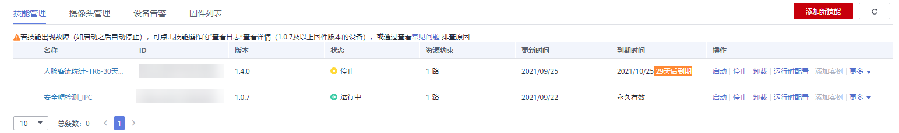
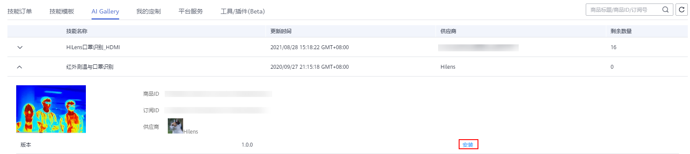

# 安装技能

针对您管理的设备，可以在技能市场中选购所需的技能，并将其安装部署到您的设备中，拓展设备的AI能力。

## 前提条件

-   “设备管理\>设备列表“中至少拥有一个设备，且设备状态为“在线“。
-   “产品订购\>订单管理“默认“技能订单“页签和“AI Gallery“页签下中至少拥有一个技能。如果未购买任意技能，即此页面显示无内容，建议您先参考指导[购买技能](购买技能.md)，在技能市场购买相关技能，也可以[在ModelArts AI Gallery订阅技能](购买技能.md#section5878245692)。
-   如果“产品订购\>订单管理\>技能订单“中的技能不满足要求，您可以前往“产品订购\>技能市场“购买其他所需技能，或者进入“产品订购\>订单管理\>我的定制“页面[定制技能](定制技能.md)。

## 操作步骤

1.  在管理控制台左侧菜单栏选择“设备管理 \>设备列表“，然后在设备列表中，选择需要进行管理的某一设备，单击设备卡片进入设备详情页面。

    “设备详情“页面默认展示“技能管理“页签。

    **图 1**  技能管理  
    

2.  在“技能管理“页签中，单击右上角“添加新技能“，系统跳转至“产品订购\>订单管理“页面。
3.  系统默认显示“技能订单“页签，展示您的帐号下已完成购买的技能列表。

    您也可以单击“AI Gallery“，切换至“AI Gallery“页签，展示您帐号下在ModelArts AI Gallery购买的技能列表。

4.  选择本次需要安装的技能。
    -   “技能订单“页签：单击技能列表“操作“列的“安装“。

        **图 2**  技能订单-15  
        

    -   “AI Gallery“页签：单击技能名称左侧，查看技能信息，单击“安装“。

        **图 3**  技能安装  
        

        > **说明：** 
        >只能选择“适用芯片：Ascend310“类型的技能，且该技能购买的份数未使用完。

5.  在弹出的安装技能对话框中，勾选您需要安装的设备，在“规格“列选择技能在设备上使用的路数，若要安装技能至多台设备，可根据自身需要选择勾选“用此规格批量安装“的“是“，单击“安装“。
6.  执行如下操作确认技能是否正常安装。若技能状态为“安装成功“，说明技能正常安装至设备。
    1.  单击左侧导航栏“设备管理 \>设备列表“，进入设备列表页面。
    2.  单击已注册设备的“技能管理“，已安装的技能状态为“停止“，单击操作列的“启动“，并单击“确定“，确定启动技能运行在端侧设备上。

        等待一会，当状态变为“运行中“，则技能成功运行在端侧设备上。

        部署技能的状态说明如[表1](#table1539193162320)所示。

        **图 4**  查看技能状态  
        

        **表 1**  安装技能状态

        
        <table><thead align="left"><tr id="row10392316236"><th class="cellrowborder" valign="top" width="19.59%" id="mcps1.2.3.1.1">
状态名

        </th>
        <th class="cellrowborder" valign="top" width="80.41%" id="mcps1.2.3.1.2">
状态说明

        </th>
        </tr>
        </thead>
        <tbody><tr id="row639193192312"><td class="cellrowborder" valign="top" width="19.59%" headers="mcps1.2.3.1.1 ">
停止

        </td>
        <td class="cellrowborder" valign="top" width="80.41%" headers="mcps1.2.3.1.2 ">
停止状态，技能停止运行在端侧设备上。

        </td>
        </tr>
        <tr id="row4395332316"><td class="cellrowborder" valign="top" width="19.59%" headers="mcps1.2.3.1.1 ">
运行中

        </td>
        <td class="cellrowborder" valign="top" width="80.41%" headers="mcps1.2.3.1.2 ">
运行状态，技能成功运行在端侧设备。

        </td>
        </tr>
        </tbody>
        </table>

