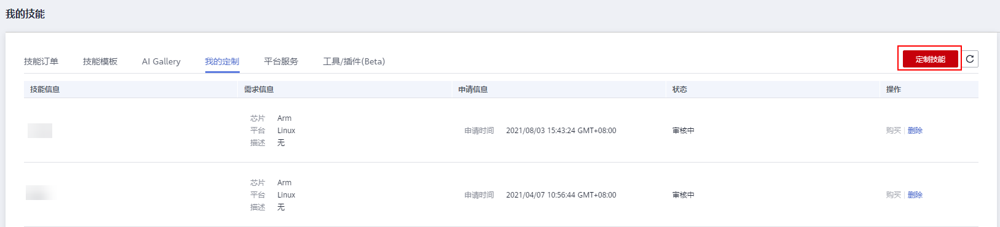
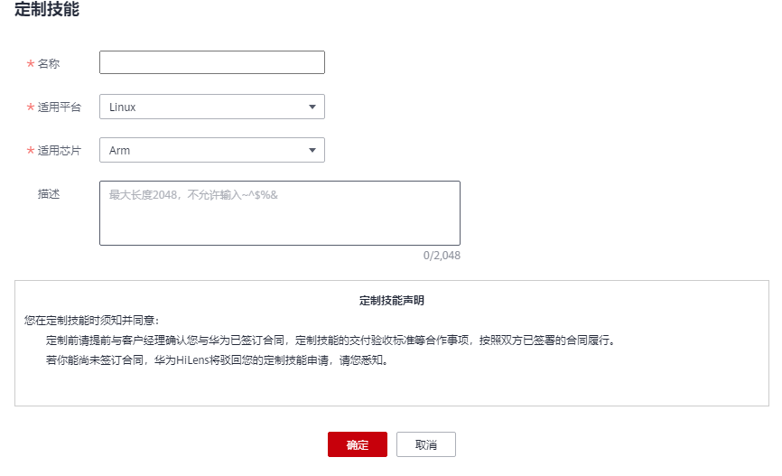
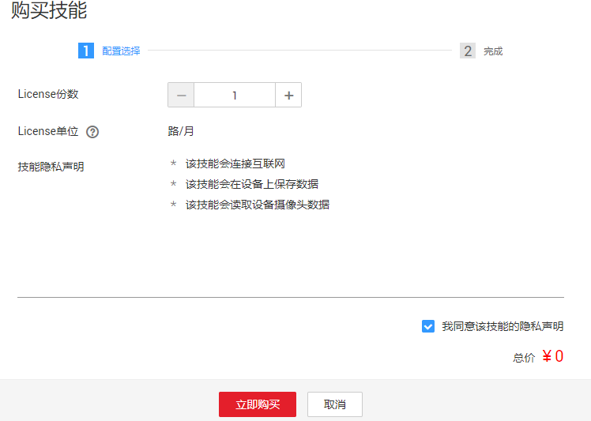
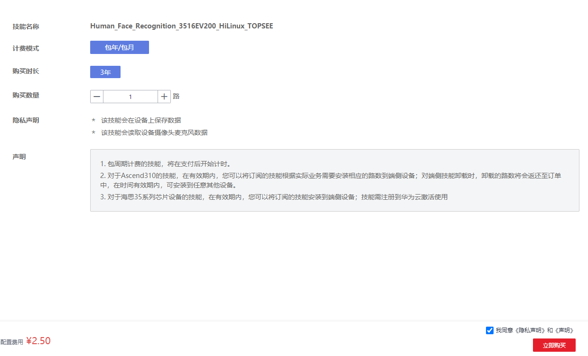

# 定制技能

当“技能市场“没有您需要的技能，可以向华为HiLens提出定制技能的需求。定制前请联系工作人员，确认已与华为签订合同，定制技能的交付验收标准等合作事项将按双方已签署的合同履行。

## 背景信息

-   可以定制“适用于Ascend310芯片的技能“或“适用于海思35XX系列芯片的技能“的任意一种。
-   定制技能需要提交定制需求，然后会有相应的工作人员与您联系，协商细节事项与费用事宜。

## 定制技能

1.  登录HiLens管理控制台，在左侧导航栏中选择“产品订购\>订单管理“。
2.  在“我的技能“页面，单击“我的定制“页签，进入定制技能页面。

    **图 1**  定制技能  
    

3.  单击右上角“定制技能“，输入定制技能参数，单击“确定“。

    **图 2**  定制技能-39  
    

    **表 1**  定制技能参数

    
    <table><thead align="left"><tr id="row1915610504913"><th class="cellrowborder" valign="top" width="17.05%" id="mcps1.2.3.1.1">
参数

    </th>
    <th class="cellrowborder" valign="top" width="82.95%" id="mcps1.2.3.1.2">
参数说明

    </th>
    </tr>
    </thead>
    <tbody><tr id="row171563501295"><td class="cellrowborder" valign="top" width="17.05%" headers="mcps1.2.3.1.1 ">
名称

    </td>
    <td class="cellrowborder" valign="top" width="82.95%" headers="mcps1.2.3.1.2 ">
需定制的技能名称。

    </td>
    </tr>
    <tr id="row1015718501793"><td class="cellrowborder" valign="top" width="17.05%" headers="mcps1.2.3.1.1 ">
适用平台

    </td>
    <td class="cellrowborder" valign="top" width="82.95%" headers="mcps1.2.3.1.2 ">
技能所运行的平台。支持“Linux”、“Android”、“iOS”、“LiteOS”、“Windows”等平台。

    </td>
    </tr>
    <tr id="row6157350296"><td class="cellrowborder" valign="top" width="17.05%" headers="mcps1.2.3.1.1 ">
适用芯片

    </td>
    <td class="cellrowborder" valign="top" width="82.95%" headers="mcps1.2.3.1.2 ">
技能所适用的芯片。支持“ARM”、“3516CV500”、“3519AV100”、“3519V101”、“3516DV300”、“Ascend310”等。其中选择“Ascend310”芯片的技能，可用于HiLens Kit设备。

    </td>
    </tr>
    <tr id="row14157750895"><td class="cellrowborder" valign="top" width="17.05%" headers="mcps1.2.3.1.1 ">
描述

    </td>
    <td class="cellrowborder" valign="top" width="82.95%" headers="mcps1.2.3.1.2 ">
该技能的详细描述，例如使用场景、技能效率等。

    </td>
    </tr>
    </tbody>
    </table>

4.  提交表单后，会有工作人员联系您协商技能具体的细节事项。同时您可以在“我的定制“页面查看此定制技能的状态。
    -   审核中：定制技能申请正在审核。
    -   未通过：如果您尚未签订合同，华为HiLens将驳回您的定制技能申请。
    -   定制中：技能正在定制。
    -   定制完成：定制技能已定制完成。定制技能定制完成后，支持购买并使用此定制技能，请见[购买定制技能](#section637125192815)。

## 购买定制技能

1.  登录HiLens管理控制台，在左侧导航栏中选择“产品订购\>订单管理“。
2.  在“我的技能“页面，单击“我的定制“页签，进入定制技能页面。
3.  单击定制技能“操作“列的“购买“。

    弹出“购买技能“对话框。

    -   若技能为**免费技能**，则弹出“购买技能“对话框。
        1.  在弹出的“购买技能“对话框中，按照“规格“选择“份数“，阅读技能隐私声明，并勾选“我同意该技能的隐私声明“，确认费用后，单击“立即购买“，完成技能购买。

            当前“规格“为“路“，表示每份License可用在设备上的视频路数，有路数和并发量两种计量方式。若以路数规格，一份License可以安装在设备上使用一路视频。

            部分技能无需勾选“我同意该技能的隐私声明“，直接单击“立即购买“，即可完成技能购买。

        2.  技能购买完成后，对话框显示购买完成，您可以单击“订单“，返回“定制技能“页面查看技能信息。也可以在左侧导航栏中选择“产品订购\>订单管理“进入“技能订单“页面，查看已购买技能。

            **图 3**  购买技能  
            

    -   若技能为**计费技能**，则进入“购买技能“页面。
        1.  选择“购买时长“和“购买数量“，确认“计费模式“、“隐私声明“和“声明“，勾选“我同意《隐私声明》和《声明》“，然后单击“立即购买“。

            进入“订单确认“页面。

            **图 4**  确认购买技能  
            

        2.  在“订单确认“页面，确认订单详情，单击“提交订单“。

            进入“支付“页面。

        3.  在“支付“页面，勾选支付方式，确认订单后，单击“确认付款“，输入支付密码，完成技能购买。

            技能购买完成后，页面显示订单支付成功，您可以单击“返回控制台“，进入华为HiLens控制台，在左侧导航栏中选择“产品订购\>订单管理“进入“技能订单“页面，查看已购买技能。

## 后续操作

购买定制技能后，可以安装技能到设备上使用，详情请见[安装技能](安装技能.md)。

