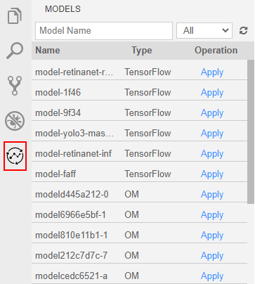

# 导入/转换ModelArts开发模型

技能可以抽象地理解为算法模型+逻辑代码。算法模型负责关键的AI推理，逻辑代码负责处理模型推理的结果。因此在HiLens Studio开发技能时，需要将模型导入HiLens Studio。

本章节介绍如何将在ModelArts开发的模型导入HiLens Studio，以及针对非“om“格式的模型，如何在HiLens Studio进行模型转换。

## 前提条件

已在ModelArts在线训练算法模型，训练模型可参见《[ModelArts文档](https://support.huaweicloud.com/engineers-modelarts/modelarts_23_0044.html)》。如果要使用ModelArts的预置算法，当前华为HiLens平台仅支持转换如下预置算法：

-   [yolov3\_resnet18（检测物体类别和位置）](https://support.huaweicloud.com/engineers-modelarts/modelarts_23_0158.html#section1)
-   [ResNet\_v1\_50（图像分类）](https://support.huaweicloud.com/engineers-modelarts/modelarts_23_0158.html#section7)

> **说明：** 
>-   暂不支持导入ModelArts中“自动学习“训练的模型。
>-   华为HiLens 只能导入ModelArts中训练的模型文件，不能导入ModelArts的模型。

## 导入（转换）模型

1.  在HiLens Studio界面左侧，单击。

    页面左侧将显示您在ModelArts训练好的模型列表。

    **图 1**  模型列表  
    

2.  选择待导入、转换的模型，单击“Operation“列的“Apply“。
    -   如果是“om“格式的模型，待模型导入成功后，HiLens Studio右下角会提示“Model imported successfully.“，文件夹“model“下会显示新导入的模型文件。
    -   如果是非“om“格式的模型，会弹出“Convert Model“对话框。

        按[表1](#table16577161142912)填写模型转换的信息，单击“OK“。

        **表 1**  Convert Model参数说明

        
        <table><thead align="left"><tr id="row115771911102912"><th class="cellrowborder" valign="top" width="19.63%" id="mcps1.2.3.1.1">
参数

        </th>
        <th class="cellrowborder" valign="top" width="80.36999999999999%" id="mcps1.2.3.1.2">
说明

        </th>
        </tr>
        </thead>
        <tbody><tr id="row105771011132919"><td class="cellrowborder" valign="top" width="19.63%" headers="mcps1.2.3.1.1 ">
Model Path

        </td>
        <td class="cellrowborder" valign="top" width="80.36999999999999%" headers="mcps1.2.3.1.2 ">
待转换的模型文件在技能项目文件中的位置。一般将模型导入至文件夹“save_model”。

        </td>
        </tr>
        <tr id="row85777110293"><td class="cellrowborder" valign="top" width="19.63%" headers="mcps1.2.3.1.1 ">
Configuration

        </td>
        <td class="cellrowborder" valign="top" width="80.36999999999999%" headers="mcps1.2.3.1.2 ">
待转换模型的配置文件在技能项目文件中的位置。例如“save_model/aipp_rgb.cfg”。

        </td>
        </tr>
        <tr id="row5577191192911"><td class="cellrowborder" valign="top" width="19.63%" headers="mcps1.2.3.1.1 ">
Output Path

        </td>
        <td class="cellrowborder" valign="top" width="80.36999999999999%" headers="mcps1.2.3.1.2 ">
模型转换后输出位置。

        </td>
        </tr>
        <tr id="row175771711182912"><td class="cellrowborder" valign="top" width="19.63%" headers="mcps1.2.3.1.1 ">
Type

        </td>
        <td class="cellrowborder" valign="top" width="80.36999999999999%" headers="mcps1.2.3.1.2 ">
模型转换的类型，包括“TF-FrozenGraph-To-Ascend-HiLens”、“Caffe to Ascend”。

        <ul id="ul83281052615"><li>“TF-FrozenGraph-To-Ascend-HiLens”
支持将Tensorflow frozen graph模型转换成可在ascend芯片上运行的模型。

        </li><li>“Caffe to Ascend”
支持将Caffe模型转换成可在ascend芯片上运行的模型。

        </li></ul>
        </td>
        </tr>
        <tr id="row657715118296"><td class="cellrowborder" valign="top" width="19.63%" headers="mcps1.2.3.1.1 ">
Advanced Options

        </td>
        <td class="cellrowborder" valign="top" width="80.36999999999999%" headers="mcps1.2.3.1.2 ">
当模型转换类型为“TF-FrozenGraph-To-Ascend-HiLens”时，可填写高级选项，包括张量形状、转换输出节点等参数选项，详情请见<a href="#table19918847567">表2</a>。

        </td>
        </tr>
        </tbody>
        </table>

        **表 2**  Advanced Options

        
        <table><thead align="left"><tr id="row1491819412562"><th class="cellrowborder" valign="top" width="28.720000000000002%" id="mcps1.2.3.1.1">
参数名称

        </th>
        <th class="cellrowborder" valign="top" width="71.28%" id="mcps1.2.3.1.2">
参数说明

        </th>
        </tr>
        </thead>
        <tbody><tr id="row179181943566"><td class="cellrowborder" valign="top" width="28.720000000000002%" headers="mcps1.2.3.1.1 ">
Input Tensor Shape

        </td>
        <td class="cellrowborder" valign="top" width="71.28%" headers="mcps1.2.3.1.2 ">
输入张量形状。若在上文“模型来源”中，选择需要转换格式的模型（非om格式模型），并且转换类型是“Tensorflow frozen graph 转 Ascend”或“Tensorflow SavedModel 转 Ascend”时，需要填写输入张量形状。

        
张量形状即模型输入数据的shape，输入数据格式为NHWC，如“input_name:1,224,224,3”，必填项。“input_name”必须是转换前的网络模型中的节点名称。当模型存在动态shape输入时必须提供。例如“input_name1:?,h,w,c”，该参数必填，其中“?”为batch数，表示1次处理的图片数量，需要根据实际情况填写，用于将动态shape的原始模型转换为固定shape的离线模型。

        
如果存在多个输入，请以分号（;）隔开。

        </td>
        </tr>
        <tr id="row29181549566"><td class="cellrowborder" valign="top" width="28.720000000000002%" headers="mcps1.2.3.1.1 ">
out_nodes

        </td>
        <td class="cellrowborder" valign="top" width="71.28%" headers="mcps1.2.3.1.2 ">
转换输出节点，即指定输出节点,例如“node_name1:0;node_name1:1;node_name2:0”，其中“node_name”必须是模型转换前的网络模型中的节点名称,冒号后的数字表示第几个输出,例如“node_name1:0”，表示节点名称为“node_name1”的第0个输出。

        </td>
        </tr>
        <tr id="row99183465617"><td class="cellrowborder" valign="top" width="28.720000000000002%" headers="mcps1.2.3.1.1 ">
input_format

        </td>
        <td class="cellrowborder" valign="top" width="71.28%" headers="mcps1.2.3.1.2 ">
输入数据格式，默认是“NHWC”,如果实际是“NCHW”的话,需要通过此参数指定“NCHW”。

        </td>
        </tr>
        <tr id="row18918154115619"><td class="cellrowborder" valign="top" width="28.720000000000002%" headers="mcps1.2.3.1.1 ">
net_format

        </td>
        <td class="cellrowborder" valign="top" width="71.28%" headers="mcps1.2.3.1.2 ">
优选数据格式，即指定网络算子优先选用的数据格式，“ND(N=4)”和“5D”。仅在网络中算子的输入数据同时支持“ND”和“5D”两种格式时，指定该参数才生效。“ND”表示模型中算子按“NCHW”转换成通用格式，“5D”表示模型中算子按华为自研的5维转换成华为格式。“5D”为默认值。

        </td>
        </tr>
        <tr id="row1918142564"><td class="cellrowborder" valign="top" width="28.720000000000002%" headers="mcps1.2.3.1.1 ">
fp16_high_precsion

        </td>
        <td class="cellrowborder" valign="top" width="71.28%" headers="mcps1.2.3.1.2 ">
生成高精度模型，指定是否生成高精度“FP16 Davinci”模型。

        <ul id="ul209184513417"><li>0为默认值，表示生成普通“FP16 Davinci”模型，推理性能更好。</li><li>1表示生成高精度“FP16 Davinci”模型，推理精度更好。</li></ul>
        </td>
        </tr>
        <tr id="row1391834125614"><td class="cellrowborder" valign="top" width="28.720000000000002%" headers="mcps1.2.3.1.1 ">
output_type

        </td>
        <td class="cellrowborder" valign="top" width="71.28%" headers="mcps1.2.3.1.2 ">
网络输出数据类型，“FP32”为默认值,推荐分类网络、检测网络使用；图像超分辨率网络，推荐使用“UINT8”，推理性能更好。

        </td>
        </tr>
        </tbody>
        </table>

