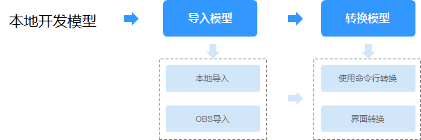

# 导入/转换本地开发模型

技能可以抽象地理解为算法模型+逻辑代码。算法模型负责关键的AI推理，逻辑代码负责处理模型推理的结果。因此在HiLens Studio开发技能时，需要将模型导入HiLens Studio。

本章节介绍如何将本地开发的模型导入HiLens Studio，以及针对非“om“格式的模型，如何在HiLens Studio进行模型转换。

## 模型要求

导入的模型可为“.om“格式、“.pb“格式或“.caffemodel“格式，其中“.om“格式的模型才可以在HiLens Kit上运行，“.pb“格式或“.caffemodel“格式的模型在导入HiLens Studio之后，需要将模型转换至“.om“格式。

并非所有模型都能转换成功，进行导入（转换）模型操作前，请确认是否为“.om“模型支持的TensorFlow和Caffe算子边界，详情请见附录[Caffe算子边界](https://support.huaweicloud.com/usermanual-hilens/hilens_02_0059.html)和[Tensorflow算子边界](https://support.huaweicloud.com/usermanual-hilens/hilens_02_0060.html)。

## 前提条件

已在本地开发模型。本地自定义的训练模型，非“.om“格式的模型上传文件包含caffe模型文件“.caffemodel“和“.prototxt“和配置文件“.cfg“，或tensorflow的“.pb“模型文件和配置文件“.cfg“。

## 导入/转换模型操作

针对本地开发的模型，首先需要导入模型至HiLens Studio。针对非“om“格式的模型，还需要在HiLens Studio进行模型转换。

导入和转换模型的操作流程如[图1](#fig1190073663211)所示，操作指引如[表1](#table185081818161912)所示。

**图 1**  操作流程  

**表 1**  导入/转换模型操作

<table><thead align="left"><tr id="row1250851891911"><th class="cellrowborder" valign="top" width="36.730000000000004%" id="mcps1.2.4.1.1">
操作

</th>
<th class="cellrowborder" valign="top" width="30.19%" id="mcps1.2.4.1.2">
操作方式

</th>
<th class="cellrowborder" valign="top" width="33.08%" id="mcps1.2.4.1.3">
操作指引

</th>
</tr>
</thead>
<tbody><tr id="row25087185191"><td class="cellrowborder" rowspan="2" valign="top" width="36.730000000000004%" headers="mcps1.2.4.1.1 ">
步骤一：导入模型至HiLens Studio

</td>
<td class="cellrowborder" valign="top" width="30.19%" headers="mcps1.2.4.1.2 ">
方式一：从本地导入

</td>
<td class="cellrowborder" valign="top" width="33.08%" headers="mcps1.2.4.1.3 ">
<a href="#section152740295517">本地导入模型至HiLens Studio</a>

</td>
</tr>
<tr id="row15584184241918"><td class="cellrowborder" valign="top" headers="mcps1.2.4.1.1 ">
方式二：从OBS导入

</td>
<td class="cellrowborder" valign="top" headers="mcps1.2.4.1.2 ">
<a href="#section146310399553">OBS导入模型至HiLens Studio</a>

</td>
</tr>
<tr id="row11767114541917"><td class="cellrowborder" rowspan="2" valign="top" width="36.730000000000004%" headers="mcps1.2.4.1.1 ">
步骤二：在HiLens Studio转换模型

</td>
<td class="cellrowborder" valign="top" width="30.19%" headers="mcps1.2.4.1.2 ">
方式一：使用命令行转换模型

</td>
<td class="cellrowborder" valign="top" width="33.08%" headers="mcps1.2.4.1.3 ">
<a href="#section4217204212164">命令行转换模型</a>

</td>
</tr>
<tr id="row5508418151911"><td class="cellrowborder" valign="top" headers="mcps1.2.4.1.1 ">
方式二：通过HiLens Studio界面转换模型

</td>
<td class="cellrowborder" valign="top" headers="mcps1.2.4.1.2 ">
<a href="#section1321714281619">界面转换模型</a>

</td>
</tr>
</tbody>
</table>

## 本地导入模型至HiLens Studio

1.  在HiLens Studio界面单击左上角，左侧将展示开发项目的文件目录。
2.  在开发项目的文件目录区选择文件夹或空白区域，右键单击选择“Upload Files...“，在本地选择已经开发好的模型文件并导入至HiLens Studio。
    -   **caffe模型**：caffe模型文件“.caffemodel“和“.prototxt“，根据业务选择上传配置文件“.cfg“。
    -   **tensorflow模型**：“.pb“模型文件，根据业务选择上传配置文件“.cfg“。

## OBS导入模型至HiLens Studio

通过OBS导入模型至HiLens Studio，首先需要将自定义的模型上传至OBS服务，请见[上传模型至OBS](#li174441016222)。然后将OBS中的模型导入至HiLens Studio，可通过[导入模型](#li539815280504)和[拖拽模型](#li927619442504)两种操作方式导入模型。

-   **上传模型至OBS**

    将自定义的模型上传到OBS服务，非“.om“格式的模型上传文件包含caffe模型文件“.caffemodel“和“.prototxt“和配置文件“.cfg“，或tensorflow的“.pb“模型文件和配置文件“.cfg“，上传操作可参见[OBS快速入门](https://support.huaweicloud.com/qs-obs/obs_qs_0002.html)。模型文件上传至OBS的目录需满足一定规范，详情请见[模型输入目录规范](模型输入目录规范.md)。上传到OBS需要收取一定费用，收费规则请参见[对象存储服务 OBS](https://www.huaweicloud.com/pricing.html?tab=detail#/obs)。上传至OBS时，需确保OBS桶与华为HiLens在同一区域，且OBS文件夹名称满足如下要求：

    -   文件夹名称不能包含以下字符：\\:\*?"<\>|。
    -   文件夹名称不能以英文句号\(.\)或斜杠\(/\)开头或结尾。
    -   文件夹绝对路径总长度不超过1023个字符。
    -   文件夹名称不能包含两个以上相邻斜杠（/）。

-   **导入模型至HiLens Studio**

    1.  在HiLens Studio界面单击，在文件目录单击文件夹“model“。
    2.  选择模型导入的文件夹。
    3.  单击“File\>Import File\(s\) from OBS“。

        弹出“Import File\(s\) from OBS“对话框。

        **图 2**  Import File\(s\) from OBS  
        -from-OBS.png "Import-File(s)-from-OBS")

    4.  在“Bucket“下拉框中选择模型存储的OBS桶，并选择模型所存储的文件路径。
    5.  单击“Import“。

        导入模型文件至HiLens Studio。

    > **说明：** 
    >除了模型文件，在HiLens Studio界面单击“File\>Import Files from OBS“，也可以根据自身业务需要从OBS导入其他文件。

-   **拖拽模型至HiLens Studio**
    1.  在HiLens Studio界面选择“View\>OBS“,，或单击右侧。

        HiLens Studio界面右侧弹出OBS桶和文件夹列表。

        

    2.  在界面“Bucket“下拉框中选择模型存储的OBS桶，然后在下方直接拖拽模型文件至左侧技能项目的“model“文件夹位置，即可从OBS快速导入模型文件。

        > **说明：** 
        >除了模型文件，也可以通过拖拽的方式，从OBS快速导入其他文件。

## 命令行转换模型

1.  导入模型至HiLens Studio后，在HiLens Studio界面上方选择“Terminal\>New Terminal“。

    新建一个终端界面。

2.  在终端界面执行以下命令转换模型。

    -   **tensorflow**

        **omg --model=./yolo3\_resnet18.pb --input\_shape='images:1,288,512,3' --framework=3  --output=./yolo3\_resnet18 --insert\_op\_conf=./aipp.cfg**

    -   **caffe**

        **omg --model=./mobilenet\_yolov3\_deploy.prototxt  --weight=./mobilenet\_yolov3.caffemodel  --insert\_op\_conf=./aipp\_yolo.cfg --framework=0 --output=./mobilent\_yolo**

    详细的参数说明请参见[转换Caffe/Tensorflow网络模型](https://support.huaweicloud.com/mcg-atlas300app3000/atlasmcg_05_c30_0004.html)。

## 界面转换模型

1.  导入模型至HiLens Studio后，在HiLens Studio界面打开一个技能项目。
2.  单击HiLens Studio界面左侧的。

    左侧将显示开发项目的文件目录，详细说明请见[项目文件说明](使用手机实时视频流编写-调试代码.md#section31895539159)。

    **图 3**  文件目录  
    

3.  右键单击文件夹“model“，单击“Model Convertion“。

    弹出“Model Convertion“对话框。

4.  按[表2](#table121961924164719)填写模型转换的信息，单击“OK“。

    **图 4**  Model Convertion  
    

    **表 2**  Convert Model参数说明

    
    <table><thead align="left"><tr id="row719632464720"><th class="cellrowborder" valign="top" width="19.63%" id="mcps1.2.3.1.1">
参数

    </th>
    <th class="cellrowborder" valign="top" width="80.36999999999999%" id="mcps1.2.3.1.2">
说明

    </th>
    </tr>
    </thead>
    <tbody><tr id="row31961724204711"><td class="cellrowborder" valign="top" width="19.63%" headers="mcps1.2.3.1.1 ">
Model Path

    </td>
    <td class="cellrowborder" valign="top" width="80.36999999999999%" headers="mcps1.2.3.1.2 ">
待转换的模型文件在技能项目文件中的位置。一般将模型导入至文件夹“model”。

    </td>
    </tr>
    <tr id="row11961124184717"><td class="cellrowborder" valign="top" width="19.63%" headers="mcps1.2.3.1.1 ">
Configuration

    </td>
    <td class="cellrowborder" valign="top" width="80.36999999999999%" headers="mcps1.2.3.1.2 ">
待转换模型的配置文件在技能项目文件中的位置。例如“model/aipp_rgb.cfg”。

    </td>
    </tr>
    <tr id="row13196624154717"><td class="cellrowborder" valign="top" width="19.63%" headers="mcps1.2.3.1.1 ">
Output Path

    </td>
    <td class="cellrowborder" valign="top" width="80.36999999999999%" headers="mcps1.2.3.1.2 ">
模型转换后输出位置。

    </td>
    </tr>
    <tr id="row91961524124715"><td class="cellrowborder" valign="top" width="19.63%" headers="mcps1.2.3.1.1 ">
Type

    </td>
    <td class="cellrowborder" valign="top" width="80.36999999999999%" headers="mcps1.2.3.1.2 ">
模型转换的类型，包括“TF-FrozenGraph-To-Ascend-HiLens”、“Caffe to Ascend”。

    <ul id="ul10196924124711"><li>“TF-FrozenGraph-To-Ascend-HiLens”
支持将Tensorflow frozen graph模型转换成可在ascend芯片上运行的模型。

    </li><li>“Caffe to Ascend”
支持将Caffe模型转换成可在ascend芯片上运行的模型。

    </li></ul>
    </td>
    </tr>
    <tr id="row0196162416474"><td class="cellrowborder" valign="top" width="19.63%" headers="mcps1.2.3.1.1 ">
Advanced Options

    </td>
    <td class="cellrowborder" valign="top" width="80.36999999999999%" headers="mcps1.2.3.1.2 ">
当模型转换类型为“TF-FrozenGraph-To-Ascend-HiLens”时，可填写高级选项，包括张量形状、转换输出节点等参数选项，详情请见<a href="#table0198824104716">表3</a>。

    </td>
    </tr>
    </tbody>
    </table>

    **表 3**  Advanced Options

    
    <table><thead align="left"><tr id="row14196182413473"><th class="cellrowborder" valign="top" width="28.720000000000002%" id="mcps1.2.3.1.1">
参数名称

    </th>
    <th class="cellrowborder" valign="top" width="71.28%" id="mcps1.2.3.1.2">
参数说明

    </th>
    </tr>
    </thead>
    <tbody><tr id="row1819711248472"><td class="cellrowborder" valign="top" width="28.720000000000002%" headers="mcps1.2.3.1.1 ">
Input Tensor Shape

    </td>
    <td class="cellrowborder" valign="top" width="71.28%" headers="mcps1.2.3.1.2 ">
输入张量形状。若在上文“模型来源”中，选择需要转换格式的模型（非om格式模型），并且转换类型是“Tensorflow frozen graph 转 Ascend”或“Tensorflow SavedModel 转 Ascend”时，需要填写输入张量形状。

    
张量形状即模型输入数据的shape，输入数据格式为NHWC，如“input_name:1,224,224,3”，必填项。“input_name”必须是转换前的网络模型中的节点名称。当模型存在动态shape输入时必须提供。例如“input_name1:?,h,w,c”，该参数必填，其中“?”为batch数，表示1次处理的图片数量，需要根据实际情况填写，用于将动态shape的原始模型转换为固定shape的离线模型。

    
如果存在多个输入，请以分号（;）隔开。

    </td>
    </tr>
    <tr id="row9197162464713"><td class="cellrowborder" valign="top" width="28.720000000000002%" headers="mcps1.2.3.1.1 ">
out_nodes

    </td>
    <td class="cellrowborder" valign="top" width="71.28%" headers="mcps1.2.3.1.2 ">
转换输出节点，即指定输出节点,例如“node_name1:0;node_name1:1;node_name2:0”，其中“node_name”必须是模型转换前的网络模型中的节点名称,冒号后的数字表示第几个输出,例如“node_name1:0”，表示节点名称为“node_name1”的第0个输出。

    </td>
    </tr>
    <tr id="row11978247470"><td class="cellrowborder" valign="top" width="28.720000000000002%" headers="mcps1.2.3.1.1 ">
input_format

    </td>
    <td class="cellrowborder" valign="top" width="71.28%" headers="mcps1.2.3.1.2 ">
输入数据格式，默认是“NHWC”,如果实际是“NCHW”的话,需要通过此参数指定“NCHW”。

    </td>
    </tr>
    <tr id="row519722410473"><td class="cellrowborder" valign="top" width="28.720000000000002%" headers="mcps1.2.3.1.1 ">
net_format

    </td>
    <td class="cellrowborder" valign="top" width="71.28%" headers="mcps1.2.3.1.2 ">
优选数据格式，即指定网络算子优先选用的数据格式，“ND(N=4)”和“5D”。仅在网络中算子的输入数据同时支持“ND”和“5D”两种格式时，指定该参数才生效。“ND”表示模型中算子按“NCHW”转换成通用格式，“5D”表示模型中算子按华为自研的5维转换成华为格式。“5D”为默认值。

    </td>
    </tr>
    <tr id="row51987249479"><td class="cellrowborder" valign="top" width="28.720000000000002%" headers="mcps1.2.3.1.1 ">
fp16_high_precsion

    </td>
    <td class="cellrowborder" valign="top" width="71.28%" headers="mcps1.2.3.1.2 ">
生成高精度模型，指定是否生成高精度“FP16 Davinci”模型。

    <ul id="ul16198192414713"><li>0为默认值，表示生成普通“FP16 Davinci”模型，推理性能更好。</li><li>1表示生成高精度“FP16 Davinci”模型，推理精度更好。</li></ul>
    </td>
    </tr>
    <tr id="row119892413474"><td class="cellrowborder" valign="top" width="28.720000000000002%" headers="mcps1.2.3.1.1 ">
output_type

    </td>
    <td class="cellrowborder" valign="top" width="71.28%" headers="mcps1.2.3.1.2 ">
网络输出数据类型，“FP32”为默认值,推荐分类网络、检测网络使用；图像超分辨率网络，推荐使用“UINT8”，推理性能更好。

    </td>
    </tr>
    </tbody>
    </table>

