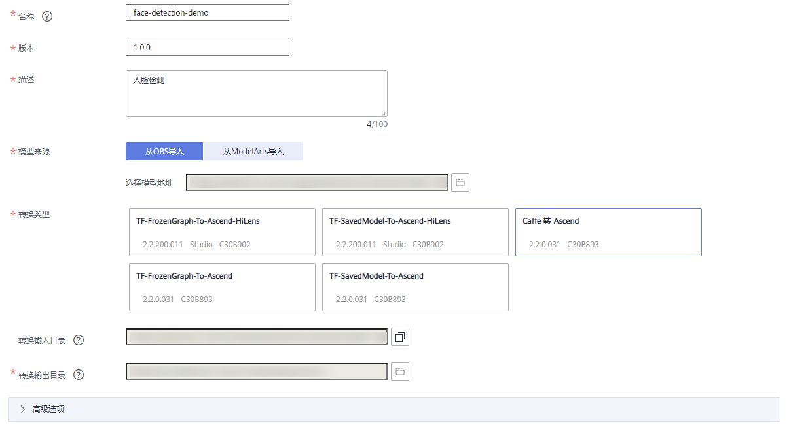
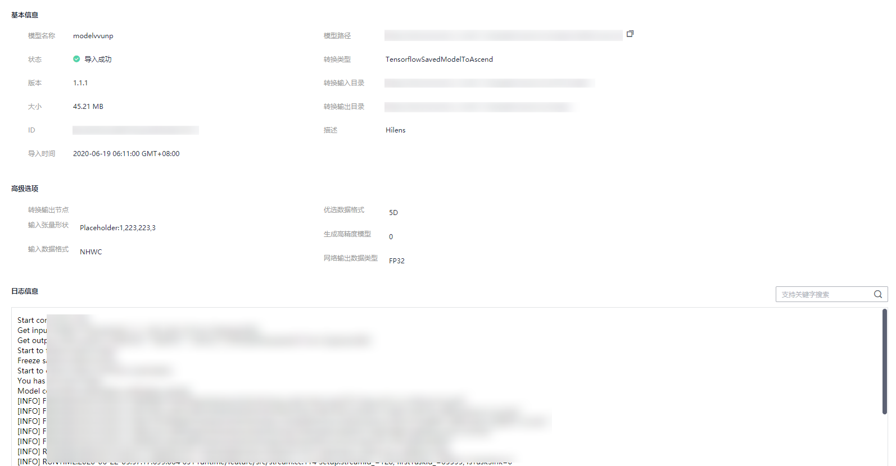
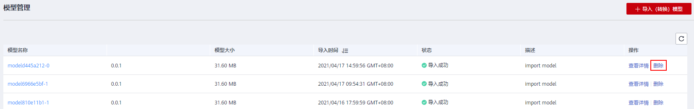

# 导入（转换）模型

技能可以抽象地理解为算法模型+逻辑代码。算法模型负责关键的AI推理，逻辑代码负责处理模型推理的结果。因此在开发技能前，需要将模型导入华为HiLens。

## 模型要求

导入的模型可为“.om“格式、“.pb“格式或“.caffemodel“格式，其中“.om“格式的模型才可以在HiLens Kit上运行，“.pb“格式或“.caffemodel“格式的模型在“导入（转换）“过程中，华为HiLens平台会自动将模型转换为“.om“格式。

并非所有模型都能转换成功，进行导入（转换）模型操作前，请确认是否为“.om“模型支持的TensorFlow和Caffe算子边界，详情请见附录[Caffe算子边界](https://support.huaweicloud.com/usermanual-hilens/hilens_02_0059.html)和[Tensorflow算子边界](https://support.huaweicloud.com/usermanual-hilens/hilens_02_0060.html)。

## 前提条件

在导入模型前，导入的模型可通过ModelArts在线训练，也可通过本地训练。

-   导入ModelArts模型文件

    导入ModelArts模型文件前，需先在ModelArts训练自己的算法模型，训练模型可参见《[ModelArts文档](https://support.huaweicloud.com/engineers-modelarts/modelarts_23_0044.html)》。如果要使用ModelArts的预置算法，当前华为HiLens平台仅支持转换如下预置算法：

    -   [yolov3\_resnet18（检测物体类别和位置）](https://support.huaweicloud.com/aimarket-modelarts/modelarts_18_0026.html)
    -   [ResNet\_v1\_50（图像分类）](https://support.huaweicloud.com/aimarket-modelarts/modelarts_18_0013.html)（该预置算法转换方式可参考最佳实践[手势判断技能开发](https://support.huaweicloud.com/bestpractice-hilens/hilens_06_0004.html)）。

    > **说明：** 
    >-   暂不支持导入ModelArts中“自动学习“训练的模型。
    >-   华为HiLens 只能导入ModelArts中训练的模型文件，不能导入ModelArts的模型。

-   本地训练模型

    导入自定义模型前，需要将自定义的模型上传到OBS服务，非“.om“格式的模型上传文件包含caffe模型文件“.caffemodel“和“.prototxt“和配置文件“.cfg“，或tensorflow的“.pb“模型文件和配置文件“.cfg“。其中，配置文件“.cfg“根据模型文件准备，可参考[AIPP配置](https://support.huaweicloud.com/mcg-atlas200dkappc30/atlasmcg_05_c30_0007.html)。

    上传操作可参见[OBS快速入门](https://support.huaweicloud.com/qs-obs/obs_qs_0002.html)。模型文件上传至OBS的目录需满足一定规范，详情请见[模型输入目录规范](https://support.huaweicloud.com/usermanual-hilens/hilens_02_0064.html)。

    上传到OBS需要收取一定费用，收费规则请参见[对象存储服务 OBS](https://www.huaweicloud.com/pricing.html?tab=detail#/obs)。

    上传至OBS时，需确保OBS桶与华为HiLens在同一区域，且OBS文件夹名称满足如下要求：

    -   文件夹名称不能包含以下字符：\\:\*?"<\>|。
    -   文件夹名称不能以英文句号\(.\)或斜杠\(/\)开头或结尾。
    -   文件夹绝对路径总长度不超过1023个字符。
    -   文件夹名称不能包含两个以上相邻斜杠（/）。

## 导入（转换）模型操作

1.  登录华为HiLens管理控制台，在左侧导航栏中选择“技能开发\>模型管理“，进入“模型管理“页面。
2.  在“模型管理“页面，单击右上角的“导入（转换）模型“。
3.  在“导入模型“页面，然后参考[表1](#table43072055143810)填写参数，信息确认无误后单击“确定“完成导入。

    **图 1**  导入模型  
    

    **表 1**  导入自定义模型

    
    <table><thead align="left"><tr id="row7305135513385"><th class="cellrowborder" valign="top" width="19.759999999999998%" id="mcps1.2.3.1.1">
参数名称

    </th>
    <th class="cellrowborder" valign="top" width="80.24%" id="mcps1.2.3.1.2">
参数说明

    </th>
    </tr>
    </thead>
    <tbody><tr id="row18305185553817"><td class="cellrowborder" valign="top" width="19.759999999999998%" headers="mcps1.2.3.1.1 ">
名称

    </td>
    <td class="cellrowborder" valign="top" width="80.24%" headers="mcps1.2.3.1.2 ">
导入模型的名称。模型名称仅支持输入小写字母、数字、中划线字符，输入以小写字母开头，以小写字母、数字结尾，长度2~24的字符。

    </td>
    </tr>
    <tr id="row1930515543813"><td class="cellrowborder" valign="top" width="19.759999999999998%" headers="mcps1.2.3.1.1 ">
版本

    </td>
    <td class="cellrowborder" valign="top" width="80.24%" headers="mcps1.2.3.1.2 ">
导入模型的版本号。

    
格式为“<em id="i930555543815">数字</em>.<em id="i9305455153819">数字</em>.<em id="i13305355143816">数字</em>”，如2.1.3，每位数字范围为0~999，超过1位时，不能以0开头。

    </td>
    </tr>
    <tr id="row18305115523812"><td class="cellrowborder" valign="top" width="19.759999999999998%" headers="mcps1.2.3.1.1 ">
描述

    </td>
    <td class="cellrowborder" valign="top" width="80.24%" headers="mcps1.2.3.1.2 ">
导入模型的描述。仅支持输入长度1~100的字符。不允许输入&amp;！"'\&lt;&gt;=等特殊字符。

    </td>
    </tr>
    <tr id="row133061155173816"><td class="cellrowborder" valign="top" width="19.759999999999998%" headers="mcps1.2.3.1.1 ">
模型来源

    </td>
    <td class="cellrowborder" valign="top" width="80.24%" headers="mcps1.2.3.1.2 ">
选择导入模型的来源，包括“从OBS导入”和“从ModelArts导入”。

    <ul id="ul330695520388"><li>从OBS导入
单击“从OBS导入”，选择导入自定义模型存储在OBS服务的桶和文件夹，单击“确定”。

    </li><li>从ModelArts导入<ol id="ol4306755133812"><li>单击“从ModelArts导入”，在右侧下拉框中选择模型框架，包括“TensorFlow”、“Caffe”、“OM（从转换任务中获取）”。
在您进行导入（转换）操作后，华为HiLens平台将TensorFlow、Caffe模型转换为“.om”格式，然后导入模型。OM模型是从前者转换任务中获取。

    </li><li>在下方的模型列表中勾选待导入的模型。</li></ol>
    </li></ul>
    </td>
    </tr>
    <tr id="row1430745510385"><td class="cellrowborder" valign="top" width="19.759999999999998%" headers="mcps1.2.3.1.1 ">
转换类型

    </td>
    <td class="cellrowborder" valign="top" width="80.24%" headers="mcps1.2.3.1.2 ">
若在上文“模型来源”中，选择需要转换格式的模型（非“.om”格式模型），需要选择模型转换的类型，包括“TF-FrozenGraph-To-Ascend-HiLens”、“TF-SavedModel-To-Ascend-HiLens”、“TF-FrozenGraph-To-Ascend”、“TF-SavedModel-To-Ascend”、“Caffe 转 Ascend”。

    <ul id="ul15307125518381"><li>TF-FrozenGraph-To-Ascend-HiLens
该模板将TF frozen_graph模型转换成可在ascend芯片上运行的模型。HiLens Kit系统固件版本为2.2.200.011时，或使用HiLens Studio调试时，建议使用此模板进行转换。

    </li><li>TF-SavedModel-To-Ascend-HiLens
该模板将TF saved_model模型转换成可在ascend芯片上运行的模型。HiLens Kit系统固件版本为2.2.200.011时，或使用HiLens Studio调试时，建议使用此模板进行转换。

    </li><li>TF-FrozenGraph-To-Ascend
该模板将TF frozen_graph模型转换成可在ascend芯片上运行的模型。HiLens Kit系统固件版本低于2.2.200.011时，建议使用此模板进行转换。

    </li><li>TF-SavedModel-To-Ascend
该模板将TF saved_model模型转换成可在ascend芯片上运行的模型。HiLens Kit系统固件版本低于2.2.200.011时，建议使用此模板进行转换。

    </li><li>Caffe 转 Ascend
支持将Caffe模型转换成可在ascend芯片上运行的模型。

    </li></ul>
    </td>
    </tr>
    <tr id="row43078552381"><td class="cellrowborder" valign="top" width="19.759999999999998%" headers="mcps1.2.3.1.1 ">
转换输入目录

    </td>
    <td class="cellrowborder" valign="top" width="80.24%" headers="mcps1.2.3.1.2 ">
若在上文“模型来源”中，选择需要转换格式的模型（非om格式模型），转换输入目录根据模型的来源自动初始化。目录下应该包含模型文件和转换所需的配置文件。模型文件的输入目录规范请见<a href="https://support.huaweicloud.com/usermanual-hilens/hilens_02_0064.html" target="_blank" rel="noopener noreferrer">模型输入目录规范</a>。

    </td>
    </tr>
    <tr id="row3307195563810"><td class="cellrowborder" valign="top" width="19.759999999999998%" headers="mcps1.2.3.1.1 ">
转换输出目录

    </td>
    <td class="cellrowborder" valign="top" width="80.24%" headers="mcps1.2.3.1.2 ">
若在上文“模型来源”中，选择需要转换格式的模型（非om格式模型），单击选择模型转换完成后输出的OBS目录。请确保该目录下没有om模型。输出目录规范请见<a href="https://support.huaweicloud.com/usermanual-hilens/hilens_02_0065.html" target="_blank" rel="noopener noreferrer">模型输出目录规范</a>。

    </td>
    </tr>
    <tr id="row83079558383"><td class="cellrowborder" valign="top" width="19.759999999999998%" headers="mcps1.2.3.1.1 ">
高级选项

    </td>
    <td class="cellrowborder" valign="top" width="80.24%" headers="mcps1.2.3.1.2 ">
包括输入张量形状、转换输出节点等参数选项，详情请见<a href="#table1730965513811">表2</a>。

    </td>
    </tr>
    </tbody>
    </table>

    **表 2**  高级选项

    
    <table><thead align="left"><tr id="row1730765512386"><th class="cellrowborder" valign="top" width="28.720000000000002%" id="mcps1.2.3.1.1">
参数名称

    </th>
    <th class="cellrowborder" valign="top" width="71.28%" id="mcps1.2.3.1.2">
参数说明

    </th>
    </tr>
    </thead>
    <tbody><tr id="row5308135503816"><td class="cellrowborder" valign="top" width="28.720000000000002%" headers="mcps1.2.3.1.1 ">
输入张量形状

    </td>
    <td class="cellrowborder" valign="top" width="71.28%" headers="mcps1.2.3.1.2 ">
若在上文“模型来源”中，选择需要转换格式的模型（非om格式模型），并且转换类型是“Tensorflow frozen graph 转 Ascend”或“Tensorflow SavedModel 转 Ascend”时，需要填写输入张量形状。

    
张量形状即模型输入数据的shape，输入数据格式为NHWC，如“input_name:1,224,224,3”。“input_name”必须是转换前的网络模型中的节点名称。当模型存在动态shape输入时必须提供。例如“input_name1:?,h,w,c”，该参数必填，其中“?”为batch数，表示1次处理的图片数量，需要根据实际情况填写，用于将动态shape的原始模型转换为固定shape的离线模型。

    
如果存在多个输入，请以分号（;）隔开。

    </td>
    </tr>
    <tr id="row1730835583814"><td class="cellrowborder" valign="top" width="28.720000000000002%" headers="mcps1.2.3.1.1 ">
转换输出节点

    </td>
    <td class="cellrowborder" valign="top" width="71.28%" headers="mcps1.2.3.1.2 ">
指定输出节点,例如“node_name1:0;node_name1:1;node_name2:0”，其中“node_name”必须是模型转换前的网络模型中的节点名称,冒号后的数字表示第几个输出,例如“node_name1:0”，表示节点名称为“node_name1”的第0个输出。

    </td>
    </tr>
    <tr id="row18308155173810"><td class="cellrowborder" valign="top" width="28.720000000000002%" headers="mcps1.2.3.1.1 ">
输入数据格式

    </td>
    <td class="cellrowborder" valign="top" width="71.28%" headers="mcps1.2.3.1.2 ">
默认是“NHWC”,如果实际是“NCHW”的话,需要通过此参数指定“NCHW”。

    </td>
    </tr>
    <tr id="row12308175583815"><td class="cellrowborder" valign="top" width="28.720000000000002%" headers="mcps1.2.3.1.1 ">
优选数据格式

    </td>
    <td class="cellrowborder" valign="top" width="71.28%" headers="mcps1.2.3.1.2 ">
指定网络算子优先选用的数据格式，“ND(N=4)”和“5D”。仅在网络中算子的输入数据同时支持“ND”和“5D”两种格式时，指定该参数才生效。“ND”表示模型中算子按“NCHW”转换成通用格式，“5D”表示模型中算子按华为自研的5维转换成华为格式。“5D”为默认值。

    </td>
    </tr>
    <tr id="row3309195583811"><td class="cellrowborder" valign="top" width="28.720000000000002%" headers="mcps1.2.3.1.1 ">
生成高精度模型

    </td>
    <td class="cellrowborder" valign="top" width="71.28%" headers="mcps1.2.3.1.2 ">
指定是否生成高精度“FP16 Davinci”模型。

    <ul id="ul330905519387"><li>0为默认值，表示生成普通“FP16 Davinci”模型，推理性能更好。</li><li>1表示生成高精度“FP16 Davinci”模型，推理精度更好。</li></ul>
    </td>
    </tr>
    <tr id="row1630925512382"><td class="cellrowborder" valign="top" width="28.720000000000002%" headers="mcps1.2.3.1.1 ">
网络输出数据类型

    </td>
    <td class="cellrowborder" valign="top" width="71.28%" headers="mcps1.2.3.1.2 ">
“FP32”为默认值,推荐分类网络、检测网络使用；图像超分辨率网络，推荐使用“UINT8”，推理性能更好。

    </td>
    </tr>
    </tbody>
    </table>

    模型导入后，将进入“模型管理“页面，您导入的模型可从列表中查看。

## 查看模型详情

1.  登录华为HiLens管理控制台，在左侧导航栏中选择“技能开发\>模型管理“，进入“模型管理“页面。

    您可以在列表中查看“模型名称“、“版本“、“模型大小“、“导入时间“、“状态“、“描述“和“操作“。其中，模型状态包括“转换中“、“转换失败“、“转换成功“、“导入失败“、“导入成功“。

2.  单击操作列的“查看详情“，进入“模型详情“页面。

    您可以查看模型的“基本信息“和“日志信息“，如[图2](#fig787454133019)所示。

    “基本信息“的参数说明请见[表2](#table1730965513811)。

    针对需要转换的模型，您可以在“日志信息“区域右上方通过关键字搜索快速定位日志中关键信息的位置，您也可以参与[论坛](https://bbs.huaweicloud.com/forum/forum-946-1.html)讨论进一步解决疑问。

    **图 2**  模型详情  
    

## 重新转换模型

当您导入的模型格式不是“.om“格式，且模型状态处于“转换失败“的状态时，您可以修改模型的相关参数，重新转换模型。

模型状态可在华为HiLens管理控制台的“模型管理“页面查看。

1.  登录华为HiLens管理控制台，在左侧导航栏中选择“技能开发\>模型管理“，进入“模型管理“页面。
2.  单击操作列的“查看详情“，进入“模型详情“页面。

    您可以查看模型的“基本信息“和“日志信息“。

    针对重新转换的模型，您可以在“日志信息“区域右上方通过关键字搜索快速定位日志中关键信息的位置，您也可以参与[论坛](https://bbs.huaweicloud.com/forum/forum-946-1.html)讨论进一步解决疑问。

3.  单击对“基本信息“中的“转换类型“、“高级选项“、“转换输入目录“、“转换输出目录“、“描述“进行修改编辑，编辑完成后单击保存信息。参数说明请见[表2](#table1730965513811)。
4.  修改完模型参数后，单击右上角“重新转换“，即可重新转换模型。

## 删除模型

您可以根据自身业务需要，删除已导入（转换）的模型。状态为“转换中“的模型不可执行删除操作。

1.  登录华为HiLens管理控制台，在左侧导航栏中选择“技能开发\>模型管理“，进入“模型管理“页面。
2.  单击操作列的“删除“，完成删除模型操作。也可单击操作列的“查看详情“，在“模型详情“页面的右上角单击“删除模型“，完成删除模型操作。

    **图 3**  删除模型  
    

