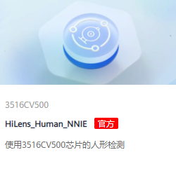

# 技能市场简介

设备注册完成后，您可在华为HiLens平台的技能市场订购所需要的技能，拓展设备的AI能力。例如订购一个“人脸判断”技能，安装在设备上后，即可让设备具备判断人脸的能力。

**图 1**  技能市场  

-   首先，您可以在“技能市场“中，通过筛选、搜索等操作，[查找您想要的技能](在技能市场查找技能.md)。
-   如果“技能市场“有您需要的技能，您可以直接[购买技能](购买技能.md)。
-   如果“技能市场“没有您需要的技能，可以向华为HiLens提出[定制技能](定制技能.md)。
-   对于您购买的技能、定制的技能，或者是您发布至市场的技能，您可以在“产品订购\>订单管理“页面进行统一管理，详细操作请参见[管理订单](管理订单.md)。

    > **说明：** 
    >当前技能市场购买的技能暂不支持在HiLens Studio中打开，您可以选择在HiLens Studio中选择技能模板新建技能项目，详情请见[新建技能项目](新建技能项目.md)。

## 什么是技能

技能（Skill）是运行在端侧摄像头的人工智能应用，一般由模型和逻辑代码组成。其中，逻辑代码是技能的框架，负责控制技能的运行，包括数据读入、模型导入、模型推理、结果输出等；模型是人工智能算法经由大数据训练而成，负责技能运行中关键场景的推理。

华为HiLens的[技能市场](技能市场简介.md)提供了丰富的技能供用户选择。

-   按应用场景划分，技能可应用于：智能园区、智慧家庭、智能车载、智能商超和其他等场景。
-   按不同的设备划分，技能分为2种，一种是适用于Ascend芯片的技能，另一种是适用于海思35XX系列芯片的技能。

    **图 2**  适用芯片  
    

## 技能的分类

如下图所示，华为HiLens根据不同芯片，分为两种类型，分别可应用于HiLens Kit设备或其他海思35XX系列芯片的设备。平台不仅支持使用技能模块快速开发技能，便捷高效；还支持自行开发模型和逻辑代码，可以满足您更丰富的场景。

由于海思35XX系列芯片内存和性能偏低，针对适用于此类设备的技能需要对模型进行优化后才能运行，若需要开发此类技能，请联系华为工程师。

**图 3**  技能开发场景划分  

