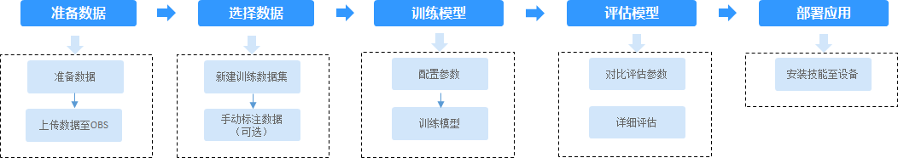

# 技能开发流程介绍

在华为HiLens控制台选择“HiLens安全帽检测“技能模板新建技能后，您可以自主上传数据训练模型，开发安全帽检测技能，实现安全帽检测功能，并快速创建技能，一键部署至端侧设备。

**图 1**  HiLens安全帽检测技能流程  

**表 1**  HiLens安全帽检测技能说明

<table><thead align="left"><tr id="row970311357496"><th class="cellrowborder" valign="top" width="33.33333333333333%" id="mcps1.2.4.1.1">
流程

</th>
<th class="cellrowborder" valign="top" width="33.33333333333333%" id="mcps1.2.4.1.2">
说明

</th>
<th class="cellrowborder" valign="top" width="33.33333333333333%" id="mcps1.2.4.1.3">
详细指导

</th>
</tr>
</thead>
<tbody><tr id="row9302652163320"><td class="cellrowborder" valign="top" width="33.33333333333333%" headers="mcps1.2.4.1.1 ">
准备数据

</td>
<td class="cellrowborder" valign="top" width="33.33333333333333%" headers="mcps1.2.4.1.2 ">
在使用安全帽检测技能模板开发技能之前，您需要提前准备用于模型训练的数据，上传至OBS服务中。

</td>
<td class="cellrowborder" valign="top" width="33.33333333333333%" headers="mcps1.2.4.1.3 ">
<a href="准备数据.md">准备数据</a>

</td>
</tr>
<tr id="row3703103510494"><td class="cellrowborder" valign="top" width="33.33333333333333%" headers="mcps1.2.4.1.1 ">
选择数据

</td>
<td class="cellrowborder" valign="top" width="33.33333333333333%" headers="mcps1.2.4.1.2 ">
在使用HiLens安全帽检测技能模板开发应用时，您需要新建训练数据集，后续训练模型操作是基于您创建的训练数据集。

</td>
<td class="cellrowborder" valign="top" width="33.33333333333333%" headers="mcps1.2.4.1.3 ">
<a href="选择数据.md">选择数据</a>

</td>
</tr>
<tr id="row170383518490"><td class="cellrowborder" valign="top" width="33.33333333333333%" headers="mcps1.2.4.1.1 ">
训练模型

</td>
<td class="cellrowborder" valign="top" width="33.33333333333333%" headers="mcps1.2.4.1.2 ">
选择训练数据后，基于已标注的训练数据，选择预训练模型、配置参数，用于训练安全帽检测模型。

</td>
<td class="cellrowborder" valign="top" width="33.33333333333333%" headers="mcps1.2.4.1.3 ">
<a href="训练模型.md">训练模型</a>

</td>
</tr>
<tr id="row16703193584916"><td class="cellrowborder" valign="top" width="33.33333333333333%" headers="mcps1.2.4.1.1 ">
评估模型

</td>
<td class="cellrowborder" valign="top" width="33.33333333333333%" headers="mcps1.2.4.1.2 ">
训练得到模型之后，整个开发过程还不算结束，需要对模型进行评估和考察。

一些常用的指标，如精准率、召回率、F1值等，能帮助您有效的评估，最终获得一个满意的模型。

</td>
<td class="cellrowborder" valign="top" width="33.33333333333333%" headers="mcps1.2.4.1.3 ">
<a href="评估模型.md">评估模型</a>

</td>
</tr>
<tr id="row7703203514494"><td class="cellrowborder" valign="top" width="33.33333333333333%" headers="mcps1.2.4.1.1 ">
部署应用

</td>
<td class="cellrowborder" valign="top" width="33.33333333333333%" headers="mcps1.2.4.1.2 ">
模型准备完成后，您可以快速创建技能，并一键安装技能至端侧设备。也可以进入HiLens Studio自动创建技能，进一步调试技能。

</td>
<td class="cellrowborder" valign="top" width="33.33333333333333%" headers="mcps1.2.4.1.3 ">
<a href="部署应用.md">部署应用</a>

</td>
</tr>
</tbody>
</table>

