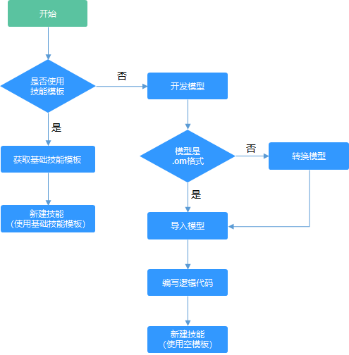

# 技能简介

技能可以抽象地理解为算法模型+逻辑代码。算法模型负责关键的AI推理，逻辑代码负责处理模型推理的结果。技能详细介绍可参见[什么是技能](技能管理简介.md#section161861359114016)。

## 技能开发说明

如[图1](#fig54917174497)所示，根据不同芯片类型，技能分为两种类型，分别为可应用于HiLens Kit设备的技能和可应用于海思35XX系列芯片设备的技能。平台不仅支持使用技能模板快速开发技能，便捷高效；还支持自行开发模型和逻辑代码，可以满足您更丰富的场景。

运行在海思35XX系列芯片的技能对内存和性能的要求比较高，针对适用于此类设备的技能需要对模型进行优化后才能运行，若需要开发此类技能，请联系华为工程师。

**图 1**  技能开发的不同场景  

## 新建技能的流程

在准备开始新建技能前，请明确您需要开发一个什么类型的技能，不同类型的技能，其主要区别在于模型和逻辑代码，与新建技能的流程无关。

> **说明：**   
>在Huawei HiLens控制台开发技能时，会占用OBS资源，需要收取一定费用，收费规则请参见[对象存储服务 OBS](https://www.huaweicloud.com/pricing.html?tab=detail#/obs)。  

新建技能的详细流程如[图1](#fig54917174497)所示。

-   **使用技能模板**：需确保平台已有可用的技能模板。
-   **使用空模板**：需开发您的技能所需的模型以及逻辑代码，如果您的模型格式不符合平台要求，Huawei HiLens平台会针对不符合要求的模型，在导入（转换）模型操作中进行模型转换。

**图 2**  技能开发  

**表 1**  新建技能常用操作指引

<table><thead align="left"><tr id="row1490445101912"><th class="cellrowborder" valign="top" width="7.5200000000000005%" id="mcps1.2.4.1.1">
类别

</th>
<th class="cellrowborder" valign="top" width="30.669999999999998%" id="mcps1.2.4.1.2">
常用操作

</th>
<th class="cellrowborder" valign="top" width="61.809999999999995%" id="mcps1.2.4.1.3">
快速跳转至详细指导

</th>
</tr>
</thead>
<tbody><tr id="row1990124561914"><td class="cellrowborder" rowspan="2" valign="top" width="7.5200000000000005%" headers="mcps1.2.4.1.1 ">
使用技能模板

</td>
<td class="cellrowborder" valign="top" width="30.669999999999998%" headers="mcps1.2.4.1.2 ">
获取技能模板

</td>
<td class="cellrowborder" valign="top" width="61.809999999999995%" headers="mcps1.2.4.1.3 ">
<a href="获取技能模板.md">获取技能模板</a>

</td>
</tr>
<tr id="row149014514196"><td class="cellrowborder" valign="top" headers="mcps1.2.4.1.1 ">
新建技能（使用技能模板）

</td>
<td class="cellrowborder" valign="top" headers="mcps1.2.4.1.2 ">
<a href="新建技能.md">新建技能</a>

</td>
</tr>
<tr id="row16901445121912"><td class="cellrowborder" rowspan="4" valign="top" width="7.5200000000000005%" headers="mcps1.2.4.1.1 ">
使用空模板

</td>
<td class="cellrowborder" valign="top" width="30.669999999999998%" headers="mcps1.2.4.1.2 ">
开发模型

</td>
<td class="cellrowborder" valign="top" width="61.809999999999995%" headers="mcps1.2.4.1.3 ">
<a href="开发模型.md">开发模型</a>

</td>
</tr>
<tr id="row921712217203"><td class="cellrowborder" valign="top" headers="mcps1.2.4.1.1 ">
导入（转换）模型

</td>
<td class="cellrowborder" valign="top" headers="mcps1.2.4.1.2 ">
<a href="导入（转换）模型.md">导入（转换）模型</a>

</td>
</tr>
<tr id="row1421822119201"><td class="cellrowborder" valign="top" headers="mcps1.2.4.1.1 ">
编写逻辑代码

</td>
<td class="cellrowborder" valign="top" headers="mcps1.2.4.1.2 ">
<a href="编写逻辑代码.md">编写逻辑代码</a>

</td>
</tr>
<tr id="row1421815219201"><td class="cellrowborder" valign="top" headers="mcps1.2.4.1.1 ">
新建技能（使用空模板）

</td>
<td class="cellrowborder" valign="top" headers="mcps1.2.4.1.2 ">
<a href="新建技能.md">新建技能</a>

</td>
</tr>
</tbody>
</table>

## 技能相关操作

在Huawei HiLens平台，在开发技能的同时，您可以管理您开发的技能，包含的操作如下表所示。

**表 2**  技能相关操作

<table><thead align="left"><tr id="row8548202814231"><th class="cellrowborder" valign="top" width="28.110000000000003%" id="mcps1.2.3.1.1">
操作

</th>
<th class="cellrowborder" valign="top" width="71.89%" id="mcps1.2.3.1.2">
说明

</th>
</tr>
</thead>
<tbody><tr id="row954942852319"><td class="cellrowborder" valign="top" width="28.110000000000003%" headers="mcps1.2.3.1.1 ">
<a href="新建技能.md">新建技能</a>

</td>
<td class="cellrowborder" valign="top" width="71.89%" headers="mcps1.2.3.1.2 ">
在确定您需要开发的技能类型后，根据<a href="#section149812434162">新建技能的流程</a>新建一个您所需的技能。

</td>
</tr>
<tr id="row1254922820235"><td class="cellrowborder" valign="top" width="28.110000000000003%" headers="mcps1.2.3.1.1 ">
<a href="编辑技能.md">编辑技能</a>

</td>
<td class="cellrowborder" valign="top" width="71.89%" headers="mcps1.2.3.1.2 ">
技能新建完成后，您可以编辑修改技能，包括基本信息、技能内容、技能消息和运行时设置。

</td>
</tr>
<tr id="row3549132816234"><td class="cellrowborder" valign="top" width="28.110000000000003%" headers="mcps1.2.3.1.1 ">
<a href="部署和调试技能.md">部署和调试技能</a>

</td>
<td class="cellrowborder" valign="top" width="71.89%" headers="mcps1.2.3.1.2 ">
在技能新建完成后，您可以将技能部署至设备中，通过查看技能视频确定技能效果，反复调试技能。

</td>
</tr>
<tr id="row295493415243"><td class="cellrowborder" valign="top" width="28.110000000000003%" headers="mcps1.2.3.1.1 ">
<a href="发布技能.md">发布技能</a>

</td>
<td class="cellrowborder" valign="top" width="71.89%" headers="mcps1.2.3.1.2 ">
调试验证后的技能，您可以将其发布至技能市场，公开给所有人或者某几个用户，分享您的技能。

</td>
</tr>
<tr id="row09551834102415"><td class="cellrowborder" valign="top" width="28.110000000000003%" headers="mcps1.2.3.1.1 ">
<a href="删除技能.md">删除技能</a>

</td>
<td class="cellrowborder" valign="top" width="71.89%" headers="mcps1.2.3.1.2 ">
对于不再使用的技能，您可以删除技能以释放资源。

</td>
</tr>
</tbody>
</table>

