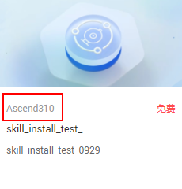

# 技能管理简介

针对已完成注册且显示在线的设备，您可以在Huawei HiLens平台中管理设备上的技能，包括安装新技能、添加运行时配置、启动技能、停止技能、卸载技能等操作。

## 什么是技能

技能（Skill）是运行在端侧摄像头的人工智能应用，一般由模型和逻辑代码组成。其中，逻辑代码是技能的框架，负责控制技能的运行，包括数据读入、模型导入、模型推理、结果输出等；模型是人工智能算法经由大数据训练而成，负责技能运行中关键场景的推理。

Huawei HiLens的[技能市场](技能市场简介.md)提供了丰富的技能供用户选择。

-   按应用场景划分，技能可应用于：智能园区、智慧家庭、智能车载、智能商超和其他等场景。
-   按不同的设备划分，技能分为2种，一种是适用于Ascend芯片的技能，另一种是适用于海思35XX系列芯片的技能。

    **图 1**  适用芯片  
    

## 技能管理说明

-   一台设备支持安装多个技能，最多支持安装5个技能。
-   针对新注册的设备，其技能管理页面无任何技能信息，需[安装新技能](安装技能.md)后使用。
-   由于当前设备管理只支持HiLens Kit设备，设备上的技能管理只能针对“适用于Ascend芯片的技能”。
-   设备上的技能来源于技能市场，包括购买技能、定制技能、安装技能等，您可以前往[技能市场](技能市场简介.md)获得更多技能。
-   在设备列表点击“技能管理“进去的技能列表中，技能状态包含“安装中“、“安装失败“、“安装成功“、“启动中“、“启动失败“、“启动成功“、“停止中“、“停止失败“、“停止成功“、“卸载中“、“卸载失败“。

## 支持的操作及其说明

**进入“技能管理“界面**：在管理控制台左侧菜单栏选择“设备管理 \>设备列表“，然后在设备列表中，选择需要进行管理的某一设备，单击“技能管理“进入设备详情页面。“设备详情“页面默认展示“技能管理“页签。

-   [安装技能](安装技能.md)
-   [添加运行时配置](添加运行时配置.md)
-   [启动或停止技能](启动或停止技能.md)
-   [卸载技能](卸载技能.md)
-   **查看设备上对应技能的数据**：在“技能管理“页面，单击“更多\>数据管理“可跳转至“数据管理“页面，可直接查看此技能运行的实时数据或者运行的历史数据。更多说明可参见[管理数据](管理数据.md)。

