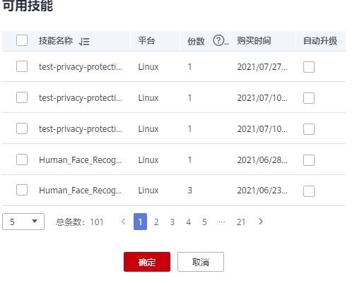
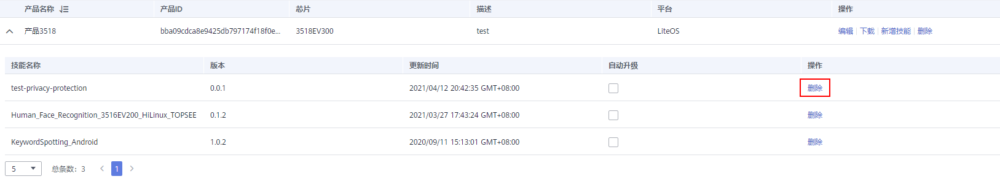

# 新增或删除技能

分发技能是指从技能市场，将技能分发至产品设备；而新增技能是指在产品管理页面，为指定产品新增技能。两个操作的最终结果是一样的。

在当前产品中，如果某些技能不再使用，可将其删除。

## 新增技能

1.  登录华为HiLens管理控制台，单击左侧导航栏“设备管理\>产品管理“，进入“产品管理“页面。
2.  选择设备产品，单击操作列的“新增技能“。
3.  在弹出的“新增技能“窗口，默认展示您订购的技能列表，选择需要新增的技能，根据需要勾选“自动升级“，单击“确定“完成操作。

    勾选“自动升级“表示如果分发的技能有新的版本，产品中的该技能会自动升级到最新版本。

    **图 1**  新增技能  
    

## 删除技能

删除技能是将云侧的技能从设备中移除。

> **说明：** 
>-   对于支持自动更新的设备（使用3516cv500、3519av100芯片的设备），检测到云侧的技能删除后，会将端侧的技能删掉。
>-   对于不支持自动更新的设备，云侧技能删除后，端侧不受影响，依然可以使用技能。若希望删除端侧的技能，您可以[提交工单](https://console.huaweicloud.com/ticket/?region=cn-north-4&locale=zh-cn#/ticketindex/createIndex)。

1.  登录华为HiLens管理控制台，单击左侧导航栏“设备管理\>产品管理“，进入“产品管理“页面。
2.  选择设备产品，单击左侧箭头，查看产品下的所有技能。
3.  选择需要删除的技能，单击“删除“。

    **图 2**  删除技能-42  
    

4.  确认需删除的技能信息，单击“确定“。

