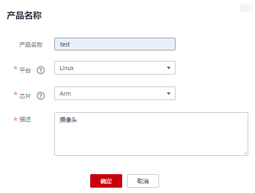
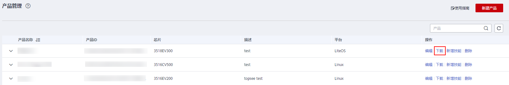
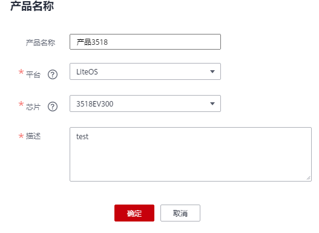
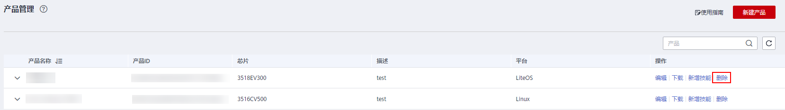

# 新建产品

厂商在华为HiLens管理控制台创建一个产品后，将把设备“关联“到这个产品上来进行管理。购买设备的用户一旦将设备注册，厂商将能在华为HiLens控制台管理已注册的设备及其技能。

## 新建产品

1.  登录HiLens管理控制台，单击左侧导航栏“设备管理\>产品管理“，进入“产品管理“页面。
2.  单击右上角“新建产品“，输入产品参数信息，如[表1](#table196933510218)所示。

    **图 1**  新建产品  
    

    **表 1**  设备产品参数

    
    <table><thead align="left"><tr id="row3969113516219"><th class="cellrowborder" valign="top" width="17.4%" id="mcps1.2.3.1.1">
参数名称

    </th>
    <th class="cellrowborder" valign="top" width="82.6%" id="mcps1.2.3.1.2">
参数说明

    </th>
    </tr>
    </thead>
    <tbody><tr id="row9969153517212"><td class="cellrowborder" valign="top" width="17.4%" headers="mcps1.2.3.1.1 ">
产品名称

    </td>
    <td class="cellrowborder" valign="top" width="82.6%" headers="mcps1.2.3.1.2 ">
产品名称。

    
请输入以中文、字母开头，以中文、字母、数字结尾，长度3~60的字符。只允许中文、字母、数字、中划线和下划线等字符。

    </td>
    </tr>
    <tr id="row1296913513214"><td class="cellrowborder" valign="top" width="17.4%" headers="mcps1.2.3.1.1 ">
平台

    </td>
    <td class="cellrowborder" valign="top" width="82.6%" headers="mcps1.2.3.1.2 ">
设备的OS类型。

    
包括Android、Linux、iOS、LiteOS、Windows。

    </td>
    </tr>
    <tr id="row17969835142112"><td class="cellrowborder" valign="top" width="17.4%" headers="mcps1.2.3.1.1 ">
芯片

    </td>
    <td class="cellrowborder" valign="top" width="82.6%" headers="mcps1.2.3.1.2 ">
设备的芯片型号。

    
海思35XX系列，包括3516CV500、3519AV100、3519V101、3516DV300、3516EV200、3516EV300、3518EV300、ARM。

    
设备芯片型号为3518EV300\3516EV200\3516EV300时，均可选择“3516CV500”。

    </td>
    </tr>
    <tr id="row13969133502111"><td class="cellrowborder" valign="top" width="17.4%" headers="mcps1.2.3.1.1 ">
描述

    </td>
    <td class="cellrowborder" valign="top" width="82.6%" headers="mcps1.2.3.1.2 ">
产品介绍。

    
字符长度小于512。

    </td>
    </tr>
    </tbody>
    </table>

3.  产品信息确认无误后，单击“确定“。

    新建成功后，系统将自动跳转至“产品管理“页面。

## 下载License

产品新建成功后，您需要下载其对应的License，并存储至设备的指定路径。

1.  单击左侧导航栏“设备管理\>产品管理“，进入“产品管理“页面。
2.  选择对应的产品，然后单击操作列的“下载“，下载License文件。

    **图 2**  下载License  
    

3.  将License文件存放至设备的指定目录下。

    存放License的位置根据不同厂商的设备有所不同，与厂商达成合作关系后，您可以[提交工单](https://console.huaweicloud.com/ticket/?region=cn-north-4&locale=zh-cn#/ticketindex/createIndex)，会有华为HiLens工作人员专门指导。您也可以通过[提交工单](https://console.huaweicloud.com/ticket/?region=cn-north-4&locale=zh-cn#/ticketindex/createIndex)了解更多小海思35XX系列芯片的技能。

## 编辑产品

1.  登录HiLens管理控制台，单击左侧导航栏“设备管理\>产品管理“，进入产品管理页面。
2.  选择对应的产品，单击操作列的“编辑“。

    弹出“更新产品“对话框。

    **图 3**  更新产品  
    

3.  在“更新产品“对话框中，按[表1](#table196933510218)编辑“产品名称“、“平台“、“芯片“和“描述“。
4.  确认产品信息，单击“确定“。

## 删除产品

> **须知：** 
>删除产品时需要确保此产品未投入使用，请谨慎操作。若产品与设备关联，若删除此产品将无法管理这些设备。若用户已经注册过该设备，厂商将无法对这些设备分发技能。

1.  登录HiLens管理控制台，单击左侧导航栏“设备管理\>产品管理“，进入产品管理页面。
2.  选择对应的产品，单击“删除“。

    **图 4**  删除产品  
    

3.  确认产品信息，单击“确定“。

