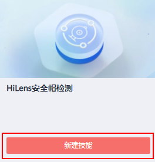
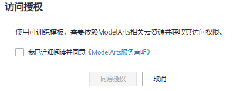

# 新建可训练技能

本章节介绍使用可训练技能模板新建技能。使用可训练技能模板新建技能，可自主上传数据训练模型，并快速创建技能，一键部署至端侧设备。

> **说明：** 
>使用可训练技能模板新建技能，仅支持训练模型提高模型精度，暂不支持修改技能的逻辑代码。如果您希望自行修改技能的逻辑代码，可以选择开发基础技能，详情请见[控制台开发技能](控制台开发技能.md)。

## 前提条件

保证华为云帐号不欠费。在华为HiLens控制台开发技能时，会占用OBS资源，需要收取一定费用，收费规则请参见[OBS价格详情](https://www.huaweicloud.com/pricing.html?tab=detail#/obs)。基于可训练技能模板新建技能，训练模型和部署技能会占用ModelArts训练资源，需要收取一定费用，收费规格请参见[ModelArts价格详情](https://www.huaweicloud.com/pricing.html?tab=detail#/modelarts)。

## 操作步骤

1.  在华为HiLens管理控制台左侧导航栏中选择“技能开发\>技能模板“。

    默认进入“全部模板“页面。

2.  单击“可训练模板（Beta）“，切换至“可训练模板“页签。
3.  选择技能，单击技能模板卡片的“新建技能“。

    **图 1**  新建技能  
    

4.  首次使用可训练模板，需要授权ModelArts。

    **图 2**  访问授权  
    

    仔细阅读ModelArts服务声明，勾选“我已详细阅读并同意《ModelArts服务声明》“，然后单击“同意授权“。

    非首次使用可训练模板，请忽略此步骤，执行下一步。

5.  在“新建技能“对话框，根据业务需求填写“技能名称“、“技能负责人“和“技能描述“，选择“所属行业“，认真阅读并勾选“同意《公测使用服务协议》“。
6.  确认信息后，单击“确定“。

    跳至“应用开发”页面，开始开发技能，详情请见[HiLens安全帽检测技能](https://support.huaweicloud.com/usermanual-hilens/hilens_02_0130.html)。

    您也可以通过如下方式进入“应用开发“页面，开发技能。

    1.  登录华为HiLens控制台，在左侧导航栏选择“技能开发\>技能管理“页面。
    2.  单击“可训练技能“，切换至“可训练技能“页签。
    3.  选择已新建的技能名称，单击“操作“列的“查看“，进入“应用开发“页面。

