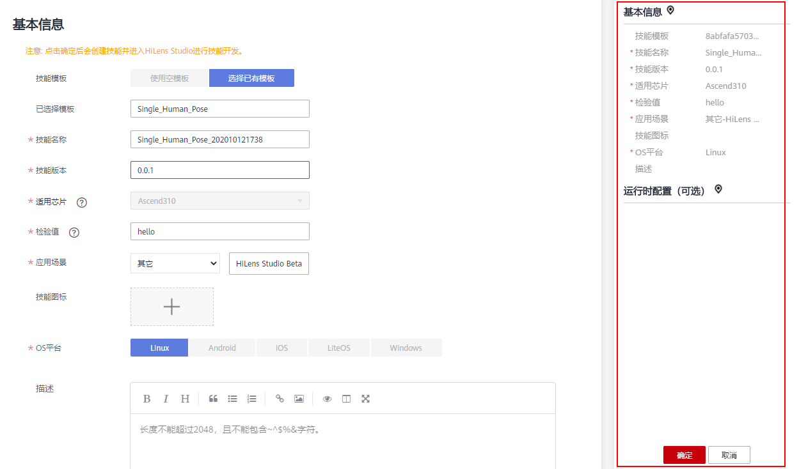
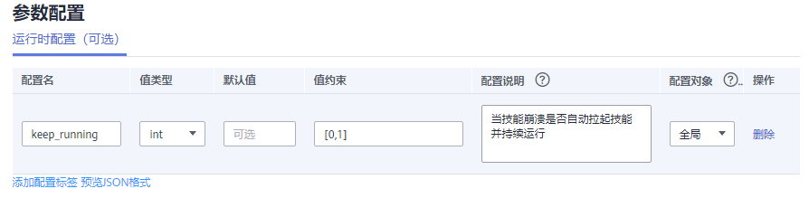
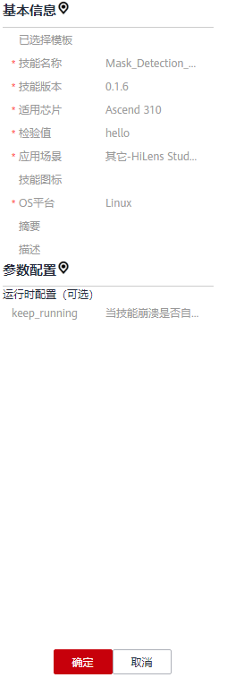

# 新建技能项目<a name="hilens_02_0087"></a>

使用HiLens Studio 新建技能项目，将技能文件组织起来以便进行编译和调试，最终开发一个新的技能。

## 前提条件<a name="section810816472505"></a>

-   保证华为云帐号处于不欠费状态。在华为HiLens控制台开发技能时，会占用OBS资源，需要收取一定费用，收费规则请参见[对象存储服务 OBS](https://www.huaweicloud.com/pricing.html?tab=detail#/obs)。
-   已申请HiLens Studio公测，详细操作请参见[申请HiLens Studio公测](申请HiLens-Studio公测.md)。
-   新建技能使用的算法模型已开发完成并[导入华为HiLens](导入（转换）模型.md)中。

> **说明：** 
>当前技能市场购买的技能暂不支持在HiLens Studio中打开，您可以选择在HiLens Studio中选择技能模板新建技能项目，详情请见[新建技能项目](新建技能项目.md)。

## 1. 开始新建项目<a name="section4985195015013"></a>

1.  登录华为HiLens管理控制台，在左侧导航栏中选择“技能开发\>HiLens Studio“。

    等待大概30秒，进入HiLens Studio 页面。

2.  在HiLens Studio页面，单击“File\>New Project“。

    弹出“选择模板创建HiLens Studio项目“对话框。

3.  在“选择模板创建HiLens Studio项目“对话框，选择您想要使用的技能模板，然后单击“新建技能“。

    页面自动跳至“创建技能“页面，您选择的模板默认配置将自动加载，您可以在创建技能页面右侧查看到相关信息。

    **图 1**  创建技能-25<a name="fig46243309108"></a>  
    


## 2. 填写基本信息<a name="section551025514581"></a>

选择已有技能模板后，页面已自动加载技能模板的默认参数配置，如[表1](#table1638755115118)所示。您必须填写“技能名称“、“技能版本“参数。

**表 1**  基本信息

<a name="table1638755115118"></a>
<table><thead align="left"><tr id="row43055512519"><th class="cellrowborder" valign="top" width="25.040000000000003%" id="mcps1.2.3.1.1"><p id="p530155585114"><a name="p530155585114"></a><a name="p530155585114"></a>字段名称</p>
</th>
<th class="cellrowborder" valign="top" width="74.96000000000001%" id="mcps1.2.3.1.2"><p id="p1930555155116"><a name="p1930555155116"></a><a name="p1930555155116"></a>说明</p>
</th>
</tr>
</thead>
<tbody><tr id="row1632855165112"><td class="cellrowborder" valign="top" width="25.040000000000003%" headers="mcps1.2.3.1.1 "><p id="p15312055185113"><a name="p15312055185113"></a><a name="p15312055185113"></a>技能模板</p>
</td>
<td class="cellrowborder" valign="top" width="74.96000000000001%" headers="mcps1.2.3.1.2 "><p id="p93125513518"><a name="p93125513518"></a><a name="p93125513518"></a>是否使用模板来开发技能。使用HiLens Studio新建技能默认选择已有模板，则会使用模板的模型和代码。即技能内容模块的字段都会使用模板的信息。</p>
</td>
</tr>
<tr id="row17156105345511"><td class="cellrowborder" valign="top" width="25.040000000000003%" headers="mcps1.2.3.1.1 "><p id="p161561853195515"><a name="p161561853195515"></a><a name="p161561853195515"></a>已选择模板</p>
</td>
<td class="cellrowborder" valign="top" width="74.96000000000001%" headers="mcps1.2.3.1.2 "><p id="p415665375518"><a name="p415665375518"></a><a name="p415665375518"></a>选择的技能模板名称。</p>
</td>
</tr>
<tr id="row63215565120"><td class="cellrowborder" valign="top" width="25.040000000000003%" headers="mcps1.2.3.1.1 "><p id="p732655115117"><a name="p732655115117"></a><a name="p732655115117"></a>技能名称</p>
</td>
<td class="cellrowborder" valign="top" width="74.96000000000001%" headers="mcps1.2.3.1.2 "><p id="p53275545120"><a name="p53275545120"></a><a name="p53275545120"></a>技能的名称，下发到端侧也使用该名称作为根目录。</p>
<p id="p152291058125618"><a name="p152291058125618"></a><a name="p152291058125618"></a>技能名称不能与<span class="parmname" id="parmname36320550573"><a name="parmname36320550573"></a><a name="parmname36320550573"></a>“已选择模板”</span>，即已选择的技能模板名称一致。</p>
<p id="p1189483451615"><a name="p1189483451615"></a><a name="p1189483451615"></a>可输入字母、数字、下划线或中划线，必须以字母开头，以字母或数字结尾，长度3~48个字符。</p>
<div class="note" id="note17827182618586"><a name="note17827182618586"></a><a name="note17827182618586"></a><span class="notetitle"> 说明： </span><div class="notebody"><p id="p4828182605812"><a name="p4828182605812"></a><a name="p4828182605812"></a>由于技能市场不允许存在同名技能，所以如果想发布到技能市场，请使用全局唯一的名称对您的技能进行命名。</p>
</div></div>
</td>
</tr>
<tr id="row143315535119"><td class="cellrowborder" valign="top" width="25.040000000000003%" headers="mcps1.2.3.1.1 "><p id="p13331755165111"><a name="p13331755165111"></a><a name="p13331755165111"></a>技能版本</p>
</td>
<td class="cellrowborder" valign="top" width="74.96000000000001%" headers="mcps1.2.3.1.2 "><p id="p1333165565111"><a name="p1333165565111"></a><a name="p1333165565111"></a>技能的版本。版本号格式为<span class="parmname" id="parmname169203446161"><a name="parmname169203446161"></a><a name="parmname169203446161"></a>“A.A.A”</span>，<span class="parmname" id="parmname363524771619"><a name="parmname363524771619"></a><a name="parmname363524771619"></a>“A”</span>为不超过3位的自然数。例如<span class="parmvalue" id="parmvalue189556590168"><a name="parmvalue189556590168"></a><a name="parmvalue189556590168"></a>“1.0.0”</span>。</p>
<p id="p191791758121219"><a name="p191791758121219"></a><a name="p191791758121219"></a>当<span class="parmname" id="parmname7979164791320"><a name="parmname7979164791320"></a><a name="parmname7979164791320"></a>“A”</span>超过一位时，不允许以<span class="parmvalue" id="parmvalue15554195016134"><a name="parmvalue15554195016134"></a><a name="parmvalue15554195016134"></a>“0”</span>开头，比如禁止输入<span class="parmvalue" id="parmvalue238263918131"><a name="parmvalue238263918131"></a><a name="parmvalue238263918131"></a>“01.0.0”</span>。</p>
</td>
</tr>
<tr id="row333185515519"><td class="cellrowborder" valign="top" width="25.040000000000003%" headers="mcps1.2.3.1.1 "><p id="p1833105515513"><a name="p1833105515513"></a><a name="p1833105515513"></a>适用芯片</p>
</td>
<td class="cellrowborder" valign="top" width="74.96000000000001%" headers="mcps1.2.3.1.2 "><p id="p33318557517"><a name="p33318557517"></a><a name="p33318557517"></a>技能支持的芯片。运行在HiLens Kit上的技能需选择Ascend 310芯片。</p>
</td>
</tr>
<tr id="row177711822115615"><td class="cellrowborder" valign="top" width="25.040000000000003%" headers="mcps1.2.3.1.1 "><p id="p1477212219565"><a name="p1477212219565"></a><a name="p1477212219565"></a>检验值</p>
</td>
<td class="cellrowborder" valign="top" width="74.96000000000001%" headers="mcps1.2.3.1.2 "><p id="p1677272275613"><a name="p1677272275613"></a><a name="p1677272275613"></a>用于技能校验，防止技能伪冒。要与代码中初始化接口的参数一致。具体使用方法请参见<a href="https://support.huaweicloud.com/devg-hilens/hilens_05_0006.html" target="_blank" rel="noopener noreferrer">开发指南&gt;初始化HiLens Framework</a>。</p>
</td>
</tr>
<tr id="row151084810198"><td class="cellrowborder" valign="top" width="25.040000000000003%" headers="mcps1.2.3.1.1 "><p id="p1034821454316"><a name="p1034821454316"></a><a name="p1034821454316"></a>应用场景</p>
</td>
<td class="cellrowborder" valign="top" width="74.96000000000001%" headers="mcps1.2.3.1.2 "><p id="p234831416436"><a name="p234831416436"></a><a name="p234831416436"></a>技能适用的场景，例如<span class="parmname" id="parmname197812010185212"><a name="parmname197812010185212"></a><a name="parmname197812010185212"></a>“园区”</span>、<span class="parmname" id="parmname17498151345215"><a name="parmname17498151345215"></a><a name="parmname17498151345215"></a>“家庭”</span>、<span class="parmname" id="parmname1870216153521"><a name="parmname1870216153521"></a><a name="parmname1870216153521"></a>“车载”</span>、<span class="parmname" id="parmname1063521818520"><a name="parmname1063521818520"></a><a name="parmname1063521818520"></a>“商超”</span>等场景及其子场景。如果选项中没有合适的场景，可选择<span class="parmname" id="parmname154561920155217"><a name="parmname154561920155217"></a><a name="parmname154561920155217"></a>“其他”</span>，然后在文本框中填写场景名称。</p>
</td>
</tr>
<tr id="row103445595111"><td class="cellrowborder" valign="top" width="25.040000000000003%" headers="mcps1.2.3.1.1 "><p id="p14331055185117"><a name="p14331055185117"></a><a name="p14331055185117"></a>技能图标</p>
</td>
<td class="cellrowborder" valign="top" width="74.96000000000001%" headers="mcps1.2.3.1.2 "><p id="p1033195525112"><a name="p1033195525112"></a><a name="p1033195525112"></a>技能的头像。</p>
</td>
</tr>
<tr id="row134755165112"><td class="cellrowborder" valign="top" width="25.040000000000003%" headers="mcps1.2.3.1.1 "><p id="p163419553515"><a name="p163419553515"></a><a name="p163419553515"></a>OS平台</p>
</td>
<td class="cellrowborder" valign="top" width="74.96000000000001%" headers="mcps1.2.3.1.2 "><p id="p2341655145110"><a name="p2341655145110"></a><a name="p2341655145110"></a>技能运行的操作系统平台，包括Linux、Android、IOS、LiteOS和Windows。HiLens Kit用的是基于CentOS制作的Linux发型版Euler系统操作系统，所以如果开发的是运行在HiLens Kit的技能，这里选择Linux。</p>
</td>
</tr>
<tr id="row1435155514512"><td class="cellrowborder" valign="top" width="25.040000000000003%" headers="mcps1.2.3.1.1 "><p id="p1434185565110"><a name="p1434185565110"></a><a name="p1434185565110"></a>描述</p>
</td>
<td class="cellrowborder" valign="top" width="74.96000000000001%" headers="mcps1.2.3.1.2 "><p id="p17351555145115"><a name="p17351555145115"></a><a name="p17351555145115"></a>对技能的详细介绍。输入最大长度2048。</p>
<div class="note" id="note11600131616192"><a name="note11600131616192"></a><a name="note11600131616192"></a><span class="notetitle"> 说明： </span><div class="notebody"><p id="p17600191661915"><a name="p17600191661915"></a><a name="p17600191661915"></a>若新建技能的场景需要发送消息到用户的手机或邮箱，比如检测到陌生人技能需要在发现陌生人后发送消息提醒用户，描述中<strong id="b1895232112336"><a name="b1895232112336"></a><a name="b1895232112336"></a>必须注明</strong>：<span class="parmvalue" id="parmvalue18687175919324"><a name="parmvalue18687175919324"></a><a name="parmvalue18687175919324"></a>“本技能支持发送订阅消息”</span>，发送的具体内容需在<a href="使用手机实时视频流编写-调试代码.md">使用手机实时视频流编写/调试代码</a>时注明，详细指导和API介绍可参见<a href="https://support.huaweicloud.com/devg-hilens/hilens_05_0001.html" target="_blank" rel="noopener noreferrer">开发指南</a>。</p>
</div></div>
</td>
</tr>
</tbody>
</table>

## 3. 运行时配置（可选）<a name="section662915238494"></a>

**图 2**  运行时配置-26<a name="fig893899141513"></a>  


部分技能在运行的时候需要用户配置参数，比如人脸判断类的技能需要用户上传人脸库等。运行时配置就像是一个“钩子”，开发者把“钩子”放出去，用户运行技能的时候设置了这些配置项，HiLens就会帮开发者把“钩子”收回来，这时候在代码里面开发者就可以使用这些用户的设置。您可以在界面中单击添加配置标签，参考[表2](#table193681822142815)填写您的配置。

您还可以单击“预览JSON格式“查看“钩子”的格式。开发者通过HiLens Framework提供的get\_skill\_config接口获取技能配置的JSON格式，读取里面字段的值来使用用户的配置。

运行时配置JSON格式如下所示：

```
{
        //全局配置
	"Language": "enum",
        //视频分路配置
	"multi_camera": [ //该字段key值multi_camera固定，值表示摄像头分路配置
		{       
			"camera_names": [     //该字段key值camera_names固定，值表示该分组配置里包含了哪些摄像头
				"cameraX",
				"cameraY"
			],
			"FaceLib": {        //配置名
				"from": "file source", //文件类型值，表示文件来自哪个服务。比如OBS
				"path": "file path"  //文件类型值，表示文件的路径
			}
		}
	],
       }
```

**表 2**  运行时配置的参数说明

<a name="table193681822142815"></a>
<table><thead align="left"><tr id="row1599282516281"><th class="cellrowborder" valign="top" width="25.1%" id="mcps1.2.3.1.1"><p id="p682118257394"><a name="p682118257394"></a><a name="p682118257394"></a>字段名称</p>
</th>
<th class="cellrowborder" valign="top" width="74.9%" id="mcps1.2.3.1.2"><p id="p28212025113919"><a name="p28212025113919"></a><a name="p28212025113919"></a>说明</p>
</th>
</tr>
</thead>
<tbody><tr id="row6368112214284"><td class="cellrowborder" valign="top" width="25.1%" headers="mcps1.2.3.1.1 "><p id="p73755565111"><a name="p73755565111"></a><a name="p73755565111"></a>配置名</p>
</td>
<td class="cellrowborder" valign="top" width="74.9%" headers="mcps1.2.3.1.2 "><p id="p15371755195112"><a name="p15371755195112"></a><a name="p15371755195112"></a>配置的名称，逻辑代码里面可用该字段获取该配置的值。运行时配置指技能在运行的时候，由用户配置的内容。比如人脸判断技能需要用户上传人脸库等。需要说明的是，整个运行时配置是可选的，但如果添加了一条配置，那么<span class="parmname" id="parmname27414261282"><a name="parmname27414261282"></a><a name="parmname27414261282"></a>“配置名”</span>、<span class="parmname" id="parmname11461202932816"><a name="parmname11461202932816"></a><a name="parmname11461202932816"></a>“配置说明”</span>是必填项。</p>
</td>
</tr>
<tr id="row11369722112812"><td class="cellrowborder" valign="top" width="25.1%" headers="mcps1.2.3.1.1 "><p id="p18371655165120"><a name="p18371655165120"></a><a name="p18371655165120"></a>值类型</p>
</td>
<td class="cellrowborder" valign="top" width="74.9%" headers="mcps1.2.3.1.2 "><p id="p1237855105112"><a name="p1237855105112"></a><a name="p1237855105112"></a>表示该配置项的值是什么类型的数据。</p>
<p id="p1637125512513"><a name="p1637125512513"></a><a name="p1637125512513"></a>数值类型（int、float）、枚举类型、字符串和文件类型。</p>
</td>
</tr>
<tr id="row1936922215283"><td class="cellrowborder" valign="top" width="25.1%" headers="mcps1.2.3.1.1 "><p id="p537355205111"><a name="p537355205111"></a><a name="p537355205111"></a>值约束</p>
</td>
<td class="cellrowborder" valign="top" width="74.9%" headers="mcps1.2.3.1.2 "><p id="p183815510510"><a name="p183815510510"></a><a name="p183815510510"></a>表示该配置可以设置的范围。跟值类型有关。</p>
<a name="ul76611933195612"></a><a name="ul76611933195612"></a><ul id="ul76611933195612"><li>数值类型：用开闭区间的表示方法。如[1,100)表示大于等于1小于100。</li><li>字符串和文件：该项无需输入。</li><li>枚举：集合的表示方式，如{a,b}。</li></ul>
</td>
</tr>
<tr id="row1436992210289"><td class="cellrowborder" valign="top" width="25.1%" headers="mcps1.2.3.1.1 "><p id="p7381551517"><a name="p7381551517"></a><a name="p7381551517"></a>配置说明</p>
</td>
<td class="cellrowborder" valign="top" width="74.9%" headers="mcps1.2.3.1.2 "><p id="p7386551517"><a name="p7386551517"></a><a name="p7386551517"></a>说明该配置的作用，以及配置方法。<strong id="b7774151845"><a name="b7774151845"></a><a name="b7774151845"></a>该字段非常重要，用户会根据该字段的说明来配置，所以如果有运行时配置，开发者一定要在这里解释清楚。</strong></p>
</td>
</tr>
<tr id="row12369922182814"><td class="cellrowborder" valign="top" width="25.1%" headers="mcps1.2.3.1.1 "><p id="p5382555516"><a name="p5382555516"></a><a name="p5382555516"></a>配置对象</p>
</td>
<td class="cellrowborder" valign="top" width="74.9%" headers="mcps1.2.3.1.2 "><p id="p18451596369"><a name="p18451596369"></a><a name="p18451596369"></a>HiLens Kit可以连接多个（个数不大于设备上所安装技能的支持通道数之和）摄像头，所以可以开发支持多路视屏的技能。</p>
<a name="ul446112207425"></a><a name="ul446112207425"></a><ul id="ul446112207425"><li>选择<span class="parmname" id="parmname2073614312420"><a name="parmname2073614312420"></a><a name="parmname2073614312420"></a>“视频”</span>，则表示该配置是可以针对设备上每个摄像头视频进行配置的，比如摄像头1和摄像头2采用不同的人脸库。</li><li>选择<span class="parmname" id="parmname16347465426"><a name="parmname16347465426"></a><a name="parmname16347465426"></a>“全局”</span>,则表示设备上所有摄像头都用同一个配置值。</li></ul>
</td>
</tr>
</tbody>
</table>

## 4. 确认信息进入HiLens Studio<a name="section1355814137177"></a>

确认信息无误后，单击“确定“，进入启动HiLens Studio的界面。

必要信息填写完成后，您可以在界面右侧查看其配置参数值，如果某个字段填写错误，在右侧会显示一个小红叉。

**图 3**  确认信息<a name="fig2372815162"></a>  


> **说明：** 
>-   确认信息后请务必进入HiLens Studio界面查看所创建的技能项目，否则会创建空项目，造成后续无法在HiLens Studio界面打开技能项目文件。
>-   如果打不开HiLens Studio界面，请检查浏览器是否设置阻止弹出式窗口。如果浏览器设置了阻止弹出式窗口，请添加HiLens Studio网址为允许浏览器弹窗的白名单地址。

