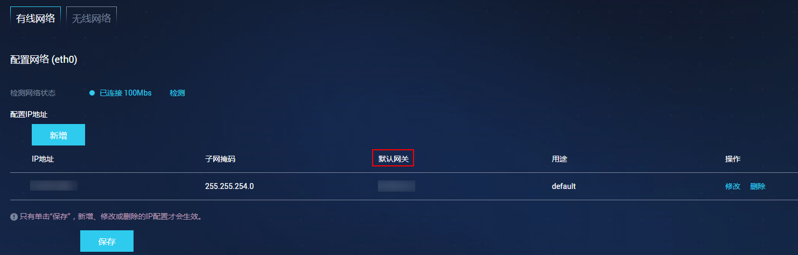

# 无线网络配置

**针对使用无线网络连接路由器的方式，需要输入无线网络密码，成功连接无线网络。**

当前HiLens Kit仅支持**2.4G频段**的无线网络和常规的**加密类型**无线网络，且**无线网络名称**不包含中文、英文的单引号和双引号，长度不能超过63个字符。

-   支持的2.4G频段无线网络所使用的协议为IEEE802.11n\\IEEE802.11g\\IEEE802.11b。
-   支持的无线网络加密类型有WEP、WPA-PSK/WPA2-PSK和AES。
-   暂不支持需要验证的无线网络。
-   暂不支持TKIP加密。

## 准备工作

网线连接PC和设备，详细操作请参见[连接PC和HiLens Kit](连接PC和HiLens-Kit.md)。

## 操作步骤

1.  登录Huawei HiLens智能边缘管理系统，详细操作请参见[登录Huawei HiLens智能边缘系统](https://support.huawei.com/enterprise/zh/doc/EDOC1100112066/a6312166)。
2.  在主菜单中选择“管理 \> 网络 \> 有线网络“。

    进入“有线网络“配置页面。

3.  检查“配置IP地址“区域的“IP地址“是否存在“默认网关“，如[图1](#fig9120542134018)所示。

    **图 1**  检查默认网关  
    

    -   若不存在默认网关，请执行下一步。
    -   若存在默认网关，请执行以下操作：

        单击操作栏“修改“，在弹出的“修改IP地址“对话框中，删除“默认网关“文本框中的已有值，单击“确定“。

        执行下一步。

        **图 2**  删除默认网关  
        

4.  在主菜单中选择“管理 \> 网络 \> 无线网络“。

    进入“无线网络“配置页面。

5.  单击，打开WIFI开关。

    搜索附近热点，可连接附近的无线网络。

6.  单击，可刷新热点信息。
7.  单击。

    弹出信息提示框。

8.  在“WIFI密码“文本框中输入WIFI密码，[图3](#fig1120942154012)所示。单击“确定“。

    页面右上角弹出“连接成功“，完成无线网络连接路由器。

    **图 3**  无线连接路由器  
    

